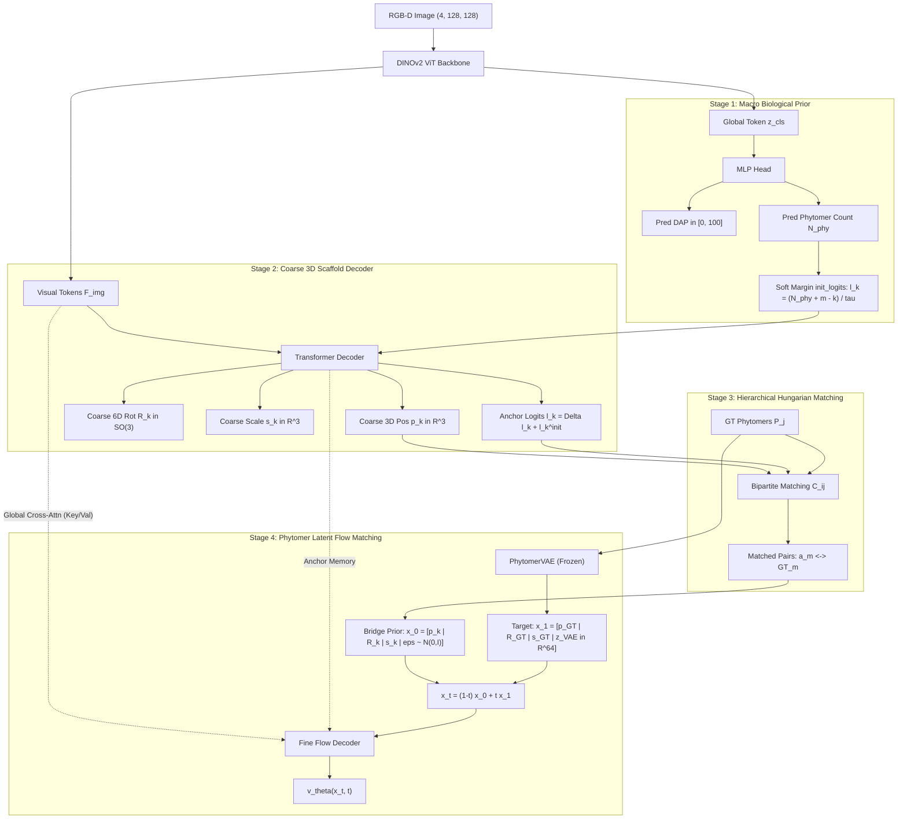

# Current Architecture & Gradient Explosion Root Cause Analysis

This document provides a detailed analysis of the **fundamental algorithmic and numerical causes** behind the log issue (`grad_norm is NaN/Inf (inf), skipping optimizer.step()`).

In summary, the failure was caused by a combination of: **mathematical overflow (Float32 overflow), autograd graph leakage in the Flow Matching prior distribution, and an optimizer skip deadlock trap**.

Below is a detailed exposition of the **end-to-end algorithmic formulation**, the **failure mechanism**, and the **remedy**.

---

### 1. End-to-End Algorithmic Formulation & Architecture

Cowpea plants exhibit **hierarchical self-similarity**, sequentially growing phytomer nodes along stems, where each node bears an internode (stem), petiole, leaflets, and flower/pod reproductive organs. To model this, the architecture consists of a 4-stage pipeline:



---

#### Stage 1: Macro Biological Prior
- **Input**: 4-channel RGB-D canopy image $I \in \mathbb{R}^{4 \times 128 \times 128}$ (RGB + LiDAR height map).
- Extracts visual tokens $F_{\text{img}} \in \mathbb{R}^{B \times N_p \times C}$ and class token $z_{\text{cls}} \in \mathbb{R}^{B \times C}$ via DINOv2 encoder.
- Predicts Days After Planting (DAP) and phytomer count:
  $$\widehat{\text{DAP}} = 100.0 \times \text{ReLU}(W_{\text{dap}} h) \in [0, 100]$$
  $$\widehat{N}_{\text{phy}} = \text{ELU}(W_{\text{phy}} h) + 1.0 \in [0, \infty)$$
- **Soft Margin Logit Bias**: For node index $k \in \{0, \dots, K-1\}$ ($K=25$), derives prior existence probability that the plant develops up to the $k$-th node:
  $$\ell_k^{\text{init}} = \frac{\widehat{N}_{\text{phy}} + m - k}{\tau}, \quad w_k = \sigma(\ell_k^{\text{init}})$$
  (where margin $m=2.0$, temperature $\tau=0.8$)

---

#### Stage 2: Coarse 3D Scaffold Decoder
- $K$ learnable query tokens perform cross-attention with visual tokens $F_{\text{img}}$ to predict 3D spatial pose and scale for each anchor:
  $$\hat{p}_k \in \mathbb{R}^3 \quad (\text{metric 3D base coordinates})$$
  $$\hat{R}_k \in \mathbb{R}^6 \xrightarrow{\text{Gram-Schmidt}} \text{SO}(3) \quad (\text{node 3D orientation frame})$$
  $$\hat{s}_k \in \mathbb{R}^3 \quad (\text{node/petiole length and thickness})$$
  $$\hat{\ell}_k = \ell_k^{\text{init}} + \Delta \ell_k \quad (\text{final anchor existence logit})$$

---

#### Stage 3: Hierarchical Hungarian Matching
- Computes optimal assignment cost between $K$ predicted slots and ground truth (GT) $P$ phytomer clusters:
  $$\mathcal{C}_{i,j} = \lambda_{\text{pos}} \|\hat{p}_i - p_j^{\text{GT}}\|_1 - \lambda_{\text{exist}} \sigma(\hat{\ell}_i) w_i + \lambda_{\text{loc}} \text{ReLU}(\|\hat{p}_i - p_j^{\text{GT}}\|_1 - r_0)^2$$
- Derives $M_{\text{anc}}$ matched pairs $(a_m \leftrightarrow \text{GT}_m)$ via the Hungarian algorithm $\pi^* = \arg\min_\pi \sum_i \mathcal{C}_{i, \pi(i)}$.

---

#### Stage 4: 76D Intra-Phytomer Latent Flow Matching
- Compresses the geometry of 10 organs per node (internode, petiole, 3 leaflets, peduncle, 4 reproductive organs) into 64D latent vector $z_{\text{phy}} \in \mathbb{R}^{64}$ using a pretrained frozen **PhytomerVAE**.
- **Final Target State ($t=1$)**:
  $$x_1 = \left[ p_m^{\text{GT}} \in \mathbb{R}^3 \;\Big|\; R_m^{\text{GT}} \in \mathbb{R}^6 \;\Big|\; s_m^{\text{GT}} \in \mathbb{R}^3 \;\Big|\; z_{\text{phy}}^{\text{VAE}} \in \mathbb{R}^{64} \right] \in \mathbb{R}^{76}$$
- **Bridge Prior Distribution ($t=0$)**: Starts aligned with the Stage 2 coarse scaffold instead of random Gaussian noise:
  $$x_0 = \left[ \hat{p}_{a_m} + \epsilon_{\text{pos}} \;\Big|\; \hat{R}_{a_m} + \epsilon_{\text{rot}} \;\Big|\; \hat{s}_{a_m} + \epsilon_{\text{scl}} \;\Big|\; \epsilon_{\text{lat}} \sim \mathcal{N}(0, \mathbf{I}) \right]$$
- **Continuous Flow Trajectory & Visual Conditioning**:
  $$x_t = (1 - t) x_0 + t x_1, \quad v_t^* = \frac{d}{dt} x_t = x_1 - x_0$$
  - **Visual Conditioning**: Rather than unconditional flow matching, the $x_t$-based decoder query cross-attends to **all ViT image tokens $F_{\text{img}}$ and anchor features** as memory:
    $$\text{Memory} = \big[ F_{\text{img}} \;\big\|\; F_{\text{anchor}} \big] \in \mathbb{R}^{B \times (T + K) \times C}$$
    $$\hat{v}_\theta(x_t, t) = \text{TransformerDecoder}(\text{Query}(x_t, t, \hat{p}_k, \hat{R}_k), \;\text{Memory})$$
- **Neural Network Prediction & Loss Function**:
  $$\mathcal{L}_{\text{vel}} = \frac{1}{M_{\text{anc}}} \sum_{m} \frac{1}{76} \|\hat{v}_\theta(x_t, t) - (x_1 - x_0)\|^2$$

---

### 2. Three Root Causes of `grad_norm is inf`

#### ① [Mathematical Overflow] Exponential Divergence of $\ell_k^{\text{init}}$ ($\exp(96.25) \to +\infty$)
In `MacroBiologicalPrior` soft margin calculation:
$$\ell_k^{\text{init}} = \frac{\widehat{N}_{\text{phy}} + m - k}{\tau} \quad (\tau = 0.8)$$
- At epochs 3–4, when mature plants with DAP 60–80 (GT phytomer count 70–80) enter a batch, if $\widehat{N}_{\text{phy}}$ reaches ~75:
  $$\text{Slot } k=0 \text{ logit: } \ell_0^{\text{init}} = \frac{75 + 2 - 0}{0.8} = \mathbf{+96.25}$$
- This logit enters the existence loss `F.binary_cross_entropy_with_logits`:
  $$\text{BCE}(\ell, y) = \max(\ell, 0) - \ell \cdot y + \log(1 + e^{-|\ell|})$$
- During backpropagation, the gradient computation $\sigma(\ell) - y = \frac{1}{1 + e^{-\ell}} - y$ encounters IEEE 754 Float32 limits ($\approx 3.4 \times 10^{38}$):
  $$e^{96.25} \approx 6.3 \times 10^{41} \gg 3.4 \times 10^{38} \implies \mathbf{+\infty \text{ (Overflow)}}$$
- **Result**: `loss.backward()` overflows Float32, recording `inf` in gradient tensors and causing `clip_grad_norm_` to return `inf`.

---

#### ② [Algorithmic Bug] Missing `.detach()` on $x_0$ Autograd Graph (Recurrent Positive Feedback Loop)
In `train_hierarchical_flow_matching.py` around line 475:
```python
z_0[:, :, :3] = pred_anchor_pos + 0.05 * eps
...
tgt_velocity = tgt_z1_phyto - z_0
loss_fine_vel = F.mse_loss(pred_velocity, tgt_velocity)
```
- $x_0$ must serve as a **fixed initial boundary condition** for the Flow Matching ODE.
- However, `pred_anchor_pos` was assigned to $z_0$ without `.detach()`.
- Consequently, backpropagation on velocity loss $\mathcal{L}_{\text{vel}} = \|\hat{v}_\theta(x_t) - (x_1 - z_0)\|^2$ flowed back into $z_0$:
  $$\frac{\partial \mathcal{L}_{\text{vel}}}{\partial z_0} = 2 (\hat{v}_\theta - v^*) \cdot \left[ (1 - t) \frac{\partial \hat{v}_\theta}{\partial x_t} + \mathbf{I} \right]$$
- **The Stage 2 coarse scaffold head was directly connected to the target velocity vector, forming a positive feedback loop that exploded scaffold coordinates to minimize target velocity error.**
- As LR Warmup finished and reached full learning rate (1.0x) around epochs 3–4, this feedback loop rapidly diverged into a gradient explosion.

---

#### ③ [Permanent Training Freeze] Deadlock Trap in `skip optimizer.step()`
Safety mechanism in `train_one_epoch`:
```python
grad_norm = torch.nn.utils.clip_grad_norm_(model.parameters(), max_norm=1.0)
if torch.isnan(grad_norm) or torch.isinf(grad_norm):
    optimizer.zero_grad(set_to_none=True) # skips step()
```
- When `grad_norm` became `inf`, `optimizer.step()` was skipped.
- **Because model weights were never updated, the model remained permanently trapped in the exact parameter state causing the overflow.**
- In subsequent steps (Step 82, 83, 84...), `inf` occurred identically, skipping every batch update and entering a **permanent deadlock freeze**.

---

### 3. Solutions and Implementation Strategy

1. **Numerical Safety Clamp on `init_logits`**:
   $$\ell_k^{\text{init}} = \text{clamp}\left( \frac{\widehat{N}_{\text{phy}} + m - k}{\tau}, \min=-15.0, \max=15.0 \right)$$
   - Since $\sigma(15.0) = 0.9999997$, information loss is merely $0.00003\%$, while $e^{15} \approx 3.2 \times 10^6$ mathematically prevents Float32 overflow.
2. **Detach Bridge Prior $z_0$ (`.detach()`)**:
   - Apply `pred_anchor_pos.detach()`, `pred_anchor_rot.detach()`, `pred_anchor_scale.detach()` when building $z_0$, cutting unwanted 2nd-order gradient interaction between Stage 2 and Stage 3.
3. **Safe Gradient Sanitization**:
   - When `grad_norm is inf` occurs, rather than discarding the step, cap `inf` values with `torch.nan_to_num(p.grad, nan=0.0, posinf=1.0, neginf=-1.0)` and apply `clip_grad_norm_(1.0)`, providing a recovery path out of divergent states.

---

### 4. Recent Architecture & Kinematics Enhancements (2026-09-12 — 2026-09-14)

Following root-cause investigations documented in [`handovers/20260912-stage2-stage3-boundary/`](../../engineering/20260912-stage2-stage3-boundary/20260912-stage2-stage3-boundary.md) and [`experiments/20260914-stage2-burst-fix-roundtrip/`](../../experiments/20260914-stage2-burst-fix-roundtrip/20260914-stage2-burst-fix-roundtrip.md), five major structural improvements were integrated into the active model:

1. **Coarse Decoder Final LayerNorm (`bf16` Burst Fix)**:
   - *Problem*: The coarse transformer decoder previously lacked a final LayerNorm, allowing raw unbounded residual streams to feed directly into `bf16` phytomer self-attention, triggering severe periodic gradient bursts.
   - *Fix*: Added a final LayerNorm (`self.final_norm`) before prediction heads. Verified: 0/8 gradient bursts across previously failing checkpoints.

2. **Packet Slot-0 Reference Frame Identity**:
   - *Specification*: Within each phytomer packet, slot 0 defines the local root reference frame. Its 6D rotation is clamped to identity ($R = \mathbf{I}_{3\times 3}$), eliminating rotational gauge ambiguity.

3. **Lossless Leaflet Packet Sequencing**:
   - *Specification*: Leaflet emissions within each phytomer are standardized to `[lateral, terminal, lateral]`. 
   - Leaf size is parameterized as a single scalar per phytomer with biological aspect scaling (1 : 1 : 10/9), eliminating unconstrained leaf deformation.

4. **Closed-Form Stem Inverse Kinematics (IK) Export**:
   - *Specification*: Analytical IK converts predicted 3D node positions into native Helios XML parameters (`pitch`, `roll`, `length`), achieving >92% mask IoU in OptiX raytracing roundtrips without geometric distortion.

5. **Parent Link Topology (`gt_parent_links`)**:
   - *Specification*: Every phytomer node is assigned a strict parent link with depth-from-root tracking; arbitrary +Z fallbacks have been removed in favor of topological parent-step loss supervision.