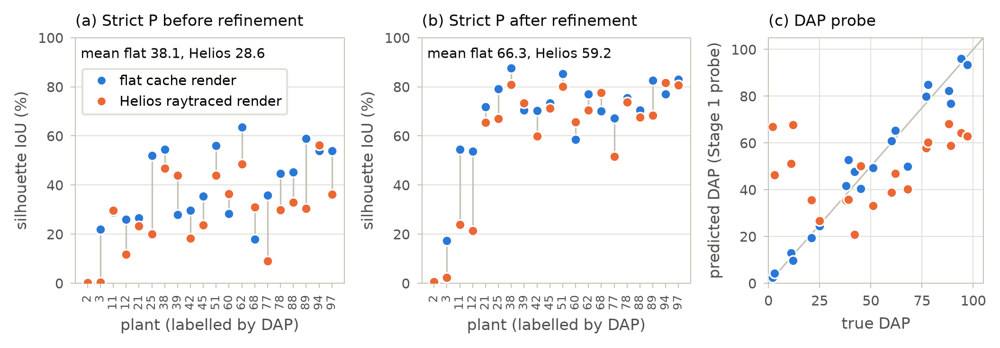
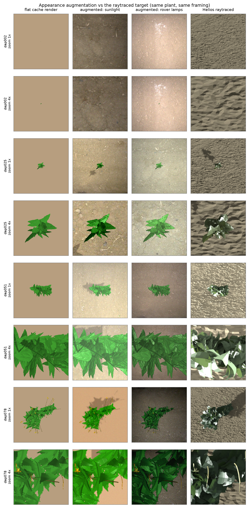
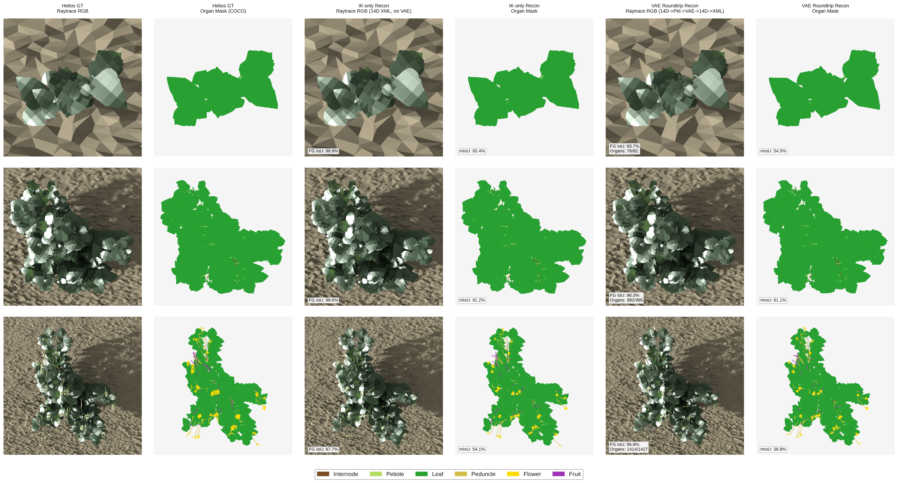
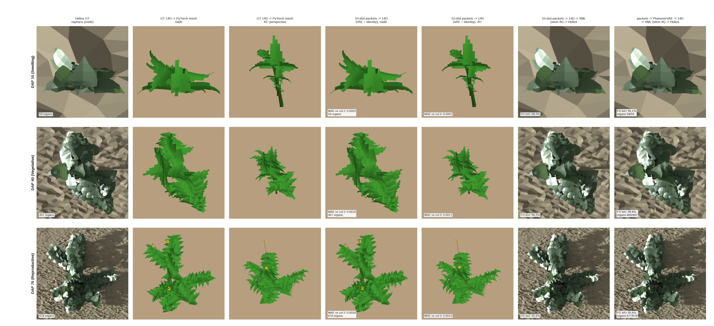

# Current State

What is running, what is being built, and what the evidence currently says. Read this first, then
[the agent handover guide](../agent-handover-guide/agent-handover-guide.md) for the full manual. Dated
sections below are newest first and are kept for the record.

**Where things live** (there is no `handovers/` folder: this file and the guide are the two entry points)

| Folder | Holds |
| :--- | :--- |
| `docs/current-state/` | this dashboard |
| `docs/agent-handover-guide/` | the master execution manual |
| `docs/experiments/` | result and measurement reports, figures beside each one |
| `docs/engineering/` | implementation and session records |
| `docs/architecture/` | design documents, specs, the code map |
| `docs/planning/`, `docs/archive/` | roadmaps; superseded material |

---

## 🔬 Running now (2026-09-18 00:05)

**Experiments**

| Experiment | State | What it found / decides |
| :--- | :---: | :--- |
| **The 09-07/08 lineage, re-measured honestly** | ✅ REDONE 2026-09-18, EARLIER VERDICT WITHDRAWN | Scored with **its own code** (0 missing / 0 unexpected tensors) over **all 20** eval plants it gets **29.8% IoU** (two runs: 27.9 and 29.8 — the flow ODE samples from noise, so single runs carry ~±2 pts), not the **24.8%** this dashboard cited. That 24.8% came from the 2026-09-07 evaluator looping `for b in range(min(B, num_samples_to_plot))` — the **first four** plants — and since the eval set is DAP-sorted ascending those four are DAP **2/3/11/12**, all seedlings, the bucket where every model scores 2–8%. The companion claim of **node RMSE 18.3 cm** is also unsafe: loading this checkpoint into *today's* model leaves **39 tensors at random init**, 25 of them in `coarse_stage`, which would cripple exactly that metric. **What the re-measurement does show:** the old model is competitive on bulk overlap but gets there by sprawling — hull **2.07x** GT, perimeter **1.73x**, solidity **0.295** against the plants' own 0.68. Today's organ run covers more (35.7%) with the right outline length (1.06). On mature plants (DAP>75) its boundary F is **18.2** against 29.2/29.1 today. So Heesup's memory was of something real, not a fluke — but it is over-spread, not better. Repro: `scratchpad/wt_870074f/rescore_sep07.py` (needs absolute dataset paths, ragged-tensor collation, and a `Digital-Crops` symlink — a bare `except Exception` around the render had been silently zeroing every prediction and reporting 0.0% IoU). |
| **Shape metrics on the finished A/B checkpoints** | ✅ DONE 2026-09-18 | All 20 plants, epoch 60, raw. **IoU and boundary F disagree, as suspected.** Holdout: organ **31.8** IoU / 30.2 bF, phytomer 28.2 / **34.7**. Fixed: organ **35.7** / 28.8, phytomer 32.3 / **31.0**. Organ covers more of the plant; phytomer places the outline better. The perimeter/hull pair says why: organ's outline is the right *length* (1.01/1.06) but mis-placed, phytomer's is 23–52% too long (fragmented) but better positioned. Organ over-spreads (hull 1.22 holdout / 1.57 fixed vs phytomer 0.96 / 1.37) — the Option B character, much reduced from the old lineage's 2.07 but present. Seedlings stay catastrophic for both, and organ's DAP<=15 hull ratio is **19.3x** on holdout. Data: `outputs/logs/20260918/rescore/*_shape.json`. |
| **Episodic silhouette collapse (open)** | 🔴 OPEN, 2026-09-18 | On scattered single epochs the rendered silhouette nearly vanishes while everything else stays healthy, then it recovers by itself. Phytomer hit it at epochs 7 (4.6%) and 9 (1.7%) before the DAP fix and again at **epoch 16 (2.4% holdout / 14.6% fixed-set)** after it, with `pred_dap` tracking ground truth through the collapse (40.0/43.8, 6.9/6.5, 80.1/79.8) and the count head tracking too. **It is NOT the dead DAP head**, and an earlier note here that the DAP fix closed it was wrong: the old run also scored a normal 20.9% and 18.9% at epochs 6 and 8 while `pred_dap` was already pinned at 0.0. The signature is narrow — node RMSE holds at 1.7-1.8 cm straight through, and the epoch before (15) was the run's best at 34.2% fixed-set / 13.3 cm — so suspicion falls on Stage 3 organ geometry going degenerate for one epoch (scale or existence), not on the scaffold. Because it is intermittent rather than a ratchet, any monitoring that samples every Nth epoch will miss instances; watch every epoch. **Diagnosed 2026-09-18 from the per-epoch figures, no checkpoint needed:** it is **organ existence collapse**. Comparing phytomer's epoch 16 panel against its epoch 29 panel on the same four plants, the organ counts fall 571 -> 86 (DAP 38), 458 -> 84 (DAP 68) and 1175 -> 462 (DAP 97), while the predicted phytomer counts stay correct (83.9/103, 82.1/56, 137.0/154) and node RMSE holds at 1.8 cm. The model keeps the scaffold and stops emitting organs, so panel (d) shows a sparse scatter of dots where a plant should be. The thing to chase is the per-organ existence logits going negative for an epoch, not Stage 3 geometry generally. Figures: `outputs/logs/20260918/run_38377985/hierarchical_self_consistency_epoch_{016,029}.png`. |
| **Option B A/B — organ vs phytomer** | ✅ DONE 2026-09-18 | Both runs COMPLETED all 60 epochs on identical data, eval set and schedule (jobs 38377984 / 38377985; organ 13h27m, phytomer 6h14m). **The result is a generalization difference, not a quality difference.** On the fixed (trained-on) set they tie, phytomer fractionally ahead: IoU 30.9 vs **31.4%** (phytomer wins 37/60) and depth 15.11 vs **14.05 cm**. On the holdout set organ wins clearly: IoU **30.6** vs 24.8% (organ wins **53/60**, last-10 mean **31.5** vs 25.1%), depth **17.19** vs 17.46 cm. Organ also holds better node RMSE (**1.71** vs 1.82 cm) and **never collapsed in 60 epochs** where phytomer collapsed twice. Since the real-image track is by definition unseen plants, holdout is the axis that matters. Cost: organ is 2.2x the wall clock, and ~75% of its step is the un-batched fine matcher (`match 0.33s` of a `0.44s` step vs phytomer's 0.02s of 0.14s) — fixable, not intrinsic, by giving the fine matching the `gpu_batch_greedy_assignment` treatment the phytomer-level matching already has. **Caveat: every number here is IoU**, which rewards blobby overlap; the figures show organ emits ~40% more organs while phytomer's skeletons align more tightly, and boundary F-score / solidity / hull ratio are what adjudicate between those. That re-scoring is the next step. |
| **vs the 2026-09-07/08 Option B lineage** | ✅ ANSWERED 2026-09-18 | Both of today's runs beat it. Same metric (self-consistency silhouette IoU, fixed 20-plant set): Sep 7/8 scores **24.8%** with node RMSE **18.3 cm** and a hull **4.35x** GT, against today's **~31%** at node RMSE **1.7 cm**. The old model earned its silhouette by gross over-spread; today's earns a higher one with structurally correct nodes, and does it on 10k samples for 60 epochs rather than the full dataset for 125-500. The remembered "45.4%" panel was one lucky 4-plant batch from a series running 39/26/34/27/45/49. |
| Option B's original checkpoints already exist | ✅ FOUND 2026-09-17 | `hierarchical_latent_fm/` holds the 2026-09-07/08 models, so the algorithm Heesup liked does **not** have to be retrained to be evaluated. Epochs 125–300 (written Sep 8–9) and 325–500 (Sep 7) are two different organ-mode runs: `slots_per_anchor=8`, `max_anchors=512`, no `flow_granularity` key at all, which predates the flag. **`hierarchical_fm_epoch_125.pt`, 2026-09-08 23:12, is the checkpoint behind the figure.** Epochs 025–100 are NOT Option B — a later phytomer run (Sep 11, `flow_granularity=phytomer`, 10 slots) overwrote them in the same directory. Three runs shared that folder and only the args stored inside each file distinguish them, which is why every new run now gets its own `OUTPUT_DIR`. Caveat for the A/B above: those runs used the **full** `cowpea_curv26` on a 500-epoch schedule, so the 10k/60-epoch pair answers "which algorithm learns better at equal budget", not "does this reproduce Sep 7". |
| Refinement step count | ✅ DONE | **The default was 5x too small.** 40 / 80 / 200 / 400 steps give refined strict P 66.3 / 69.1 / **73.7** / 70.0 — the curve peaks near 200 (mature plants 80.7). Every refined number in this project's history was measured before the search converged. A cosine learning-rate schedule (−2.3) and continuous existence (−1.8) both hurt. Plan §8. |
| Appearance gap | ✅ DONE | Pixels alone cost **38.1 → 28.6** raw and 66.3 → 59.2 refined on identical geometry, reproducing the real-image failures (wrong DAP, existence collapse) on synthetic plants. Plan §5. |
| Stage 3 readout | ✅ DONE, NOT PROMOTED | Regression, and regression with correct nodes, both collapse to the dataset mean (R² −0.064, **+0.001**). The conditioning is the limit: one 7.5 cm token holds 7–15 phytomers, a 12 cm ROI still 12–22, so the same input has many targets and the mean is the optimum. The flow stays — its latents have the only realistic spread and are the best refinement start. Plan §6.1–6.2. |
| Appearance augmentation fine-tune (`sub10_v10_cam_aug`) | ⏸ PAUSED at ep165 | Whether training on real-soil/shaded pixels fixes the brittleness. Was recovering when paused (count 34 → 46 of 55, holdout back to 39–44%). Its ep161–165 saw the wrapped-shadow bug, so a clean restart from ep160 is the safer resume. |
| Whole-frame multi-plant pipeline | 🟡 RUNNING | 4 frames at `--init helios --steps 200`, no plant cap. Figure: `docs/experiments/20260916-multiplant-scene/assets/20260917_multiplant_pipeline.png`. Plan §9.4–9.5. |
| Backbone ladder (latent ceiling) | ⚪ QUEUED | Whether a finer feature grid recovers per-node information: DINOv2 224 (75 mm/cell) → 448 (37.5) → DINOv3-satellite → Swin V2 stride 8 (18.8) and 4 (9.4), plus a 12 cm ROI crop as the ceiling. Pure ridge probe, no training. |
| Resolution of the refinement target | ⚪ QUEUED | The target is loaded at 128 px while the cache holds 256; raising the render past the target only sharpens a prediction against a blurry target. A GT depth pyramid re-rendered at 512 is the decisive arm. |

**Engineering**

| Change | State | Why |
| :--- | :---: | :--- |
| `REPO_ROOT` under `sbatch` in all three `scripts/*.sh` launchers | ✅ LANDED 2026-09-17 | **Every SLURM submission had been failing since the `d78796f` restructure**, which swapped a hardcoded repo path for `$(dirname "${BASH_SOURCE[0]}")/..`. That is right for `bash scripts/...` but wrong under `sbatch`, which executes a spooled copy at `/var/spool/slurmd/job<ID>/slurm_script`: `REPO_ROOT` became `/var/spool/slurmd` and the first `mkdir` died with "Permission denied" one second in, under `set -e`. It read as a filesystem problem, and it stayed hidden because all work since the restructure ran locally. Now `SLURM_SUBMIT_DIR` is tried first, `BASH_SOURCE` second, each walked up to a repo marker, and an unresolvable case exits with both candidates named instead of creating directories somewhere arbitrary. |
| Per-sample targets in the matcher's fine pass (`hierarchical_hungarian_matcher.py`) | ✅ LANDED 2026-09-17 | `t_label` / `t_geom` are loop variables of Pass 1, and Pass 3 read them without re-reading them per sample, so **every sample was matched against the last sample's organs**. With an earlier sample larger than the last, indexing ran past the end and the CUDA kernel raised `index out of bounds`; when the counts happened to line up it matched the wrong plant in silence. Only organ granularity reaches this code — phytomer mode takes the batched matcher — which is why it survived unseen, and why it blocked the Option B run above. Pinned by `tests/test_matcher_fine_per_sample_targets.py` (per-sample equivalence; all three cases fail without the fix). |
| `plant_recon/dataset/appearance_augment.py`, `tools/build_soil_bank.py` | ✅ IN USE | Real soil from the rover frames, shading and cast shadow from the CHM gradient, and **two lighting regimes** (sunlight, rover lamps with distance falloff). Moves the training distribution toward real photos at every zoom; Helios is *further* from real than the flat render at 2x–8x. Plan §7, §9.2. |
| Fixed-metre real crop window (`base_window_px`) | ✅ LANDED | Real plants reached the network **3.7x too large** (480 px vs 1795). Plan §7.3. |
| `plant_recon/eval/ckpt_compat.py` | ✅ LANDED | Pre-restructure checkpoints store `diffusion_based/...` paths; every eval script failed on the best lineage until this remap. Plan §9.1. |
| `use_cases/real_world/` repo-root depth + imports (9 files) | ✅ LANDED | The whole real-image pipeline could not run after the restructure. Plan §9.1. |
| Refinement options `--lr_schedule`, `--refine_px`, `--input_px`, `--target_dir` | ✅ LANDED | The loop rendered at a hardcoded 128 px while scoring at 256, and read a 128 px target from a 256 px cache. |
| Optimised part tensor rendered before XML export | ✅ LANDED | The XML round trip loses each plant's placement (only 1 of 3 kept `base_position`), so the optimiser's own output is now rendered and saved directly. Plan §9.4. |
| Per-node ROI conditioning for Stage 3 | ⚪ NEXT | The measured fix, gated on the backbone ladder. |

**Documentation**

`handovers/` was dissolved (2026-09-17): this dashboard and `agent-handover-guide/` are the two entry
points, the dated records moved to `engineering/` and `experiments/`, the onboarding page was absorbed as
the guide's §0, and 47 figure references became actual embeds — the recent reports cited figures as plain
paths, which is why a restructure tool had judged many of them unreferenced.

---

*Pixels alone cost 10 points of raw strict P on identical geometry (38.1 → 28.6), which is what makes the
real-image track fail. Plan §5.*

*The augmentation now under test: real soil from the rover frames, shading and cast shadow derived from
the CHM gradient. It moves the training distribution toward real photos at every zoom level, while Helios
itself is further from real than the flat render at 2x-8x. Plan §7.*

---

## 🚨 CURRENT SYSTEM STATE (2026-09-16, Claude Code handover)

Read this section first; the 2026-09-14 table below it is the previous state, still accurate for
anything this section does not contradict.

### Synthetic track — plateaued, and the plateau is the finding

| Component | Status | Details |
| :--- | :---: | :--- |
| **Raw model quality** | 🟡 PLATEAU | Strict-protocol P sits at **33–39** no matter what. Every training lever tried over 2026-09-15/16 — Stage 3 geometry, teacher forcing, latent normalisation, multizoom, node-token window, existence-count weight, render-to-latent, render-to-exist, a render-fraction curriculum, 10% vs 100% of the data — lands in that band. Treat this as an architecture/information limit, not a tuning problem, until something structural changes. |
| **Test-time refinement** | 🟢 THE LEVER | 40 AdamW steps on node positions / scales / latents against the input CHM lifts the same checkpoints to **P 67–68** (`eval_test_time_refinement.py`, defaults now `--input_camera`, `reg_scale 5`, `reg_latent 0.5`, four zoom targets). This is the largest single gain found and it needs no retraining. |
| **Guided sampling** | 🔴 NOT WORTH IT | DPS-style render guidance inside the ODE (`eval_guided_sampling.py`, `guidance_fn` hook in `sample_ode`) is roughly neutral alone (35.2 → 37.3 at `--guide_start_frac 0.5`) and actively **hurts** when chained into refinement (63.2 vs 67.6). The two mechanisms interfere; do not combine them without a new idea. |
| **Best lineage** | 🟢 | `hierarchical_fm_v10_cam/` — full data + input camera + EMA. ep160 raw 38.7 / refined **68.3**, the best numbers to date. |

### Real-image track — the pipeline runs end to end; the reconstructions are not yet usable

**Be blunt with yourself here: no real-image reconstruction has been shown to be geometrically
correct.** What exists is plumbing that works and a set of well-localised reasons it does not.

| Component | Status | Details |
| :--- | :---: | :--- |
| **Plant detection** | 🟢 WORKS | AgML `gemini_plant_detection_2022` box detector mAP50 **0.975**; Roboflow `t4_plant_weed_seg` instance-segmentation detector mAP50 0.844 plant / 0.612 weed. Detection is not the bottleneck. |
| **Whole-frame multi-plant pipeline** | 🟢 RUNS | `use_cases/real_world/eval/run_multiplant_scene.py`: frame → detections → plot metres → Helios `params.json` → per-plant XML → model state → differentiable-renderer refinement → XML → one rendered plot. Follows the `Image2PlantArchitecture_v2` params.json convention. |
| **Helios XML export fidelity** | 🟢 FIXED | Exports now match the source structurally (leaves 76/77, 100/101, 160/161, 130/131; shoots 5/5, 8/8, 12/12, 10/10). Previously a packet-decoded plant exported as ONE unifoliate shoot, which cost two of every three leaflets — see [20260916-multiplant-scene.md §7](../experiments/20260916-multiplant-scene/20260916-multiplant-scene.md). |
| **Network cold start on real crops** | 🔴 BROKEN | Collapses: 14 of 20 AgML crops sampled a **single live phytomer**; on the Roboflow frame two plants came back with 8 and 38 organs. Refinement cannot fix what is not there (nodes move 0.0–1.0 cm). |
| **Refinement on real crops** | 🔴 INFLATES | Against a loose target it grows leaves rather than fitting them: leaf scale max 0.0865 → **0.208–0.221** (2.4–2.6x) on the AgML frame. The per-component absolute cap (`--scale_abs_max_len/_rad`, calibrated 2026-09-16) stops the flat-polygon failure but bounds the phytomer scale `s_a`, not realized organ size. |
| **Does a real mask fix it?** | 🔴 NO | On the Roboflow frame (real instance masks, a much tighter Dice target) the Helios-init data losses are **0.76–3.03**, i.e. WORSE than the AgML bbox-target numbers (0.58–0.67). That confirms the AgML numbers were inflation filling a loose target, and that fit quality on real images is genuinely poor. |
| **Pixel → metre scale** | 🟡 ASSUMED | The rover camera has no intrinsics here; only its 1.5 m height is known. `--plot_width_m` (default 1.3, the Davis plot width) sets the scene's absolute scale by assumption. |
| **Stage 3 conditioning, settled (2026-09-17)** | 🔴 THE LIMIT | Follow-up run `sub10_v10_cam_s3reg_tf` (regression head conditioned on GT nodes, p 0.5, 1 cm jitter): with correct node positions the head still outputs the dataset mean exactly (latent RMSE 4.656 vs the mean latent's 4.658, R² +0.001; spread 0.07 vs GT 0.177). Node error is not what hides the per-node shape and neither is the flow objective — what Stage 3 is *given*, one bilinear token at 7.5 cm pitch from a frozen backbone, does not contain the phytomer's shape. Per-node high-resolution ROI patches are now the necessary next change for Stage 3. The flow stays as the readout: its latents have the only realistic spread (0.183 vs GT 0.177) and are the best refinement start (flat 66.3 vs 61-65 regressed/mean). Plan §6.2. |
| **Appearance: the target is real photos, not Helios (2026-09-17)** | 🟢 BUILT | Measured with DINOv2 MMD against 220 real plant crops cut at the cache's own framing: the new augmentation (real soil from the rover frames + shading and cast shadow computed from the CHM gradient + photometric jitter, `plant_recon/dataset/appearance_augment.py`, `--appearance_augment`) moves the training distribution toward real photos at every zoom (0.61→0.42, 0.54→0.34, 0.55→0.43, 0.54→0.47), while the **Helios raytraced render is further from real than the flat render** at zooms 2x-8x. So §5's 10-point drop shows brittleness to any appearance shift, not that Helios is the target; training toward Helios (plan §2.1 as first written) would have been a mistake. Helios keeps its value as a held-out robustness probe. Plan §7. |
| **Real crop framing, fixed (2026-09-17)** | 🟢 FIXED | The real-image crops were cut at 1.2× the detector box while training renders a fixed 1.2 m ground window: **3.7× too large** for a typical detection (480 px vs 1795 px), which is the likely mechanism behind the over-predicted DAP. `base_window_px()` now cuts the fixed metre window (`--plot_width_m`, legacy behaviour at 0). Plan §7.3. |
| **Stage 3 regression readout (2026-09-17 01:15)** | 🔴 NEGATIVE | `--stage3_regression` (same decoder and conditioning, z_0 = 0 / t = 0 so the state is regressed directly) fine-tuned 10 epochs from v10_cam ep160 on the 10% protocol (`sub10_v10_cam_s3reg`, paused at ep170): the head converged to the conditional mean in two epochs (latent R² −0.59 → −0.06, per-dim spread 0.18 → 0.07, GT geometry + predicted latent 47.0 → 41.3, P 38.7 → 37.2) and is a worse refinement init than the mean latent (flat 61.3 vs 66.6, Helios RGB 55.3 vs 58.3). Conclusion: the conditioning at 7.5 cm token pitch gathered at Stage 2's nodes carries no per-node shape a direct readout can extract; the objective was not the limit. IoU rewards realistic spread (flow's plausible-but-wrong latents +8 over the mean under GT geometry), so the flow stays as a proposal distribution. Next: GT-node-conditioned regression as the node-error vs resolution diagnostic, then the per-node high-res ROI patch — plan §6.1. |
| **Appearance gap, measured (16:30–18:30)** | 🔴 LARGE | Same 20 eval plants, same ep160 EMA checkpoint, same CHM planes and refinement targets, only the 12 RGB planes swapped from the flat cache render to a Helios raytraced re-render at the cache's exact framing (`render_helios_eval_crops.py`, framing verified per plant): strict P **38.1 → 28.6** raw, **66.3 → 59.2** refined. Seedlings (DAP ≤ 15) go 31.4 → 12.0 refined with the DAP probe off by 51 days (DAP 2 read as 67); mature plants (> 75) 48.8 → 32.4 raw with DAP under-read by 25 days and 40% fewer active nodes; mid-season plants unchanged. This reproduces the real-image failure modes (wrong DAP, existence collapse) on synthetic geometry, so pixels alone account for them — see [20260916-sim-to-real-assessment.md §5](../experiments/20260916-sim-to-real-assessment/20260916-sim-to-real-assessment.md). The network reads only RGB (`DINORayEncoder.forward`), and training RGB is flat with no augmentation, which is the lever. |

**Where to start next on this track** (in the order most likely to matter; updated 18:30 after the
appearance-gap measurement, [20260916-sim-to-real-assessment.md §5](../experiments/20260916-sim-to-real-assessment/20260916-sim-to-real-assessment.md)):
1. Close the appearance gap in training: fine-tune the ep160 lineage on Helios raytraced RGB crops
   at the cache framing (`render_helios_eval_crops.py` shows the recipe; the training set needs the
   same re-render or a crop of the auto-framed dataset JPEGs) plus ordinary augmentation, and
   re-measure with the same flat-vs-Helios protocol. The single-phytomer collapse and the wrong DAP
   on real crops are what this gap does to the DAP probe and the existence gate.
2. Fix the real crop framing: a fixed 1.2 m ground window from the pixel-to-metre scale, not 1.2×
   the detector box (`real_plant_crop_utils.py`, plan §1.3).
3. Bound realized organ size, not `s_a`, so refinement cannot inflate leaves regardless of target;
   make existence a continuous variable in refinement.
4. Only then revisit the cold-start comparison, on the segmentation-mask source.

---

## Previous system state (2026-09-14 ~11:30 PDT, Claude Code handover)

| Component | Status | Details |
| :--- | :---: | :--- |
| **Main training** | 🟢 CLUSTER, 2 GPU | Job **`38253656`** (gpu-6000_ada-h, gpu-10-54, 24 h): v9 lineage, `AUTO_RESUME` from `hierarchical_fm_v9/hierarchical_fm_epoch_025.pt` at batch 48/GPU, `NUM_WORKERS=8`, on `25c2251` — the training step without per-sample Python: vectorized packet assembly (`f3c5366`), parent links in the loader workers + one VAE encode per batch + one nvdiffrast pass for all rendered plants (`a1a82bc`), pointer-jumping `chain_phytomers` + batched matcher over the padded batch (`25c2251`). Step at batch 48: 1.9 s this morning → 0.15-0.24 s (1 GPU). Output `hierarchical_fm_v9/`, log `outputs/logs/20260914/hierarchical_fm_38253656.log`, panels `outputs/logs/20260914/run_38253656/`. Predecessors today: `38253029` (epochs 16-21, ~9 min/epoch), `38253401` (epochs 22-25, ~7 min/epoch; IoU 32.6-35.5%, node RMSE 1.8-1.9 cm). |
| **Cluster jobs (queued)** | ⚪ NONE | The `low`-partition resubmissions (`38249632`, `38250275`) were cancelled 9/14 10:13. The lineage lives only in `38253656`; it hits the 24 h limit ~9/15 14:45 — resubmit then with `AUTO_RESUME=1` (same OUTPUT_DIR) or queue a `low`/`publicgrp` continuation with `--requeue`. |
| **Stage 2 gradient burst** | 🟢 FIXED | The coarse `nn.TransformerDecoder` had no final LayerNorm, so its raw residual stream fed the bf16 phytomer self-attention (design doc §1.9.2). `FM_DECODER_FINAL_NORM=1` + `FM_SELFATTN_FP32=1` (defaults): 0/8 burst steps on the frozen burst state vs 8/8. Consider it closed once the run passes epoch ~30 (the v8 lineage burst at 27-28). |
| **PhytomerVAE** | 🟢 DEFAULT | `phytomer_vae_v9_tl_rw4_20k` — 128D hybrid (48 coarse + 10×8 per-slot residual), terminal-last packets, 20,000 files. Export VAE (eval scripts default to it, `PHYTOMER_TERMINAL_LAST=1`) and the FM training VAE of the v9 run. |
| **Packet cache** | 🟢 VAE-INDEPENDENT | `dataset/cache/cowpea_curv26_pkt_v9/` — 100,000 files, `pkt_version` 7, terminal-last packets. Since 2026-09-14 the cache stores only packets/presence/centers/refs/keys and FM encodes the Stage-3 latents on the fly from them, so the cache is VAE-independent (a new VAE needs no rebuild). The packet ORDER still must match the VAE: v9 runs pair this cache with `PHYTOMER_TERMINAL_LAST=1`; v8 runs keep `cowpea_curv26_pkt/` (pkt 6, `PHYTOMER_TERMINAL_LAST=0`). |
| **Helios round-trip, exact_gt DAP 10/50/90** | 🟢 SOLVED | fig14: IK-only **99.9 / 99.6 / 97.7%**, VAE round-trip **93.7 / 98.3 / 95.8%** FG IoU (`docs/experiments/20260914-stage2-burst-fix-roundtrip/assets/fig14_phytomer_vae_helios_roundtrip.png`). |
| **Helios round-trip, dataset DAP 15/40/75** | 🟢 SOLVED | fig12: packet path **98.3 / 98.2 / 95.6%**, VAE **95.1 / 96.8 / 95.6%** (was 81.8 / 92.2 / 54.6 on the morning of 2026-09-14; `docs/experiments/20260914-stage2-burst-fix-roundtrip/assets/fig12_phytomer_10slot_helios_roundtrip.png`). |
| **Topology targets** | 🟢 FIXED | `gt_parent_links(..., internode_base=)` resolves 97.8% of lateral branch points (was 66.2%; the training call site passes the decoded base). `chain_phytomers` follows drooping shoots (same-shoot links 100% on 30 plants) and keeps the cotyledon node as shoot 0 (`root_own_shoot`). |
| **Export (14D → Helios XML)** | 🟢 | Analytical converter + **stem IK** (`part_tensor_stem_ik.py`) + **leaf IK** (`part_tensor_leaf_ik.py`), both on by default (`PART_TENSOR_STEM_IK`, `PART_TENSOR_LEAF_IK`). |
| **The 09-07/08 "45.4%" Option B panel** | 🟢 EXPLAINED | A 4-plant random-batch mean at one of six evaluations (series 39/26/34/27/45/49). The same checkpoint with its exact code scores **24.8%** on today's 20-plant set (today's runs: 30–34). Not a bar; its one transferable property is the unit-variance latent (takeover guide §0-B.9). |
| **Heesup's regeneration jobs** | ⛔ DO NOT CANCEL | `regen_shard` / `regen_synth` / `regen_mopup` (geminigrp) — they hold the group's GPU quota; training goes to `low`/`publicgrp`. |

---

## Active Documents

| Document | Purpose |
| :--- | :--- |
| **[20260916-sim-to-real-assessment.md](../experiments/20260916-sim-to-real-assessment/20260916-sim-to-real-assessment.md)** | **2026-09-16, plan:** what the code adds to the handover (the network reads RGB only; training RGB is flat with no augmentation while Helios raytraced renders sit unused; the real-image crop framing does not match the cache's fixed 1.2 m window), ranked training-side and real-image-side next steps, and the appearance-gap measurement being run first (`render_helios_eval_crops.py` + `eval_test_time_refinement.py --rgb_override_dir`) |
| **[20260912-stage2-stage3-boundary.md](../engineering/20260912-stage2-stage3-boundary/20260912-stage2-stage3-boundary.md)** | **Primary record (read §5 first):** §0 status, §1.9.2 gradient-burst root cause + ablation, §2.1-2.3 Stage 2/3 boundary redesign, §2.4-2.5 round-trip + stem IK, **§2.6 dataset-plant round-trip (chaining, branch points, leaf IK)**, §6 commit log |
| **[`docs/experiments/20260916-multiplant-scene/20260916-multiplant-scene.md`](../experiments/20260916-multiplant-scene/20260916-multiplant-scene.md)** | **2026-09-16, real-image track:** whole-frame multi-plant reconstruction (detection → Helios params.json → per-plant XML → model state → refinement → plot render), the Helios-procedural cold start, the per-component scale cap calibration, and §7's XML-export bug (two of every three leaflets dropped) with its fix |
| **[`docs/experiments/20260916-agml-dataset-swap/20260916-agml-dataset-swap.md`](../experiments/20260916-agml-dataset-swap/20260916-agml-dataset-swap.md)** | 2026-09-16: swapping the real-image source from Roboflow to AgML, the stronger detector, and why box-only sources break the plausibility priors |
| **[`docs/experiments/20260915-real-image-first-test/20260915-real-image-first-test.md`](../experiments/20260915-real-image-first-test/20260915-real-image-first-test.md)** | 2026-09-15: the first real-image pass — Roboflow segmentation detector, rover-margin cropping, Depth Anything pseudo-CHM, the canvas-inflation diagnosis |
| **[agent-takeover-guide.md](../agent-handover-guide/agent-handover-guide.md)** | Master handover; §0-A is the 2026-09-14 state, later sections are the 2026-09-11 state where not contradicted |
| **[`docs/experiments/20260914-stage2-burst-fix-roundtrip/20260914-stage2-burst-fix-roundtrip.md`](../experiments/20260914-stage2-burst-fix-roundtrip/20260914-stage2-burst-fix-roundtrip.md)** | 2026-09-14 report: burst fix, dataset-plant round-trip, figures, training state (Korean) |
| [20260911-grad-norm-fix-roundtrip.md](../engineering/20260911-grad-norm-fix-roundtrip/20260911-grad-norm-fix-roundtrip.md) | 2026-09-11: grad-norm deadlock fix, 10-slot contract restore, first round-trip collapse diagnosis |
| [20260911-hybrid-vae-rotation-topology.md](../engineering/20260911-hybrid-vae-rotation-topology/20260911-hybrid-vae-rotation-topology.md) | 2026-09-11: hybrid 128D VAE, rotation capacity, topology-recovery ablation |
| [20260909-phytomer-latent-matching.md](../engineering/20260909-phytomer-latent-matching/20260909-phytomer-latent-matching.md) | Engineering log: phytomer latent, Stage-3 decoder, pipeline refactor |
| [phytomer-vae-latent-visualizer.md](../tools/phytomer-vae-latent-visualizer/phytomer-vae-latent-visualizer.md) | PhytomerVAE latent visualizer GUI |
| [20260908-phytomer-capacity-recalibration.md](../engineering/20260908-phytomer-capacity-recalibration/20260908-phytomer-capacity-recalibration.md) | Node capacity logistic recalibration, gradient-safety audit |

---

## Next steps (2026-09-16)

The ranked lists live in [20260916-sim-to-real-assessment.md](../experiments/20260916-sim-to-real-assessment/20260916-sim-to-real-assessment.md) (§2 training side, §3 real-image side, §5 the measurement that set the order). In one line each:

| Priority | Task | Where |
| :--- | :--- | :--- |
| **P0** | **Close the appearance gap in training**: fine-tune the `hierarchical_fm_v10_cam` ep160 lineage on Helios raytraced RGB at the cache framing plus ordinary augmentation; re-measure with the flat-vs-Helios protocol (`plant_recon/eval/render_helios_eval_crops.py`, `eval_test_time_refinement.py --rgb_override_dir`). | plan §2.1, §5 |
| **P1** | **Fix the real crop framing** to a fixed 1.2 m ground window from the pixel-to-metre scale (`use_cases/real_world/dataset/real_plant_crop_utils.py`). | plan §1.3, §3.2 |
| **P2** | **Existence as a continuous variable in refinement**, and a bound on realised organ size in metres rather than on `s_a`. | plan §2.2, §3.4 |
| **P3** | Pick DAP from measured plant size; per-leaf masks and a DINOv2 feature loss as refinement targets; clean the pseudo-CHM; real-image proxies (leaf count, mask IoU, extent). | plan §3.3–3.6 |
| **P4** | Stop investing in the Stage 3 latent (deploy Stage 2 nodes + mean latent + refinement); try `dinov2_vitb14` with multizoom; use more than 20 eval plants for decisions. | plan §2.3–2.5 |

## Next steps as of 2026-09-14 ~11:30 (superseded, kept for the record)

Every job named below has ended; the v10_cam lineage finished at ep160 on 2026-09-16 (raw 38.7 / refined 68.3). The P2 cell is the compressed 2026-09-14/15 chronology; the full version is takeover guide §0-B.9.

| Priority | Task | Notes |
| :--- | :--- | :--- |
| **P0** | **Watch the v9 run past epoch 30** | canary hits, Stage 2 Scl/Ord/Ext losses, and the per-epoch self-consistency panels; the goal is rendering that matches the original, not the loss alone. With the assembly vectorized, epochs are ~6x faster; re-measure whether a larger batch now pays (the 256 measurement was made with the old assembly loop dominating). |
| **P1** | **Keep the lineage alive past the 24 h limit** | `38253656` ends ~9/15 14:45; resubmit with `AUTO_RESUME=1` into `hierarchical_fm_v9/` (or a `low` job with `--requeue`). |
| **P2** | **Stage 3 A/B, three runs (takeover guide §0-B.9)** | From epoch 45: baseline `38257989` (cluster), geometry run `STAGE3_GEOMETRY=1` (local, `local_s3geom_ab2.log`), teacher-forcing run `STAGE3_GT_NODES=1` (local, `local_gtnodes_ab.log`). Baseline 46-65 mean 31.3, 66-82 mean ~35 (best 38.1) — but under the strict 256 px protocol its P is flat (27.5 at ep50 → 27.3 at ep80) and its existence head under-predicts (57 of 73 GT nodes active), so read the in-training IoU as a trend only. Geometry 47-55 mean 31.1 = baseline over the same span (Vel still falling; ablation P 27.5→29.6 but its sampled latent stays noisy, std 0.46 vs GT 0.18). gt_nodes 46-52: 32.8/31.2/35.8/**39.4**/32.6/32.2/33.9% (mean 34.0 vs baseline 30.6 at the same epochs, deployable output). Overnight (9/15 08:40, strict protocol at the latest checkpoints): baseline ep135 P 28.9 (flat, existence 55/73), geometry ep76 P **33.9** (climbing), gt_nodes ep70 deployable 29.4 / teacher-forced 45.3, latent R² 0.41; in-training the baseline fell back to ~30 after peaking at 36. **10% protocol readings (9/15 12:20, results report §11.1-11.3):** every run plateaus within 10 epochs on 10k plants — geometry family (combination 34.2, **v10 full 35.1-36.0** strict P, young plants 18) vs 26-29 for baseline-on-10%, standardized latent, scheduled TF (deployable; teacher-forced 44) and render→latent; no run memorizes the training plants, no run's latent carries per-node information, and the coverage loss does not spread the nodes (the matcher already pairs every GT phytomer; the deficit is existence gating and 4-6 cm node error at 7.5 cm per DINOv2 token). Running v10 variants: render every sample (`38274747`), lr 2e-4 (`38274748`), unfrozen backbone and 3×3 token window + t0 (local). **Test-time refinement** (`eval_test_time_refinement.py`, 40 Adam steps of nodes/scales/latents against the input CHM, no GT) lifts v10 ep95 from 37.0 to **44.3** strict P (DAP > 15: 41.7 → 52.0) — the largest gain of the day; variants with input-loss model selection running. Its ep50/ep55 checkpoints: with GT nodes the latent is worth +7.8/+9.6 IoU over the mean latent (baseline +2.5) and per-node R² 0.115/0.187 (baseline ≈ 0) -> node error does starve the latent; with Stage 2's nodes the strict protocol gives P 20.2/23.9 (baseline 27.3) = exposure bias, recovering. `low` is blocked by other users' RAM, not GPUs, and Heesup says geminigrp's `gpu-6000_ada-h` allows up to 8 high-priority GPUs, so the runs run as six independent 1-GPU jobs there (first started 10:32 9/15, rest as GPUs free) — on **10% of the data** (Heesup's proposal: check convergence on 10k plants first, ~1 min/epoch, same 20 eval plants force-included via `EVAL_SET_FILE`, 20 held-out plants reported as `[Holdout]`): `38274493` baseline-on-10% → `38274494` `LATENT_NORM=1` → `38274495` scheduled TF → `38274496` `RENDER_TO_LATENT=1` → `38274497` combination → `38274498` v10 full (all six v10 pieces, design doc §2.7). Same-plant check vs the 9/8 Option B: its nodes are scatter (RMSE 18 cm, hull 4.4× GT), today's runs under-spread (hull 0.5–0.7×, 25% of GT phytomers within 3 cm) — node spread is the lever after the latent. 10:55 9/15: the local full-data geometry (ep80) and gt_nodes (ep78) runs were stopped on Heesup's request; this node's GPU now runs the 10% combination and v10-full runs (`local_sub10_combo.log`, `local_sub10_v10.log`). Caveat: `gpu-10-50` (inside desktop job `38252204`, ~24 h left) has been draining since 17:20 — resubmit from the checkpoints if it reboots (commands in takeover guide §0-B.9). **Finding:** Stage 3's latent carries no per-node image information (sampled latent worse than the dataset-mean latent, R² −0.34; t=0 estimate R² ≈ 0.1) while the GT latent is worth +33-38 IoU with GT geometry. Run 4 `RENDER_TO_LATENT=1` = `low` job `38260124` (2×A100, from epoch 45, `hierarchical_fm_v9_r2l/`); then a unit-variance latent scale for the flow.  **9/15 13:20, best deployable so far: test-time refinement** (`eval_test_time_refinement.py`, 40 Adam steps on node positions/scales/latents against the input CHM, no GT): v10 ep95 strict P 34.9 → 46.9 origin-frame; 33.5 → **62.9** in the input's camera frame (`--input_camera`, DAP > 15 38.4 → 74.5) but with inflated flat leaves on some plants; a scale/latent prior (`--reg_scale 5 --reg_latent 0.5`) removes the inflation and keeps the gain (six figure plants 39.6 → 70.4; all 20 plants strict P 35.8 → 63.9 with 1×/2× targets, **35.8 → 67.6** with all four zoom levels as targets, DAP > 15 41.1 → 74.0; these are now the script defaults); figures `docs/../agent-handover-guide/assets20260915_test_time_refinement_before_after*.png` (results report §11.7–11.10). The same camera frame now exists for the training loss (`RENDER_INPUT_CAMERA=1`; 10% run `sub10_v10_cam` local, ep80/85 strict P 35.8/34.0). **Scale-up (14:15): full-data v10 + input camera, job `38275054` on ada-h (2 GPUs), checkpoints `hierarchical_fm_v10_cam/`; the plateaued 10% cluster jobs were cancelled for it. Raw checkpoints swing (ep80 27.5, ep85 14.0 strict P; refined 64.6 / 53.3), so EMA weights were added (`EMA_DECAY=0.999`, `<ckpt>_ema.pt`) and job `38279147` continues the lineage with EMA from ep90. Refinement from a DAP-spanning mean latent (`--init_mean_latent`) reaches 66.5 for both the 10% v10 and the full-data ep90 checkpoint: the sampled latent is dispensable, the network's contribution is the nodes. Full-data ep95–110: strict P climbs slowly (raw 35.9 → 38.3, EMA 35.1 → 39.0 at ep110, best of any run) while the refined level stays 65–68; the lineage completed ep128 and continues to ep160 as job `38332343` (2026-09-16; ep128 raw 38.1 / EMA 37.7, refined 67.0).** |
| **P3** | **Export residuals** | terminal leaflets (one free angle, 1-1.6° mean), first-node petiole azimuth (only the shoot base roll can set it; a naive roll step was reverted), 2.2% of laterals still resolve to the wrong branch point |
| **P4** | Housekeeping | delete diagnostic checkpoint dirs (`local_probe_burst`, `local_act_probe`, `local_replay_*`, `local_smoke_parent`) if space matters |
