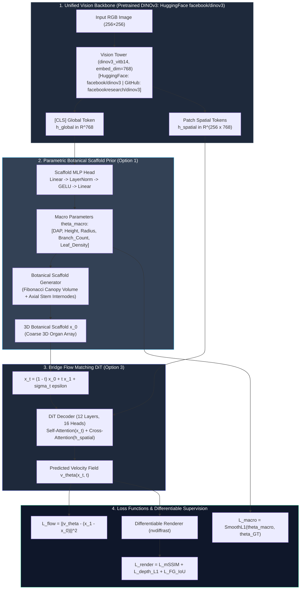

# VLM-Scaffold-DiT: Unified Vision-Language Scaffold Flow Matching Architecture

> **Date**: 2026-08-23  
> **Topic**: Architectural Specification for Option 1 + Option 3 Integration (Pretrained Vision Tower + Parametric Botanical Scaffold Prior + Continuous Flow Matching)  
> **Status**: Designed & Scheduled for Phase 2 Implementation  

---

## 1. Motivation & Theoretical Formulation

### 1.1 The Fundamental Trade-off in 3D Plant Reconstruction
1. **Vision-Language Models (VLMs / Autoregressive Transformers)**:
   - **Strengths**: Global phenotyping, developmental stage (DAP) estimation, species habit identification, discrete branching topology rules.
   - **Weaknesses**: Cannot accurately localize overlapping 3D continuous organ coordinates from 2D pixels; lack differentiable rendering gradients.
2. **Diffusion Transformers (DiT / Continuous Flow Matching)**:
   - **Strengths**: Sub-millimeter continuous 3D Euclidean regression, $SO(3)$ continuous rotation alignment, direct compatibility with differentiable rasterization losses.
   - **Weaknesses**: Cold-start singularity when integrating from pure Gaussian noise $\mathcal{N}(0, \mathbf{I})$ or zero vectors, leading to trajectory crossings in complex multi-branch canopies.

### 1.2 The Unified Resolution: VLM-Scaffold-DiT
By combining **Option 1 (Parametric Botanical Scaffold Prior)** and **Option 3 (Shared Pretrained Vision Backbone)**, we achieve a single end-to-end differentiable pipeline:

$$\text{Image } I \xrightarrow{\text{Vision Tower}} \begin{cases} h_{\text{global}} \xrightarrow{\text{Scaffold Head}} \hat{\theta}_{\text{macro}} \xrightarrow{\text{Generator}} x_0 (\text{3D Coarse Scaffold Prior}) \\ h_{\text{spatial}} \xrightarrow{\text{Cross-Attention}} v_\theta(x_t, t, h_{\text{spatial}}) \xrightarrow{\text{ODE}} x_1 (\text{Exact 3D Plant}) \end{cases}$$

---

## 2. System Architecture & Component Design

---

## 3. Mathematical Details

### 3.1 Macro Parameter Prediction
The global token $h_{\text{global}} \in \mathbb{R}^{D}$ is mapped to normalized biological traits:

$$\hat{\theta}_{\text{macro}} = \sigma\left(\mathbf{W}_2 \cdot \text{GELU}\left(\text{LN}(\mathbf{W}_1 h_{\text{global}} + \mathbf{b}_1)\right) + \mathbf{b}_2\right)$$

$$\begin{aligned}
\widehat{\text{DAP}} &= 5.0 + 95.0 \cdot \hat{\theta}_0 \quad (\text{days}) \\
\hat{H} &= 0.05 + 0.95 \cdot \hat{\theta}_1 \quad (\text{meters}) \\
\hat{R} &= 0.05 + 0.95 \cdot \hat{\theta}_2 \quad (\text{meters}) \\
\hat{N}_{\text{active}} &= 12 + (N_{\text{max}} - 12) \cdot \hat{\theta}_3 \quad (\text{organ slots})
\end{aligned}$$

### 3.2 Dynamic 3D Botanical Scaffold Generation
Given $\hat{\theta}_{\text{macro}}$, the scaffold $\hat{x}_{\text{scaffold}} \in \mathbb{R}^{N \times 26}$ is generated analytically:
1. **Internodes (Stem Axis)**:
   $$\mathbf{b}_k^{\text{stem}} = \left[ 0, \, 0, \, \frac{k}{K_{\text{stem}}} \hat{H} \right]^T, \quad \mathbf{d}_k = [0, 0, 1]^T$$
2. **Leaves & Petioles (Fibonacci Canopy Volume)**:
   For leaf slot $m \in [0, M-1]$:
   $$\theta_m = m \cdot 137.508^\circ, \quad r_m = \hat{R} \sqrt{\frac{m}{M}}, \quad z_m = \hat{H} \cdot \left(\frac{m}{M}\right)^{0.7}$$
   $$\mathbf{b}_m^{\text{leaf}} = [r_m \cos\theta_m, \, r_m \sin\theta_m, \, z_m]^T$$

### 3.3 Bridge Flow Matching Trajectory
Instead of standard Gaussian noise, the bridge trajectory connects the predicted scaffold $x_0 \sim \mathcal{N}(\hat{x}_{\text{scaffold}}, \sigma_0^2 \mathbf{I})$ to the ground truth plant $x_1$:

$$x_t = (1 - t) x_0 + t x_1$$
$$u_t = \frac{d x_t}{d t} = x_1 - x_0$$

Because $\|x_1 - x_0\|$ is dramatically smaller than $\|x_1 - \mathcal{N}(0, \mathbf{I})\|$, the velocity field $v_\theta$ is near-linear, enabling high-quality ODE integration in **only 10–15 steps**.

---

## 4. Multi-Task Training Objective

$$\mathcal{L}_{\text{total}} = \mathcal{L}_{\text{flow}} + \lambda_{\text{macro}} \mathcal{L}_{\text{macro}} + \lambda_{\text{snap}} \mathcal{L}_{\text{snap}} + \lambda_{\text{render}} \mathcal{L}_{\text{render}}$$

1. **Velocity Field Flow Loss**:
   $$\mathcal{L}_{\text{flow}} = \mathbb{E}_{t, x_0, x_1} \left[ w_{\text{active}} \cdot \|v_\theta(x_t, t, h_{\text{spatial}}) - (x_1 - x_0)\|^2 \right]$$
2. **Macro Biological Supervision**:
   $$\mathcal{L}_{\text{macro}} = \text{SmoothL1}\left(\frac{\widehat{\text{DAP}}}{100}, \frac{\text{DAP}_{\text{GT}}}{100}\right) + \text{SmoothL1}\left(\frac{\hat{N}_{\text{active}}}{1000}, \frac{N_{\text{GT}}}{1000}\right)$$
3. **Joint Kinematic Snap Loss**:
   $$\mathcal{L}_{\text{snap}} = \sum_{k} \|\mathbf{p}_{\text{parent\_tip}, k} - \mathbf{p}_{\text{child\_base}, k}\|^2$$
4. **Differentiable Depth & Mask Rendering Loss**:
   $$\mathcal{L}_{\text{render}} = 1 - \text{mSSIM}(\hat{I}_{\text{depth}}, I_{\text{depth}}^{\text{GT}}) + \text{BCE}(\hat{M}_{\text{fg}}, M_{\text{fg}}^{\text{GT}})$$

---

## 5. Execution Roadmap for Phase 2

1. **Step 1**: Load pretrained `dinov3_vitb14` via HuggingFace [facebook/dinov3](https://huggingface.co/collections/facebook/dinov3) or [GitHub](https://github.com/facebookresearch/dinov3) (`AutoModel.from_pretrained('facebook/dinov3-...')`) in `diffusion_based/models/vlm_vision_tower.py`.
2. **Step 2**: Connect `ConditionalScaffoldPredictor` to the DINOv3 `[CLS]` token.
3. **Step 3**: Implement Bridge Flow Matching in `CanonicalCowpeaDiTLargeModel` with cross-attention to DINOv3 `Patch` tokens.
4. **Step 4**: Run 60-epoch DDP training on 2× H100 and benchmark against the baseline.
