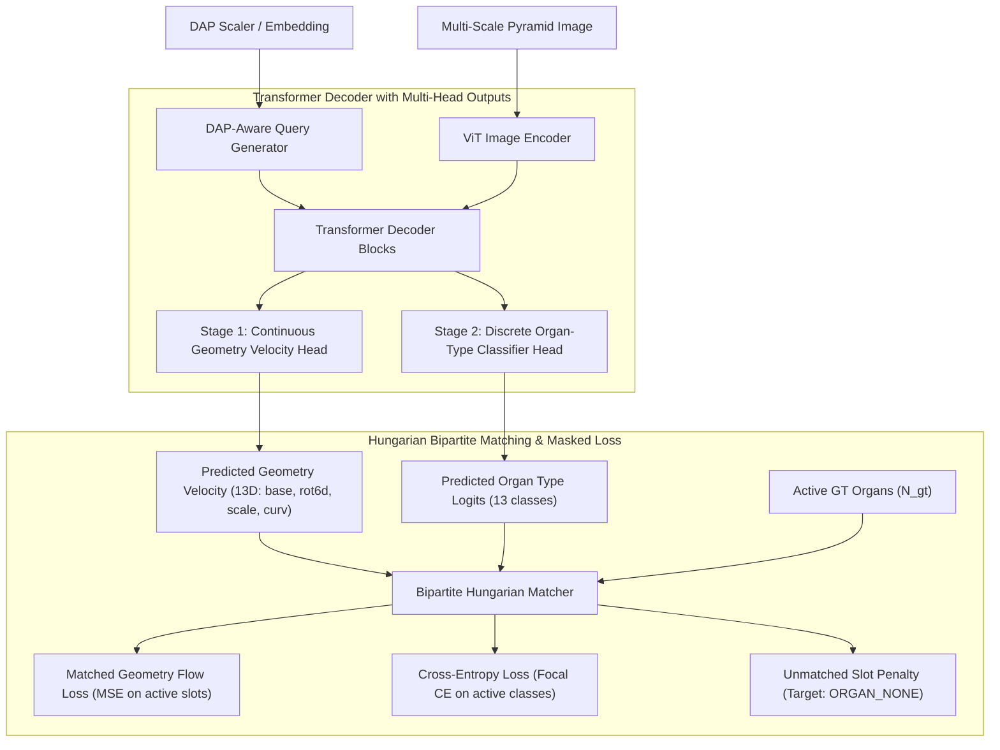

# [Implementation Plan] Two-Stage Flow Matching, Hungarian Matching & DAP Hierarchical Architecture

## 1. 개요 및 배경 (Context & Problem Statement)

현재 Part-Centric Flow Matching(`PartFlowMatchingModel`)은 26D 텐서 `[one_hot(13), base(3), rot6d(6), scale(3), curv(1)]`에 대해 유클리드 공간 상에서 직접 속도장을 회귀하고 있습니다.
그러나 실제 실험 분석 결과 세 가지 치명적인 구조적 병목이 발견되었습니다:

1. **이산 카테고리와 연속 Flow 간의 충돌 (Type Mobility Failure - exp7)**:
   - 13차원 One-hot 표현에 연속 속도장을 적분하고 최종적으로 `argmax`를 취하는 방식은 결정 경계가 매우 취약하여, 학습 도중 미세한 오차만으로도 필요한 기관이 `ORGAN_NONE`(0)으로 판정되어 증발(Erasure)하거나 엉뚱한 타입으로 굳어집니다.
2. **슬롯 순서 불일치 (Permutation & Slot Ordering Mismatch)**:
   - GT 데이터는 식물 위상 순서대로 정렬되어 있으나, Transformer Decoder의 FM 예측 슬롯은 순서가 임의적(Unordered Set)입니다. 1:1 고정 인덱스로 MSE를 계산하면 줄기와 잎 슬롯이 엉뚱하게 매칭되어 모델이 평균값(왜곡된 폴리곤)으로 붕괴합니다.
3. **희소 슬롯 착시 (Sparsity Loss Trap)**:
   - 512~2048개 슬롯 중 95% 이상이 빈 슬롯(`ORGAN_NONE`)이라 속도를 0으로 예측하기만 해도 Loss가 20,606 → 68로 급감하지만, 정작 실제 존재하는 소수의 기관 복원율(IoU 14~25%)은 처참한 상태로 방치됩니다.
4. **생육 단계(DAP)별 위상 계층 부재**:
   - 유묘기(DAP 10: 7개 기관)와 성체(DAP 90: 수백 개 기관)가 동일한 고정 512개 평면 슬롯에 투입되어, 어린 식물에서는 불필요한 빈 슬롯 노이즈가 발생하고 성체에서는 캐노피 밀도가 부족해집니다.

---

## 2. 핵심 제안 아키텍처 (Proposed Architecture)

---

## 3. 세부 설계 (Technical Specifications)

### A. Two-Stage Decoupling (연속 기하 Flow + 이산 타입 분류기)
- **Stage 1 (기하 속도장 예측 - 13D Continuous Space)**:
  - Flow Matching 벡터에서 13차원 One-Hot 블록을 완전히 제거합니다.
  - 연속 기하 상태 $\mathbf{g} \in \mathbb{R}^{13} = [\text{base\_xyz}(3), \text{rot6d}(6), \text{scale\_xyz}(3), \text{curv}(1)]$.
  - Euclidean ODE는 순수 기하 좌표 이동만 담당하므로 수학적 불연속성 없이 매끄럽게 수렴합니다.
- **Stage 2 (이산 기관 타입 분류 헤드 - Cross-Entropy)**:
  - Transformer Decoder의 각 토큰 출력 $H_i \in \mathbb{R}^D$에서 Cross-Entropy 로짓 $\mathbf{z}_i \in \mathbb{R}^{13}$을 직접 예측합니다.
  - One-hot MSE 대신 **Focal Loss / Cross-Entropy Loss**를 적용하여 `argmax` 경계 붕괴 현상을 원천 차단합니다.

### B. DETR 스타일 Hungarian Bipartite Matching (슬롯 순서 및 희소성 해결)
- 예측 슬롯 집합 $\hat{Y} = \{(\hat{\mathbf{v}}_i, \hat{\mathbf{p}}_i)\}_{i=1}^{N_{\text{slots}}}$과 정답 기관 집합 $Y = \{(\mathbf{v}_j^*, c_j^*)\}_{j=1}^{N_{\text{active}}}$ 사이의 최적 1:1 매칭 $\hat{\sigma}$ 탐색:
  $$\mathcal{C}(i, j) = -\lambda_{\text{cls}} \hat{p}_i(c_j^*) + \lambda_{\text{base}} \|\hat{\mathbf{v}}_{i, \text{base}} - \mathbf{v}_{j, \text{base}}^*\|_1 + \lambda_{\text{rot}} \|\hat{\mathbf{v}}_{i, \text{rot}} - \mathbf{v}_{j, \text{rot}}^*\|_1 + \lambda_{\text{scale}} \|\hat{\mathbf{v}}_{i, \text{scale}} - \mathbf{v}_{j, \text{scale}}^*\|_1$$
- `scipy.optimize.linear_sum_assignment`를 배치 단위로 고속 실행.
- **손실 정규화**:
  - 매칭된 $N_{\text{active}}$ 슬롯에 대해서만 기하 Flow MSE Loss + Type Cross-Entropy Loss 적용.
  - 매칭되지 않은 나머지 $(N_{\text{slots}} - N_{\text{active}})$ 슬롯은 오직 `ORGAN_NONE` 클래스 분류 손실만 부여.
  - **전체 Loss를 512가 아닌 실제 활성 기관 수 $N_{\text{active}}$로 정규화**하므로, 빈 슬롯 때문에 Loss가 68로 떨어지는 착시가 원천 제거됩니다.

### C. DAP 기반 계층 구조 (Local/Hierarchical Phytomer Prior)
- **식물의 마디(Phytomer) 단위 그룹화**:
  - 식물의 기관은 독립적인 점이 아니라 `마디 = [줄기(Internode), 잎자루(Petiole), 잎(Leaf), 꽃/봉오리(Flower/Bud)]`의 계층 구조를 갖습니다.
  - 쿼리 슬롯을 4개 단위의 Phytomer 클러스터로 묶어, 클러스터 공통의 Local 위치/Phytomer 인덱스 임베딩을 공유합니다.
- **DAP-Conditional Slot Masking & Capacity**:
  - DAP(생육일수) 스칼라를 사인파 인코딩 후 MLP를 거쳐 디코더에 주입.
  - DAP에 따라 활성화할 최대 쿼리 슬롯 수 $K(\text{DAP})$를 동적으로 조절 (예: DAP 10은 16개 슬롯, DAP 50은 128개 슬롯, DAP 90은 512개 슬롯).
  - 유묘기 이미지에 512개 슬롯이 전부 달려들어 노이즈를 생성하는 문제를 차단합니다.

---

## 4. 변경 대상 파일 (Proposed File Changes)

### [Component 1: Dataset & Layout]
#### [MODIFY] [part_array_dataset.py](file:///home/lion397/codes/image-to-l-system/diffusion_based/dataset/part_array_dataset.py)
- `encode_fm` / `decode_fm`:
  - FM 노드 레이아웃을 26D(One-hot 포함)에서 **13D 순수 기하 레이아웃** `[base(3), rot6d(6), scale(3), curv(1)]`으로 개편.
  - `target_type_labels`: One-hot 대신 `(N,)` 형태의 정수 정답 라벨(`torch.long`)을 별도로 반환하도록 분리.

### [Component 2: Models]
#### [MODIFY] [part_flow_matching.py](file:///home/lion397/codes/image-to-l-system/diffusion_based/models/part_flow_matching.py)
- `node_dim` 기본값을 26에서 13으로 축소.
- 디코더 출력단에 `velocity_head` (13D)와 더불어 **`type_classifier_head` (13 클래스 로짓)** 추가.
- DAP 스칼라를 조건으로 받는 `dap_embed` 레이어 추가.
- `forward()`가 `{"pred_velocity": (B, N, 13), "pred_type_logits": (B, N, 13)}`를 반환하도록 업데이트.

### [Component 3: Loss & Training]
#### [NEW] `diffusion_based/training/hungarian_matcher.py`
- DETR 스타일의 `PartHungarianMatcher` 구현.
- GPU-CPU 텐서 변환 최적화 및 배치 단위 Bipartite Matching 수행.
#### [MODIFY] [train_part_flow_matching.py](file:///home/lion397/codes/image-to-l-system/diffusion_based/training/train_part_flow_matching.py)
- Hungarian Matcher를 학습 루프에 통합.
- One-hot MSE 제거 $\to$ `F.cross_entropy` + 매칭 슬롯 전용 기하 MSE Loss로 교체.
- Active slot 기반 손실 정규화 적용.

### [Component 4: Evaluation & Visualization]
#### [MODIFY] [fm_visualization.py](file:///home/lion397/codes/image-to-l-system/diffusion_based/training/fm_visualization.py)
- 샘플링 루프에서 기하 속도장 적분과 타입 로짓 `softmax/argmax` 분리 디코딩 반영.
- DAP별(10, 50, 90) 슬롯 활성화 및 시각화 지원.

---

## 5. 단계별 검증 계획 (Verification Plan)

### Step 1: 단위 테스트 (Unit Tests)
- `test_hungarian_matcher.py`: 10개 기관에 대해 임의로 섞인 예측 슬롯이 정확히 정답 슬롯과 1:1로 매칭되는지 확인.
- `test_two_stage_model_shapes.py`: 13D 기하 속도와 13 클래스 로짓의 Shape 및 그래디언트 역전파 흐름 검증.

### Step 2: 수렴 테스트 (Smoke Training Run)
- 1개 노드 2개 GPU 환경에서 5 에폭 스모크 트레이닝 실행.
- 분류 정확도(`type_accuracy`), 매칭된 기하 오차(`matched_geom_l1`), 빈 슬롯 페널티 수렴 확인.

### Step 3: 시각적 복원 품질 검증 (Visual Validation)
- DAP 10, DAP 50, DAP 90 샘플에 대해 추론 실행.
- 생성된 메시와 GT 메시 간의 **Foreground Mask IoU** 및 **Chamfer Distance** 측정 (기존 0.14~0.25 수준에서 0.6+ 달성 여부 확인).
- 이전 단일 50 에폭 결과 패널([fm_curv_epoch_050.png](file:///home/lion397/codes/image-to-l-system/docs/results/assets/fm_curv_epoch_050.png))과 정량적/시각적 나란히 비교.

---

## 6. 사용자 검토 필요 사항 (User Review Required)

> [!IMPORTANT]
> **캐시/샤드 호환성 (Shard Compatibility)**:
> 26D One-hot 레이아웃에서 13D 기하 + 정수 클래스 레이아웃으로 변경 시, 기존 `dataset/cache/cowpea_curv26` 캐시 데이터에서 슬라이싱을 통해 런타임에 13D로 변환하여 학습할 수 있으므로 대규모 데이터 재합성(Helios Raytracing) 없이 즉시 실험이 가능합니다.

계획을 확인하시고 승인해 주시면 구현을 진행하겠습니다.
