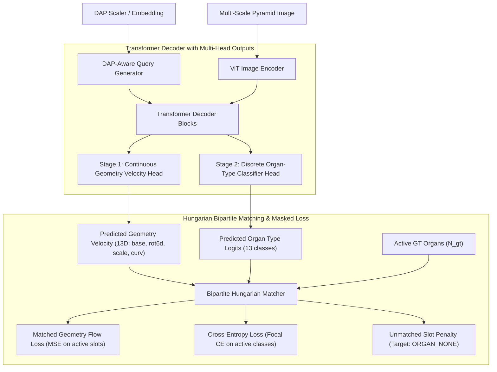

# [Implementation Plan] Two-Stage Flow Matching, Hungarian Matching & DAP Hierarchical Architecture

## 1. Context & Problem Statement

Current Part-Centric Flow Matching (`PartFlowMatchingModel`) regresses velocity fields directly in Euclidean space over a 26D tensor `[one_hot(13), base(3), rot6d(6), scale(3), curv(1)]`.
However, empirical analysis revealed three severe structural bottlenecks:

1. **Conflict Between Discrete Categories and Continuous Flow (Type Mobility Failure - exp7)**:
   - Integrating continuous velocity fields over a 13D one-hot representation and taking `argmax` at inference creates fragile decision boundaries. Small errors during training cause required organs to be classified as `ORGAN_NONE` (0) (causing erasure) or frozen into incorrect categories.
2. **Permutation & Slot Ordering Mismatch**:
   - Ground truth data is topologically ordered, but Transformer Decoder FM prediction slots form an unordered set. Computing MSE with fixed 1:1 index alignment causes stems and leaves to match incorrectly, collapsing predictions into an averaged degenerate polygon.
3. **Sparsity Loss Trap**:
   - Out of 512–2048 slots, over 95% are empty (`ORGAN_NONE`). Merely predicting zero velocity drops loss from 20,606 → 68, while actual active organ recovery remains severely degraded (IoU 14–25%).
4. **Lack of Growth Stage (DAP) Topological Hierarchy**:
   - Seedlings (DAP 10: ~7 organs) and mature canopies (DAP 90: hundreds of organs) share the same fixed 512 flat slots, generating noise in seedlings and lacking canopy density in mature plants.

---

## 2. Proposed Architecture

---

## 3. Technical Specifications

### A. Two-Stage Decoupling (Continuous Geometry Flow + Discrete Type Classifier)
- **Stage 1 (Geometry Velocity Field Prediction - 13D Continuous Space)**:
  - Completely remove the 13D one-hot block from the Flow Matching vector.
  - Continuous geometry state $\mathbf{g} \in \mathbb{R}^{13} = [\text{base\_xyz}(3), \text{rot6d}(6), \text{scale\_xyz}(3), \text{curv}(1)]$.
  - The Euclidean ODE exclusively handles coordinate trajectories, converging smoothly without mathematical discontinuities.
- **Stage 2 (Discrete Organ Type Classifier Head - Cross-Entropy)**:
  - Directly predict Cross-Entropy logits $\mathbf{z}_i \in \mathbb{R}^{13}$ from each Transformer Decoder output token $H_i \in \mathbb{R}^D$.
  - Apply **Focal Loss / Cross-Entropy Loss** instead of one-hot MSE to prevent `argmax` boundary collapse.

### B. DETR-Style Hungarian Bipartite Matching (Resolving Permutation & Sparsity)
- Find optimal 1:1 matching $\hat{\sigma}$ between predicted slots $\hat{Y} = \{(\hat{\mathbf{v}}_i, \hat{\mathbf{p}}_i)\}_{i=1}^{N_{\text{slots}}}$ and ground truth organs $Y = \{(\mathbf{v}_j^*, c_j^*)\}_{j=1}^{N_{\text{active}}}$:
  $$\mathcal{C}(i, j) = -\lambda_{\text{cls}} \hat{p}_i(c_j^*) + \lambda_{\text{base}} \|\hat{\mathbf{v}}_{i, \text{base}} - \mathbf{v}_{j, \text{base}}^*\|_1 + \lambda_{\text{rot}} \|\hat{\mathbf{v}}_{i, \text{rot}} - \mathbf{v}_{j, \text{rot}}^*\|_1 + \lambda_{\text{scale}} \|\hat{\mathbf{v}}_{i, \text{scale}} - \mathbf{v}_{j, \text{scale}}^*\|_1$$
- Efficient batch evaluation with `scipy.optimize.linear_sum_assignment`.
- **Loss Normalization**:
  - Apply geometry flow MSE + type cross-entropy loss only to matched $N_{\text{active}}$ slots.
  - Unmatched $(N_{\text{slots}} - N_{\text{active}})$ slots receive only `ORGAN_NONE` background penalty.
  - **Normalize total loss by actual active organ count $N_{\text{active}}$ rather than 512**, eliminating the sparsity illusion where loss drops artificially to 68.

### C. DAP-Based Hierarchical Grouping (Local/Hierarchical Phytomer Prior)
- **Grouping by Plant Phytomer Units**:
  - Plant organs are not independent points; they follow a hierarchical structure: `phytomer = [internode, petiole, leaflets, flower/bud]`.
  - Group query slots into 4-organ phytomer clusters sharing common local position/phytomer index embeddings.
- **DAP-Conditional Slot Masking & Capacity**:
  - Inject sinusoidally encoded DAP scalar through an MLP into the decoder.
  - Dynamically adjust active query slots $K(\text{DAP})$ based on DAP (e.g. 16 slots for DAP 10, 128 for DAP 50, 512 for DAP 90).
  - Prevents 512 slots from overwhelming seedling images with noise.

---

## 4. Proposed File Changes

### [Component 1: Dataset & Layout]
#### [MODIFY] [part_array_dataset.py](file:///home/lion397/codes/image-to-l-system/plant_recon/dataset/part_array_dataset.py)
- `encode_fm` / `decode_fm`:
  - Reorganize FM node layout from 26D (with one-hot) to **13D pure geometry** `[base(3), rot6d(6), scale(3), curv(1)]`.
  - `target_type_labels`: Return integer class labels (`torch.long`) of shape `(N,)` separately.

### [Component 2: Models]
#### [MODIFY] [part_flow_matching.py](file:///home/lion397/codes/image-to-l-system/plant_recon/models/part_flow_matching.py)
- Reduce default `node_dim` from 26 to 13.
- Add **`type_classifier_head` (13-class logits)** alongside `velocity_head` (13D) at decoder output.
- Add `dap_embed` conditioning layer.
- Update `forward()` to return `{"pred_velocity": (B, N, 13), "pred_type_logits": (B, N, 13)}`.

### [Component 3: Loss & Training]
#### [NEW] `plant_recon/training/hungarian_matcher.py`
- Implement DETR-style `PartHungarianMatcher`.
- GPU-CPU tensor optimization and batch bipartite matching.
#### [MODIFY] `train_part_flow_matching.py`
- Integrate Hungarian Matcher into training loop.
- Replace one-hot MSE with `F.cross_entropy` + matched-slot geometry MSE.
- Apply active-slot loss normalization.

### [Component 4: Evaluation & Visualization]
#### [MODIFY] [`fm_visualization.py`](../../../plant_recon/training/fm_visualization.py)
- Support separate decoding of geometry velocity integration and type logit `softmax/argmax`.
- Support DAP-specific (10, 50, 90) slot activation and visualization.

---

## 5. Verification Plan

### Step 1: Unit Tests
- `test_hungarian_matcher.py`: Confirm scrambled predicted slots correctly match 1:1 with ground truth.
- `test_two_stage_model_shapes.py`: Verify shapes and gradient backpropagation flow for 13D geometry velocities and 13-class logits.

### Step 2: Smoke Training Run
- Run 5-epoch smoke test on 1 node, 2 GPUs.
- Verify convergence of classification accuracy (`type_accuracy`), matched geometry error (`matched_geom_l1`), and empty slot penalties.

### Step 3: Visual Validation
- Run inference on DAP 10, DAP 50, DAP 90 samples.
- Measure **Foreground Mask IoU** and **Chamfer Distance** between generated and GT meshes (targeting 0.6+ improvement over baseline 0.14–0.25).
- Side-by-side quantitative and visual comparison against earlier 50-epoch panel (`fm_curv_epoch_050.png`).

---

## 6. User Review Required

> [!IMPORTANT]
> **Shard Compatibility**:
> Changing from 26D one-hot layout to 13D geometry + integer class labels can be sliced on-the-fly from the existing `dataset/cache/cowpea_curv26` cache at runtime, allowing immediate experiments without expensive dataset regeneration (Helios raytracing).
