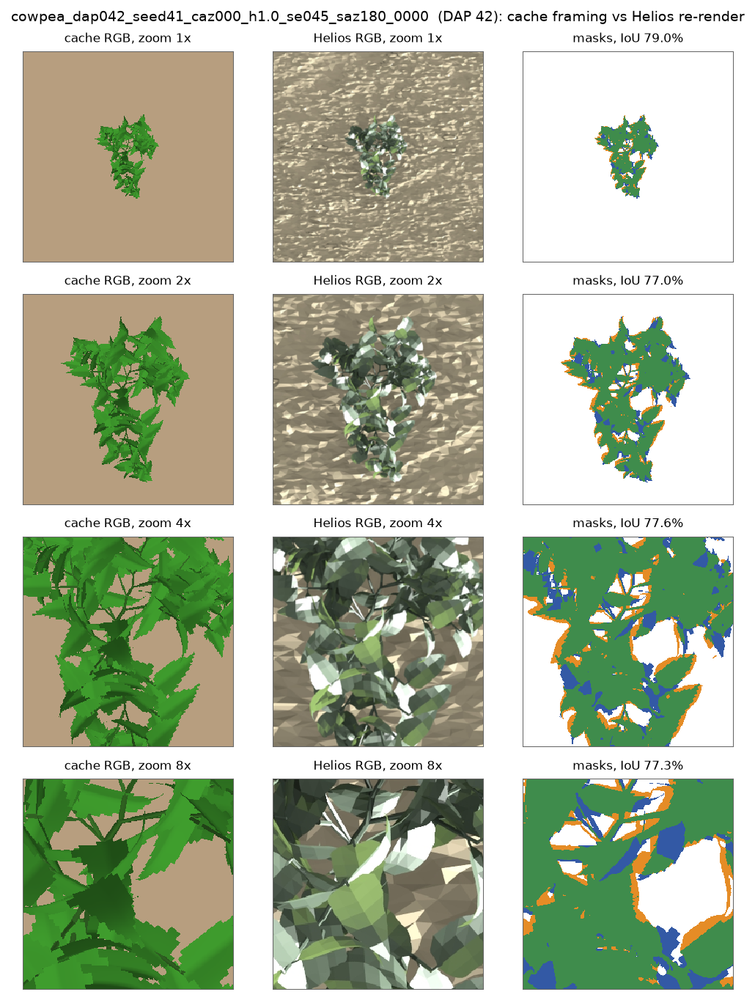

# Sim-to-real assessment: where the next effort should go (2026-09-16)

**Status**: plan, written after reading every document under `docs/` as of the 2026-09-16 handover
and checking the claims against the code. The first item of the real-image list is being executed
in the same session; its result will be appended as §5.

**Question asked**: how to make model training and real-image testing better.

---

## 1. What the record says, and what the code adds

The handover (`ongoing/README.md`, 2026-09-16 section) concludes that the synthetic track has
plateaued at strict-protocol P 33–39 across every training lever, that test-time refinement lifts the
same checkpoints to 67–68, and that the real-image reconstructions are not yet usable. All of that
holds. Reading the code alongside it adds four facts that change where the next effort should go.

### 1.1 The network never sees the CHM channel

`DINORayEncoder.forward` (`plant_recon/models/dinov2_ray_encoder.py`, line 164 onward) takes
channels 0:3 of the input at every zoom level. The depth channel is only ever a render-loss target
during training and refinement. Consequences:

- The cold-start collapse on real crops (14 of 20 AgML plants with one live phytomer) is a pure RGB
  appearance gap. Depth Anything's pseudo-CHM cannot be its cause.
- Any CHM fix helps only the refinement target, not the network's prediction.

### 1.2 Training RGB is flat-shaded green on uniform tan, with no augmentation at all

`generate_cache.py` renders every training image with the PyTorch renderer (`background="ground"`,
a single tan colour, flat organ shading, no shadows, no texture). A grep of the dataset and
training code for colour jitter, blur, noise, flips, background or lighting variation finds
nothing. Meanwhile each of the 100,000 training plants has a Helios raytraced render
(`dataset/helios_data/cowpea/*_rad.jpeg`, 720 px, textured soil, shaded and specular leaves,
cast shadows) sitting next to its XML, unused. For the same DAP 40 plant the cache image and the
Helios render look like different datasets. Caveat on the Helios renders: all 100,000 use one
lighting configuration (sun elevation 45°, azimuth 180°), and each image is auto-framed on its
plant, so the ground footprint varies from 7 mm at DAP 5 to 1.3 m at DAP 90.

### 1.3 The real-image crop framing does not match the training framing

The cache's zoom pyramid is a **fixed ground window**: 1.2 m at zoom 1×, then 0.6 / 0.3 / 0.15 m,
centred on the plant's 3D bbox centre, camera 5 m above it
(`compute_focus_plant_camera`, `reference_window_size` branch, `helios_pytorch_renderer.py`
line 119). The real-image crop utility (`use_cases/real_world/dataset/real_plant_crop_utils.py`,
`build_pyramid_16ch`) instead uses **1.2 × the detector bbox** as the zoom-1× window. Its comment
says this "matches generate_cache.py's zoom-1x window == 1.2x the plant's own extent", which is
not what the cache does. So on a real crop every plant fills about 80% of the zoom-1× frame,
whereas in training a 0.3 m plant occupies a quarter of it and a seedling a few pixels. The
network reads plant size and DAP from apparent size in a fixed window; this alone can explain
why Stage 1's DAP on real crops was "uncorrelated with the true DAP and higher in 7 of 8 cases".
The fix is one line once the pixel-to-metre scale is known (the multi-plant script already
assumes the 1.3 m plot width): window_px = 1.2 m × (frame_px / plot_width_m).

### 1.4 On synthetic data, Stage 3 is dead weight for the deployable path

Refinement from the DAP-spanning mean latent reaches the same 66.5 as from the sampled latent
(takeover guide §0-B.9, 17:20 entry). The network's real contribution is node positions,
existence and topology, and refinement cannot add organs. Every remaining synthetic error lives in
Stage 2 and in the refiner, not in Stage 3.

### 1.5 Nobody has measured the appearance gap separately from the architecture gap

A real cowpea may differ from a Helios cowpea in structure, or only in pixels. The real-image
runs to date cannot tell those apart, and they are the difference between "fine-tune on realistic
renders" and "re-tune the Helios cowpea parameters to the Davis field".

---

## 2. Training side, ranked

1. **Train on realistic RGB.** Crop the Helios raytraced renders to the cache's fixed windows (or
   re-render the training plants at those windows, since the existing renders are auto-framed) and
   fine-tune from `hierarchical_fm_v10_cam` ep160 on them, mixed with the flat renders. Add ordinary
   augmentation on top: colour jitter, blur, sensor noise, real soil backgrounds composited under
   the flat render using its own mask, random shadows. Largest untouched lever for real testing.
2. **Make existence a continuous variable in refinement.** The synthetic deficit (about 60 of 73
   GT nodes active) and the real-image collapse are both "organs that are not there".
   `results/20260915_real_image_first_test.md` §6.2 already sketches the mechanism: keep Stage 2's
   raw logits and use a soft compositing weight in the decode instead of the hard select, so
   refinement can switch nodes on and off. Lowering the threshold failed only because refinement
   could not switch false positives off.
3. **Stop investing in the Stage 3 latent.** Deploy Stage 2 nodes + mean latent + refinement. If
   Stage 3 stays, a deterministic regression head is enough; the flow only learns the marginal.
4. **Try a larger backbone with multizoom.** Node error sits at the token pitch (4–6 cm at 7.5 cm
   per token). The record shows only the unfrozen ViT-S run; `dinov2_vitb14` is one flag away.
5. **Use more eval plants for decisions.** Epoch-to-epoch spread is ±3 points on 20 plants, the
   size of most effects compared. Fifty to a hundred plants under the strict protocol.

## 3. Real-image side, ranked

1. **Measure the appearance gap first** (in progress, §4). Run the strict protocol on Helios
   raytraced crops of the same 20 eval plants, framed exactly as the cache frames them. If P falls
   from 38 toward the real-image behaviour, the fix is training item 1. If P holds, the gap is
   structural.
2. **Fix the crop framing** (§1.3): a fixed 1.2 m window from the known pixel-to-metre scale.
3. **Pick DAP from measured plant size**, not from Stage 1 or the timestamp: detector box in
   metres against an extent-versus-DAP table from the synthetic set. The multi-plant frame assumed
   DAP 25 for plants that are clearly seedlings, so the Helios cold start was too big before
   refinement inflated it further.
4. **Fix the refinement target.** A single blob mask plus blurred pseudo-depth cannot constrain
   leaves, which is why the optimiser inflates them. Per-leaf instance masks, and a DINOv2 feature
   loss between render and photo (robust to appearance, per-organ signal). Bound realised leaf
   size in metres rather than the phytomer scale, as the handover notes.
5. **Clean the pseudo-CHM** for the refinement target: estimate ground from the mask complement,
   zero the CHM outside the mask, drop `depth_downsample=3`.
6. **Add real-image proxies** so real runs get a number: leaf count vs instance count, mask IoU,
   plant extent, 2D leaf-centroid matching.

---

## 4. Item 1 in practice: the appearance-gap measurement

Design, chosen so that only the pixels differ between the two runs:

- Same 20 plants (`hierarchical_fm_v9/eval_set.json`), same checkpoint
  (`hierarchical_fm_v10_cam/hierarchical_fm_epoch_160_ema.pt`), same script
  (`eval_test_time_refinement.py`, strict 256 px protocol before and after refinement), same CHM
  channels and refinement targets from the cache.
- Only the 12 RGB channels of the 16-channel input are replaced by Helios raytraced pixels.
- The Helios image is re-rendered per plant rather than cropped from the auto-framed dataset
  JPEG: the plant's XML is shifted so its 3D bbox centre (the cache's camera centre) sits at the
  plot origin, the camera is placed 5 m above that centre, the FOV is set to the 1.2 m window,
  and the 0.6 / 0.3 / 0.15 m levels are centre crops of one high-resolution render (a narrower FOV
  from the same pinhole is exactly a centre crop). Lighting follows the dataset renders.
- Framing check before scoring: the silhouette of the Helios crop against the cache CHM > 0 mask
  at every zoom level. If those do not overlap at ~90%+, the framing is wrong and the P numbers
  are not an appearance measurement.

Readout: raw strict P and refined P on Helios RGB versus the flat-render baseline (ep160 EMA:
raw 38.7 / refined 68.3), per plant and by DAP bucket, plus the number of active nodes and the
DAP probe's prediction. The comparison isolates appearance from every other difference.

---

## 5. Result of item 1: pixels alone cost 10 points raw and 7 refined (2026-09-16, 18:30)

**Setup, as designed in §4.** Checkpoint `hierarchical_fm_v10_cam/hierarchical_fm_epoch_160_ema.pt`,
`eval_test_time_refinement.py` with its defaults (40 steps, input camera, four zoom targets,
scale/latent priors). The flat baseline was re-scored in the same session so both runs share code
and flags: 38.1 / 66.3 against the 38.7 / 68.3 recorded this morning, i.e. within the ODE-sampling
noise. Run folder: `outputs/logs/20260916/helios_eval_crops/` (`ttr_ep160ema_{flat,helios}.json`,
`compare.md`, `summary.json`, per-plant `panels/`, the Helios runs under `helios/`).

**Framing check passed.** All 20 plants keep the identity orientation (each flip loses 25 points or
more of mask IoU); mask centroid offsets are within 3 px at 2× and 4× for 18 plants, and the two
larger offsets (index 77889 at 2×, 16 px; 67809 at 4×, 6 px) are cast shadows that the green-pixel
heuristic counts as plant, not framing errors (panels inspected). Mean mask IoU per zoom is 72–80%,
limited by specular highlights and shadows in the heuristic, not by geometry. Render cost 30–100 s
per plant at 2048 px, 958 s for the set. Example panel:
[`assets/20260916_appearance_gap_framing_check_dap042.png`](assets/20260916_appearance_gap_framing_check_dap042.png).

**Numbers** (`compare_rgb_source_readings.py`; nodes = active predicted phytomer nodes before
refinement, GT = ground-truth phytomers; DAP error = |Stage 1 probe − true DAP| in days):

| plants | n | raw P flat | raw P Helios | refined flat | refined Helios | nodes flat / Helios / GT | DAP error flat / Helios |
|---|---:|---:|---:|---:|---:|---|---|
| DAP ≤ 15 | 4 | 19.2 | 10.5 | 31.4 | 12.0 | 4.5 / 8.8 / 6.5 | 1.4 / 51.0 |
| 16–45 | 6 | 37.7 | 29.4 | 75.4 | 69.7 | 21.7 / 37.5 / 39.0 | 5.0 / 8.1 |
| 46–75 | 4 | 41.4 | 39.9 | 72.7 | 73.5 | 102.5 / 98.2 / 116.8 | 6.0 / 20.5 |
| > 75 | 6 | 48.8 | 32.4 | 76.0 | 70.6 | 107.0 / 63.2 / 122.2 | 5.5 / 25.1 |
| **all** | 20 | **38.1** | **28.6** | **66.3** | **59.2** | 60.0 / 51.6 / 73.0 | 4.6 / 24.3 |

Figure: [`assets/20260916_appearance_gap_flat_vs_helios.png`](assets/20260916_appearance_gap_flat_vs_helios.png) — (a) raw P per plant,
(b) refined P per plant, (c) predicted against true DAP, flat in blue and Helios in orange.

**Reading.**

1. **Pixels alone cost 9.5 points raw and 7.1 refined on identical geometry.** Raw P on Helios
   pixels (28.6) is where the latent-only baseline sat (27–29 under this protocol), so the
   appearance gap erases the whole v10 gain.
2. **The loss sits in the seedlings and the mature plants, and it is the DAP probe and the
   existence gate that fail.** Seedlings: the probe reads DAP 2 as 67, 3 as 46, 11 as 51, 12 as 68;
   two of four collapse to a single active node; refined P 31.4 → 12.0. Mature plants: DAP
   under-read by 25 days (97 → 63, 94 → 64, 89 → 59), active nodes 107 → 63 against 122 GT, raw P
   48.8 → 32.4. Mid-season plants are unchanged. Both heads estimate plant size from RGB, and with
   textured soil, shading and cast shadows both regress toward the middle of the DAP range: small
   plants are read as large, large plants as smaller. On the real crops the same two heads failed
   the same way (DAP uncorrelated with the truth, single-phytomer collapse). That failure is now
   reproduced on synthetic geometry, so the pixels account for it.
3. **Refinement recovers most of the loss for DAP > 15 (71.0 against 75.0)** because its target,
   the cache CHM, is unchanged in this experiment. On real images the target is the pseudo-CHM and a
   blob mask, so the recovery there will be smaller.
4. **Bounds.** This is a lower bound on the real gap: Helios renders are not photographs, and each
   plant carries one lighting draw. The mid-season null sits inside the ±3 epoch noise; the seedling
   and mature effects (10–19 points, 25–51 DAP days) are far outside it.

**Decision.** Training item 1 of §2 (fine-tune on Helios RGB crops with augmentation) is the right
next bet, and the structural gap cannot be measured until it is closed. Before the next real-image
test, also fix the crop framing (§1.3): the DAP probe is exactly the head that depends on apparent
size in a fixed window.

---

## 6. Decisions after review (2026-09-16 evening) and the Stage 3 regression experiment

**Two corrections from Heesup.** (1) The rig does provide a depth channel, but it is not accurate:
depth is therefore **always normalized before it is compared**, in refinement and in the training
render loss alike; no absolute canopy-height term anywhere. (2) Dropping the Stage 3 latent flow
would stray too far from the design; keep a learned per-node shape readout, at minimum a regression
from the node's local patch features through the decoder. §2.3 above is superseded accordingly.

**Why regression is the right first change, not a retreat.** The record says the shape information is
in the image and reachable, and that the flow objective is what loses it: the latent's per-dim std is
0.41 against unit noise, so about 85% of the velocity target is noise; with GT geometry the predicted
latent is worth only 2–8 points over the mean latent while the GT latent is worth 33+; and when Stage 3
was trained on clean nodes its per-node latent R² rose to 0.41 (baseline ≈ 0.1). Regressing the
conditional mean keeps the phytomer-latent design, the decoder, the conditioning and the losses, and
only changes the objective. The flow can return later as a residual proposal distribution for
multi-start refinement, which is where a generative model belongs in an analysis-by-synthesis pipeline.

**Implementation (`--stage3_regression`, launcher `STAGE3_REGRESSION=1`).** Training sets z_0 = 0 and
t = 0, so the existing velocity target z_1 − z_0 becomes the state itself and `clean_z1 = pred_velocity`;
the matched-node MSE, the geometry weight, the idle regularizer and the render block are untouched.
`sample_ode` evaluates the decoder once at (x = 0, t = 0) and takes its output as the state, so the
sample is deterministic and step-free (`tests/test_stage3_regression.py`). Every eval script rebuilds
the model with the flag read from the checkpoint args.

**Run.** `outputs/checkpoints/sub10_v10_cam_s3reg/`, log
`outputs/logs/20260916/local_sub10_v10_cam_s3reg.log`: the v10_cam recipe (geometry, render-to-latent,
latent norm, coverage 1.0, multizoom, count weight 0.5, EMA 0.999, input camera) plus the flag, 10%
protocol (10k plants, the same 20 eval plants, 2 held-out per bucket), resumed from the raw ep160
checkpoint with its optimizer state, `EPOCHS=320` so the cosine sits near 5e-5 instead of its exhausted
tail; to be stopped at ep180. Local TITAN RTX, batch auto-tuned.

**Readout and decision rule.** On the ep170 / ep180 checkpoints (raw and EMA), the substitution
ablation (`eval_gt_substitution_ablation.py`): per-node latent R² over the mean (target: above the 0.41
that teacher forcing reached), "ALL−latent" = GT geometry + predicted latent (target: above the flow's
best 48.7), deployable strict P; then `eval_test_time_refinement.py` on the flat and on the Helios-RGB
inputs, regressed latent versus `--init_mean_latent`, since the initial latent matters most where the
target is weak. If R² and ALL−latent clear those bars, regression becomes the default Stage 3 readout
and the next step is the per-node high-resolution ROI patch (§ "local patch") to lift the 7.5 cm token
bottleneck; if not, the conditioning, not the objective, is the limit, and the ROI patch comes first.

### 6.1 Result (2026-09-17 01:15): the head converges to the mean; the conditioning is the limit

Run `sub10_v10_cam_s3reg`, epochs 161–170 (paused at the ep170 checkpoint, ~13 min/epoch on the local
TITAN RTX at batch 32). Stage 3's loss went 4.60 → 4.48 and was flat from epoch 162; holdout IoU 40–44%,
depth MAE 13.8–14.2 cm (flow ep160: 43.2% / 15.5 cm). Readouts on the same 20 eval plants
(`run_local_20260916_215934/gt_substitution_epoch170*.json`, `ttr_ep170ema_*.json`):

| variant | flow ep160 EMA | regression ep170 raw | regression ep170 EMA |
|---|---:|---:|---:|
| P (all predicted) | 38.7 | 37.9 | 37.2 |
| pos ← GT | 46.5 | 43.5 | 42.9 |
| GT geometry + mean latent | 38.7 | 37.4 | 38.0 |
| GT geometry + predicted latent | **47.0** | 42.1 | 41.3 |
| ALL | 75.8 | 74.8 | 76.1 |
| latent RMSE vs GT (mean latent: 4.66) | 5.86 | 4.80 | 4.81 |
| latent R² over the mean | −0.585 | −0.063 | −0.064 |
| predicted latent per-dim std (GT 0.177) | 0.183 | 0.070 | 0.069 |
| active / GT nodes | 60.0 / 73 | 60.3 / 73 | 60.2 / 73 |

| refinement, 40 steps, defaults | flow ep160 EMA | regression ep170 EMA |
|---|---:|---:|
| flat input, from the model's own latent | 38.1 → 66.3 | 37.2 → 61.3 |
| flat input, from the mean latent | (66.5 at ep90) | 34.7 → 66.6 |
| Helios RGB, from the model's own latent | 28.6 → 59.2 | 28.4 → 55.3 |
| Helios RGB, from the mean latent | – | 28.5 → 58.3 |

**Reading.**

1. **The regression collapsed to the conditional mean.** R² −0.59 → −0.06 with RMSE 5.86 → 4.80 says the
   output moved from "a marginal draw" to "the mean, slightly perturbed"; the per-dim spread fell to 40% of
   the GT's; the training loss was flat within two epochs. Nothing per node was learned. With the same
   decoder, the same conditioning (multizoom tokens at 7.5 cm pitch, gathered at Stage 2's own node
   positions) and only the objective changed, this is the decision rule's second branch: **the
   conditioning, not the objective, is the limit.**
2. **IoU rewards realistic spread.** Under GT geometry the flow's wrong-but-plausible latents score 47.0
   against 38.7 for the mean latent and 41.3 for the regressed one. A latent with the right variance is
   worth ~8 points even when it is not the right latent. This is the argument for keeping the flow as a
   proposal distribution (multi-hypothesis refinement) rather than as a point estimate, and it explains why
   the mean-latent start "loses nothing" after refinement: refinement re-inflates the shapes.
3. **The regressed latent is a worse refinement init than the mean** (61.3 vs 66.6 flat, 55.3 vs 58.3
   Helios). It must not become the default readout. On Helios RGB the flow sample (59.2) and the mean
   (58.3) are level.
4. Caveat: 10 epochs on 10% data at LR ≈ 5e-5, but the loss plateaued in two, and the teacher-forced flow
   run's R² kept rising for 25 epochs only *with a falling loss*; there is no sign of that here. ep180 is
   not expected to differ; the run is left paused with its checkpoints for confirmation if wanted.

**Next step, in this order.** (a) The cheap diagnostic that separates node error from token resolution:
allow the scheduled GT-node conditioning (`--stage3_gt_nodes_p 0.5`, jitter 1 cm) together with
`--stage3_geometry` for the regression head, since clean conditioning was what raised the flow's per-node
R² to 0.41; read R² teacher-forced and deployable. (b) The per-node high-resolution ROI patch (a ~10 cm
window around the projected node from the full-resolution image through the frozen backbone, jittered
in training) as Stage 3's local conditioning, which addresses both causes at once. (c) The flow returns
on top of whichever readout wins, as a residual proposal for multi-start refinement.

### 6.2 The conditioning is the limit, not the objective and not node error (2026-09-17)

The follow-up the decision rule called for: the same regression head, but conditioned on the GT node
position with probability 0.5 and 1 cm jitter (`--stage3_regression --stage3_gt_nodes
--stage3_gt_nodes_p 0.5 --stage3_gt_nodes_jitter_cm 1.0`, run `sub10_v10_cam_s3reg_tf`, ep161-170 from
v10_cam ep160; the trainer's refusal to combine teacher forcing with `--stage3_geometry` was lifted for
the regression objective only, where the override is a conditioning diagnostic and the geometry targets
stay parent-relative). Same 20 plants, ablation run both teacher-forced and deployable:

| | flow ep160 EMA | regression ep170 | reg + GT nodes, teacher-forced | reg + GT nodes, deployable |
|---|---:|---:|---:|---:|
| P (all predicted) | 38.7 | 37.2 | 43.3 | 38.2 |
| GT geometry + mean latent | 38.7 | 38.0 | 40.2 | 33.9 |
| GT geometry + predicted latent | 47.0 | 41.3 | 42.7 | 41.3 |
| latent RMSE vs GT (mean latent 4.658) | 5.863 | 4.805 | **4.656** | 4.800 |
| latent R² over the mean | −0.585 | −0.064 | **+0.001** | −0.062 |
| predicted latent spread (GT 0.177) | 0.183 | 0.069 | 0.071 | 0.070 |

**Conclusion.** With correct node positions on half its nodes, the head's output is the dataset mean to
three decimals (RMSE 4.656 against the mean latent's 4.658, R² 0.001). Node error is therefore not what
hides the per-node shape, and neither is the flow objective: two different objectives and two different
conditioning qualities all land on the marginal. What Stage 3 is given -- a bilinear token sample at
7.5 cm pitch from a frozen backbone -- does not contain the shape of the phytomer at that node. The
per-node high-resolution ROI patch is now the necessary next change for Stage 3, not an optional one.

Correction to §6's decision rule: it set "above the 0.41 that teacher forcing reached" as a bar, but that
0.41 came from `latent_probe.py` (R² over the PER-PLANT mean at t = 0) while the table above is the
ablation's R² over the DATASET mean. The two are not comparable; the comparison that stands is within
this ablation's own metric, where GT-node conditioning moved −0.064 to +0.001.

**What keeps the flow worth keeping.** Under GT geometry the flow's latents score 47.0 against 38.0-40.2
for the mean and 41.3-42.7 for the regressed one, with the only realistic spread of the three (0.183 vs
GT 0.177, against 0.07 regressed). A latent with the right variance is worth ~6 IoU points even when it
is not the right latent, so the flow belongs as a proposal distribution for multi-start refinement, not
as a point estimate -- which is also why the mean-latent start "loses nothing" after refinement.

---

## 7. Appearance: Helios is the wrong target; real soil + geometric shading is the right one (2026-09-17)

§5 measured that pixels alone cost 10 points of raw strict P, and §2.1 concluded "fine-tune on Helios
raytraced RGB". That conclusion was wrong, and the measurement that corrects it is below.

### 7.1 What was built

- `tools/build_soil_bank.py` — cuts bare-soil patches out of the real AgML GEMINI rover frames: inside
  the rig margins, away from every plant/weed box, and rejected if they are not warm-coloured. The last
  filter matters: the rig reaches further into the frame than the detection-time margins assume (every
  contaminated patch in the first bank began at x = 285 px, just inside the 11% left margin) and its
  grey-blue metal and pink-white plastic scored 0.859-0.866 warm-pixel fraction against 1.000 for clean
  soil. Bank: 94 patches, 0.51 m each, at the frame's own 1495 px/m.
- `plant_recon/dataset/appearance_augment.py` — per sample, consistently across all four zoom levels:
  a real soil background (concentric sub-windows of one tile, so the levels stay one physical scene);
  Lambertian shading plus a Blinn-Phong highlight computed from the **CHM channel's own gradient**, which
  is a real surface normal rather than painted-on variation; a cast shadow displaced by
  `height * cot(elevation)` along the sun azimuth; and brightness/contrast/saturation/hue/blur/noise.
  The plant silhouette is exact (`chm > 0`), so no segmentation step is needed, and **only the 12 RGB
  planes change** -- the depth planes are the render loss's own target and pass through untouched
  (`tests/test_appearance_augment.py`). Cost 33-63 ms per sample in a DataLoader worker, ~10% of a step.
  **Shadow bug, found and fixed 2026-09-17 (Heesup spotted it in the panel).** The cast shadow was
  displaced with `torch.roll`, which wraps circularly, so the part leaving one edge reappeared at the
  opposite one and a single plant painted two or three shadows. The displacement is a large fraction of
  the frame at high zoom (146 px of 256 at zoom 4x with an 8 cm canopy and a 25 degree sun), which is why
  it was obvious there. Now a zero-filled shift (`_shift_zero`): the shadow leaves the frame instead, and
  at zooms 4x/8x it correctly covers 0% of the background, since a 0.3 m window cannot contain the shadow
  of a 20 cm canopy at that sun angle. Epochs 161-165 of `sub10_v10_cam_aug` trained with the wrapped
  version; soil and shading dominate the augmentation, but that run's first five epochs carry the defect.

  Soil grain is cut at a deliberately RANDOM scale: across the dataset it then carries no consistent
  size cue, so the network cannot read plant scale off the ground (a wrongly but consistently scaled
  ground would teach a false cue; mirror-tiling to keep true scale left visible symmetry instead).
- `plant_recon/eval/eval_appearance_augment.py` — the validation, including real plant crops cut from
  the AgML test frames at the cache's own fixed 1.2 m window.

### 7.2 The measurement

DINOv2 features (CLS + mean patch, the representation the network actually reads), unbiased kernel
two-sample distance (MMD; a Frechet/FID statistic is meaningless at 20 samples against 768 dimensions).
20 synthetic plants, 4 augmentation draws each, 220 real plant crops.

| MMD to **real photos** | flat cache render | augmented | Helios raytraced |
|---|---:|---:|---:|
| zoom 1x | 0.614 | **0.418** | 0.547 |
| zoom 2x | 0.543 | **0.341** | 0.561 |
| zoom 4x | 0.550 | **0.432** | 0.637 |
| zoom 8x | 0.536 | **0.465** | 0.624 |

Two findings:

1. **The augmentation moves the training distribution toward real photos at every zoom level**, by
   28-37% of the flat render's distance.
2. **Helios is further from real than the flat render is** at zooms 2x, 4x and 8x -- the levels where
   leaves fill the frame. Its extreme white speculars are a material artefact, not realism. So §5's
   10-point drop was never evidence that Helios is the target; it is evidence that the network is
   **brittle to any appearance shift**. The Helios set keeps its value as a held-out robustness probe,
   and training toward it would have been a mistake.

Figure: `assets/20260917_appearance_augment_panel.png` (flat | two augmented draws | Helios, per plant
and zoom). Caveat: MMD on frozen features is a proxy for transfer, not proof; the decisive test is a
fine-tune with `--appearance_augment` scored on the clean and the Helios inputs.

### 7.3 The crop framing, quantified

`use_cases/real_world/dataset/real_plant_crop_utils.py` sized the zoom-1x window at 1.2x the detector
box while the training cache renders a FIXED 1.2 m ground window. For a typical AgML detection the two
differ by **3.7x** (480 px against 1795 px), so every real plant reached the network almost four times
too large -- and Stage 1's DAP head reads plant size out of a fixed window, which is the likely
mechanism behind "predicted DAP uncorrelated with the truth and higher in 7 of 8 cases" (2026-09-15).
Fixed: `base_window_px()` now cuts a fixed `window_m` ground window from `--plot_width_m`, with the
legacy behaviour still reachable at `--plot_width_m 0` so the two can be compared.

Refinement from each readout, 40 steps, script defaults (`run_local_20260917_074138/ttr_ep170ema_*.json`):

| 40-step refinement | flow ep160 EMA | regression ep170 | reg + GT nodes ep170 |
|---|---:|---:|---:|
| flat input, from the model's own latent | 38.1 → **66.3** | 37.2 → 61.3 | 38.2 → 61.2 |
| flat input, from the mean latent | – | 34.7 → 66.6 | 34.9 → 65.3 |
| Helios RGB, from the model's own latent | 28.6 → **59.2** | 28.4 → 55.3 | 27.3 → 54.2 |
| Helios RGB, from the mean latent | – | 28.5 → 58.3 | 28.5 → 58.0 |

Both regression variants are a *worse* refinement start than the plain dataset-mean latent (61 against
65-67 on flat input, 54 against 58 on Helios), and the flow's own sample is the best start of all. A
point estimate of a latent the conditioning cannot resolve is worth less than a generic latent with the
right variance, which is the same conclusion the ablation reaches from the other direction. The
regression readout is therefore **not** promoted; `--stage3_regression` stays available as the diagnostic
that produced this finding.

---

## 8. Refinement was never converged: 40 steps -> 200 steps is worth 7 points (2026-09-17)

Test-time refinement is independent of training -- it takes only its starting point from a checkpoint and
then optimises this plant's own variables -- so it can be pushed while a training run is paused. Sweep on
the v10_cam ep160 EMA checkpoint, 20 eval plants, strict 256 px protocol, one lever at a time
(`outputs/logs/20260917/run_refine_sweep/`).

| configuration | raw | refined |
|---|---:|---:|
| 40 steps (the script default, every number in this document until now) | 38.1 | 66.3 |
| 80 steps (recorded 2026-09-15) | 36.0 | 69.1 |
| **200 steps** | 36.9 | **73.7** (DAP > 15: **80.7**) |
| 200 steps + cosine learning-rate decay | 36.6 | 71.4 |
| 200 steps + cosine + continuous existence in the optimised set | 35.9 | 69.6 |

**Step count is the lever, and the default was five times too small.** 66.3 -> 69.1 -> 73.7 over 40 / 80 /
200 steps, still rising at 200; mature plants reach 80.7. Every refined number in this project's history
was measured at a step count the search had not converged at.

**Two ideas of mine are refuted, both by their own controls.**

- A cosine learning-rate schedule costs 2.3 points (71.4 against 73.7). The reasoning was that a constant
  rate keeps taking full-size steps after the search has arrived, and that the resulting jitter is why
  `--keep_best` was needed. But `--keep_best` already removes that cost, so decaying the rate only means
  covering less ground in the same budget.
- Continuous existence costs a further 1.8 points (69.6 against its own control, 71.4 -- both cosine, so
  the comparison is clean). This was the most promising untested lever on paper: it is the only variable
  that can change the NUMBER of organs, which is where the remaining deficit lives (~60 of 73 GT nodes
  active). A likely cause is the mismatch between what is optimised and what is scored: the search fades
  organs with a soft alpha, then the final materialisation applies a hard `> 0.5` threshold, so a node
  that settles at 0.49 vanishes from the scored plant. Worth one retry with the threshold aligned to the
  search before the idea is abandoned; not worth more than that.

Both flags stay available (`--lr_schedule`, `--opt ...,exist`) and both now have a measured reason not to
be defaults.

---

## 9. Whole-frame pipeline, and the bugs the restructure left behind (2026-09-17)

### 9.1 Four bugs that made measurements impossible or wrong

The 2026-09-16 repository restructure moved the package and the real-image track, and left three
breakages that only surface when something is actually run. All are fixed; each is listed with how it
was noticed, because none of them announced itself.

| Bug | Effect | Fix |
| :--- | :--- | :--- |
| Checkpoints store the paths of the run that wrote them, and pre-restructure ones say `diffusion_based/...` | **Every eval script failed on the best lineage** (v10_cam ep160). The refinement sweep died in seconds. | `plant_recon/eval/ckpt_compat.py` remaps stored paths; the seven scripts that read checkpoint args call it |
| `REPO_ROOT` in `use_cases/real_world/` was one directory too shallow, and module imports still said `real_world.` | **The whole real-image pipeline could not run**, resolving e.g. the detector weights to `use_cases/outputs/...`. Unnoticed since the restructure because nobody had run it | depth recomputed from each file's own location, imports repointed, 9 files |
| The cast shadow was displaced with `torch.roll`, which wraps circularly | one plant painted two or three shadows (Heesup spotted it in the augmentation panel); at zoom 4x the displacement is 146 px of 256 | `_shift_zero`: the shadow leaves the frame, as it physically must |
| The soil background was cut once at zoom 1x and re-cropped for the finer levels | double resampling: a zoom-4x window carried 64 px of real detail stretched over 256, the visible haze | each level is cut from the patch at its own native size (zoom 4x: 449 px, was 64) |

### 9.2 Two lighting regimes, not one

The real captures mix natural sunlight with the rover's own lamps (Heesup). The augmentation now draws
one regime per sample. The rover regime is not a photometric tweak: its lamps ride with the nadir camera,
so cast shadows hide behind the objects throwing them, and the light is NEAR rather than parallel, so its
intensity falls off with distance and the canopy top is lit more strongly than the soil. Parallel sunlight
never does that, which makes the falloff the physically distinguishing cue. Also measured: the AgML source
is a **single capture session** (all 402 frames are 2022-06-20 19:29:23), so its soil bank covers one
condition only; a bank spanning both regimes needs the other source.

### 9.3 The detector choice sets how much of the scene is reconstructed

| on 6 dense frames | AgML (box only) | Roboflow (segmentation) |
| :--- | ---: | ---: |
| detections | 58 | 44 |
| on 6 sparse AgML frames | 12 | 13 |

AgML finds ~32% more plants where plants are dense, and its mAP50 is 0.975 against 0.844 -- but it has no
segmentation output, so `bbox_to_mask` gives a rectangle, and a rectangle was already measured (2026-09-16)
to be too loose a Dice target and a contributor to leaf inflation. The combination worth building is AgML
boxes for finding plants with a segmentation model for the mask; swapping the default to AgML alone trades
detection for refinement quality.

### 9.4 The whole-frame figure, and what it took to make it honest

`plant_recon/eval/figure_multiplant_pipeline.py` composes one row per scene from a completed
`run_multiplant_scene.py` run. Columns, in the order the pipeline runs:
real frame | object detection | Helios prior | PyTorch prior | PyTorch optimised | Helios re-rendered.
Columns 4 and 5 share a renderer, so what refinement changed is read directly; column 6 shows what
survives the XML export.

Three labelling errors were made and corrected while building it, all from inferring meaning from file
names instead of reading the code that wrote them:

1. the detection count came from re-detecting at figure time with a different detector than the run used
   (21 vs the 6 actually reconstructed) -- now the plants are marked from the run's own `plants_xy`;
2. `scene_renders["network"]` was labelled "model architecture" when it is the result *refined from* the
   model -- both it and the Helios one are post-refinement and differ only in their starting point;
3. the PyTorch columns rendered the exported XMLs without applying each plant's `base_position`, so every
   plant landed on the origin and the plot collapsed into one clump.

**Error 3 exposed a real export bug.** The ROOT_META row already carries `base_position` and the XML writer
already reads it, but nothing added it back when reading, and worse: of three refined plants only ONE kept
its position through the export at all (the other two wrote `(0,0,0)`). So the run now renders the
**optimised 14D tensor directly**, in plot coordinates, before any XML conversion (`pytorch_prior_*.png`,
`pytorch_opt_*.png`, plus the tensors themselves), and the XML path adds the ROOT_META offset back.

### 9.5 Cost, measured rather than guessed

Per frame, `--init helios --steps 200` (stage timers now in the run's `results.json`):

| plants | Helios growth + cold raytrace | refinement | Helios re-render | total |
| ---: | ---: | ---: | ---: | ---: |
| 1 | 45 s | 107 s | 50 s | 3.4 min |
| 7 | 59 s | 349 s | 54 s | 7.7 min |
| 13 | 80 s | 652 s | 95 s | 13.8 min |

Refinement dominates and scales with plant count; the earlier "40 minutes" was `--init both`, which
refines twice and raytraces three scenes.
