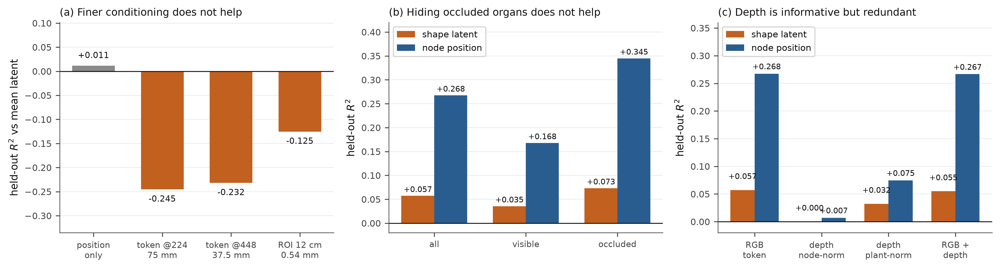

# Stage 3 conditioning, settled: the information is not in a nadir view

**Status**: four probes, no training runs. Three of them return negative results that close
long-standing hypotheses; the fourth shows what *is* recoverable. Together they change the direction
of Stage 3 work rather than refine it.

**Question asked**: Stage 3's per-node shape latent sits at the dataset mean. Why, and what fixes it?

---

## 1. The four candidate explanations, and what each measured

Until today there were four live hypotheses for the mean collapse. Each had an obvious fix attached,
and the fixes point in completely different directions, so they were worth separating before spending
GPU-weeks on any of them.

| # | Hypothesis | Proposed fix | Verdict |
| :-- | :--- | :--- | :--- |
| 1 | One DINOv2 token spans 75 mm and covers 7–15 phytomers, so the feature is shared and the target is their average | finer conditioning: 448 px, per-node ROI crops | **rejected** |
| 2 | 53% of organs are fully occluded; their shape is unanswerable, and their gradient drags the shared feature to the mean | visibility-weighted or masked shape loss | **rejected** |
| 3 | The encoder never sees depth, though the design specifies RGB-D | restore the depth channel to the backbone | **not the cause** (but see §5) |
| 4 | Regression to the conditional mean is the wrong objective; a contrastive alignment would preserve discriminative information | InfoNCE between ViT tokens and phytomer latents | **starts from chance** |



---

## 2. Resolution does not help (hypothesis 1)

`plant_recon/eval/eval_latent_conditioning_ceiling.py`, 59 plants / 2,441 nodes, ridge probe from
frozen features to the ground-truth PhytomerVAE latent, held out by plant. R² is measured against the
*training-set mean latent*, so 0 means "no better than predicting the mean".

| conditioning | resolution | held-out R² |
| :--- | :--- | ---: |
| position only (no image) | — | **+0.011** |
| token @224 | 75.0 mm/cell | −0.245 |
| token @448 | 37.5 mm/cell | −0.232 |
| ROI crop, 12 cm window | **0.54 mm/px** | −0.125 |

Doubling the feature grid moves the number by 0.013. A 12 cm crop at 0.54 mm per pixel — roughly
140× finer than a token — is still *worse than predicting the mean*. The negative values mean the
image features actively mislead across a plant-level split, which a constant predictor would not.

This is the hypothesis the previous three sessions were built around, including the backbone ladder
that was implemented for exactly this test. It does not survive it.

## 3. Occlusion is not the cause (hypothesis 2)

Per-organ visibility now comes straight from the rasterizer: nvdiffrast packs (triangle id + 1) into
`rast_out[..., 3]`, and the mesh builder carries a per-vertex `part_indices`, so an exact
occlusion-aware pixel count per organ costs nothing extra at render time.

Across the 20-plant eval set, of **9,636 ground-truth organs, 53.4% contribute ZERO pixels** (30–79%
per plant), and on mature plants the median *visible* organ covers 11–13 pixels. Helios' own COCO
masks agree in kind: the DAP 72 plant has 965 organs but 385 annotations, 148 of them under 50 px.

That made hypothesis 2 look compelling. It is still wrong. Restricting the probe to visible organs
**lowers** latent R², 0.057 → 0.036, and occluded organs are slightly *more* predictable (0.073).
The likely reason is mundane: occluded organs sit deep inside the canopies of large plants, which is
a coarse regularity, while visible organs are on the surface and far more varied.

**A visibility-weighted shape loss is therefore not worth building.** Two further points fall out:

- **Do not mask node position by visibility.** Occluded positions are the most decodable quantity in
  the whole study (R² 0.345, against 0.168 for visible). Masking them would discard the strongest
  signal the conditioning carries.
- The scaffold's health is explained. Node position is recoverable at R² 0.27 while shape is not,
  which is why node RMSE holds at ~1.7 cm through every silhouette collapse observed in the A/B runs.

## 4. Contrastive alignment would start from chance (hypothesis 4)

R² asks whether the conditional *mean* is recoverable. Contrastive learning asks whether the feature
can *discriminate*, and the two genuinely differ: if a token is equally compatible with two very
different shapes, the conditional mean is their average and R² is ~0 while the feature still carries
real information. So the question deserved its own measurement rather than an inference from R².

The probe reports retrieval top-1 through a learned linear map: can a node's predicted target pick out
its own organ among the other organs *of the same plant*? On visible organs it scores **0.027 against
a chance rate of 0.041** — at or below chance. InfoNCE optimises exactly this quantity, so it would be
starting from chance rather than unlocking latent information.

Not ruled out with nonlinear projection heads or stronger features; but there is no evidence here of
information waiting for a better objective.

> Method note: the retrieval metric must go through a learned map. An earlier version compared raw
> DINOv2 features to VAE latents by cosine on truncated dimensions — spaces that share no geometry —
> and duly scored below chance.

## 5. Depth: informative, redundant here, and still an open design gap (hypothesis 3)

`DINORayEncoder.forward` takes `x[:, 4*l : 4*l+3]` for each pyramid level — the RGB of each level and
**never channel 3** — so all four depth channels of the 16-channel RGB-D pyramid are discarded, while
`current-architecture.md`, the cascaded design-space ADR and the 3-stage milestone all specify an
RGB-D input. Depth survives only as a *loss* target, which is why this stayed invisible: the project
genuinely does use depth, just never as an input. (This was already recorded as §1.1 of the
2026-09-16 sim-to-real assessment and not acted on; it was rediscovered independently on 2026-09-18.)

| conditioning | shape latent R² | node position R² |
| :--- | ---: | ---: |
| RGB token | +0.057 | +0.268 |
| depth, node-normalised | +0.000 | +0.007 |
| depth, plant-normalised | +0.032 | +0.075 |
| RGB + depth | +0.055 | +0.267 |

**The normalisation is not neutral.** Standardising each node's depth patch individually — what
"always normalise depth before comparing" implies if applied to an input feature — scores 0.000,
because it subtracts the node's own height, which is the entire signal a canopy height map carries.
Per-plant normalisation recovers +0.032. Any future depth input must preserve relative height.

Depth is then informative but redundant: 25 raw numbers recover 56% of what a 384-dimensional DINOv2
token does for shape, yet RGB + depth is no better than RGB alone. The top-down render already encodes
height through shading and occlusion.

**This does not settle the real-image case.** The test used a perfect synthetic CHM against clean
renders. On real frames RGB is the *degraded* channel — DINOv2 MMD to real photos is 0.614 for flat
synthetic against 0.418 augmented — so depth's relative value there could be much higher. The doc↔code
mismatch stays open on those grounds, not on these.

---

## 6. What this means for Stage 3

Per-organ shape is **not present in a single nadir view at any resolution tested**. Petiole curvature,
three leaflet orientations and four reproductive slots are not observable from directly above; no
encoder extracts what the viewpoint does not contain. The mean collapse is the model behaving
correctly under an ill-posed target.

The implication is a change of goal, not of method:

1. **Stop trying to make Stage 3 deterministic.** It already is generative (rectified flow). Judge it
   on the *distribution* it produces — spread, hull ratio, boundary F — not on per-node latent R².
2. **Put the effort into shape statistics and selection.** Get the sampled distribution right, then
   let the silhouette loss and test-time refinement choose among plausible samples. The `--spread_weight`
   objective (implemented, never launched) is aimed at exactly this.
3. **Leave the scaffold alone.** Node position is the one thing the conditioning does carry.
4. **Revisit conditioning only with a genuinely different observation** — a second viewpoint, or real
   depth on real frames where RGB is degraded. More pixels from the same nadir view will not do it.

## 7. Reproducing

```bash
# (a) conditioning ladder -- phytomer latent, 224 vs 448 vs ROI
python plant_recon/eval/eval_latent_conditioning_ceiling.py \
    --checkpoint outputs/checkpoints/ab_organ/hierarchical_fm_epoch_060.pt \
    --n_plants 60 --backbones "dinov2_vits14@224,dinov2_vits14@448"

# (b,c) visibility split and depth conditioning -- organ latent and node position
python plant_recon/eval/eval_visibility_conditioning_probe.py \
    --checkpoint outputs/checkpoints/ab_organ/hierarchical_fm_epoch_060.pt --n_plants 80
```

Results: `outputs/logs/20260918/latent_ceiling/latent_ceiling.json`,
`outputs/logs/20260918/visibility_depth_probe.json`.
