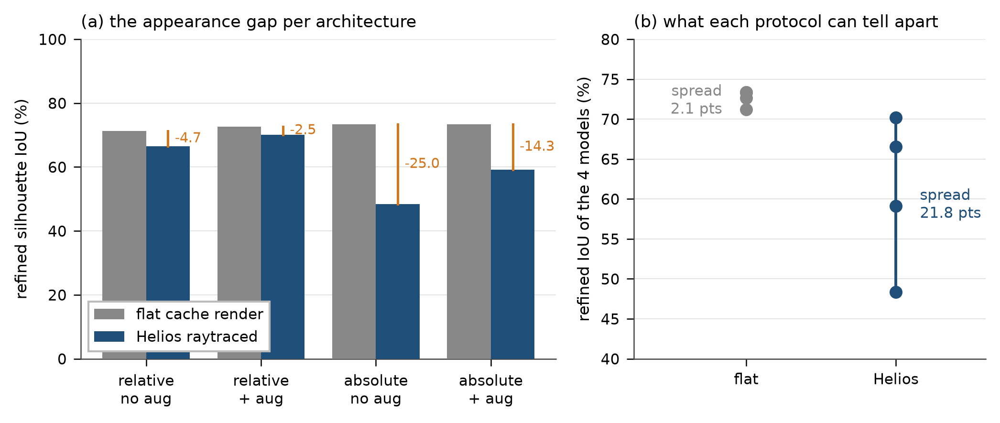

# The flat render does not discriminate architectures, and it reversed two of today's conclusions

> # ⚠️ EVERY ABSOLUTE NUMBER IN THIS REPORT IS INVALID (found 2026-09-20)
>
> `sample_ode` returns the node's own **rot6d (6 components)** in `phytomer_roll` under
> `--stage3_absolute`; the relative layout carries roll (2). `eval_test_time_refinement.py` never
> branched on the layout, so the 6-wide rot6d went into `roll_to_matrix`, which normalises all six
> together, reads only the first two as (cos, sin), discards the rest, and rebuilds the forward axis
> **from the chain** — exactly what the absolute layout exists to avoid. Absolute models were
> evaluated as relative ones with a corrupted roll.
>
> **The relative numbers here are unaffected.** Every `merged_*` figure is not. Fixed and re-running;
> conclusions about the absolute layout must wait for those results.


2026-09-19. Four checkpoints, each scored on the flat cache render (this project's standard protocol)
and on Helios raytraced re-renders at the cache's framing (`--rgb_override_dir`). All at
`--steps 200 --sample_seed 0`, replicated, on the same 20 plants.

The four form a clean 2x2 over `stage3_absolute` (the merged hybrid's flow state) and
`APPEARANCE_AUGMENT`. Every other setting matches, and the three 10k-sample runs share
`max_train_samples=10000`.

| | flat | **Helios** | gap |
| :--- | ---: | ---: | ---: |
| relative, no aug (`v10_cam` ep160) | 71.23 | 66.53 | −4.70 |
| relative, **aug** (`sub10_v10_cam_aug` ep230) | 72.65 | **70.16** | −2.49 |
| absolute, no aug (`merged_abs` ep280) | 73.34 | 48.36 | −24.98 |
| absolute, aug (`merged_aug` ep280) | 73.37 | 59.11 | −14.26 |



*Regenerate with `assets/plot_flat_vs_helios.py`.*

## The headline is the spread, not any single row

**Flat spreads these four models over 2.1 points (71.2–73.4). Helios spreads them over 21.8
(48.4–70.2).** And the orders are nearly reversed: on flat the two absolute models rank first and
second, on Helios they rank third and fourth by a wide margin.

The flat render is a nearly appearance-free image — uniform colours, no shadows, no texture. A model
can score well on it by exploiting cues that do not survive contact with a raytraced image, and the
flat metric cannot see the difference. So **architecture comparisons run on flat renders have been
measuring something that barely varies**, which is why so many of this project's A/B results have
landed within two or three points of each other.

## Two of today's conclusions do not survive

**"The merged architecture ties the baseline."** Measured on flat: merged_aug 73.37 vs baseline
71.23. Measured on Helios: 59.11 vs 66.53. The tie was an artifact of the appearance that flatters
the absolute state.

**"Gate G is the strongest lever."** On flat, `--n_starts 8` is worth +3.42 at 6.8 SE — the clearest
effect of the sweep. On Helios, for the relative augmented lineage, it is worth **+1.08 at 1.3 SE**,
i.e. not resolved. Its mechanism is selection among eight hypotheses on final input loss; under an
appearance shift the hypotheses are apparently more uniformly poor, so there is less to select.
That is the same shape as the start-insensitivity seen in `merged_abs`.

## What the 2x2 says about the two factors

```
effect of augmentation on the gap:   relative +2.21    absolute +10.72
effect of stage3_absolute on the gap:  no aug -20.28    aug -11.77
```

**`stage3_absolute` is what makes the lineage appearance-brittle** — it costs 20.3 points of gap
without augmentation and 11.8 with. Augmentation helps both variants but helps the absolute one
roughly five times more, because it has five times as much to repair. Augmentation is not fixing a
general weakness so much as partially compensating for one the absolute state introduces.

## Best measured configuration on realistic appearance

**relative + appearance augmentation + Gate G = 71.24.** That is the number a new architecture has to
beat, and it should be quoted from the Helios column from now on.

## Consequence for protocol

Report Helios alongside flat for anything that compares architectures or training recipes. Flat
remains fine for things that do not touch how pixels are read — refinement step count, optimiser
choice, regularisation weights — since those act on geometry after the image has been consumed. It
is not fine for anything that changes the encoder, the flow state, or the training distribution.
