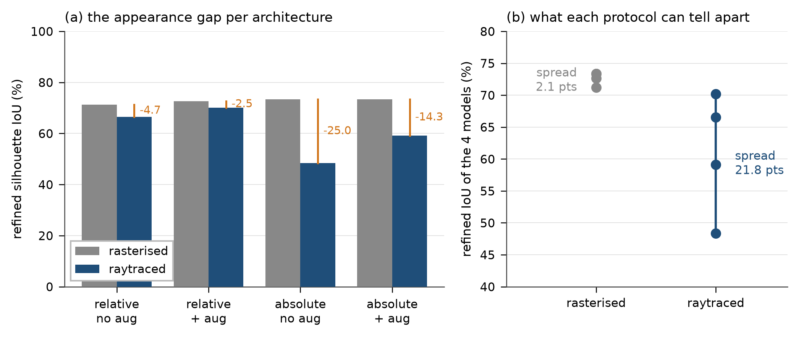

# The rasterised render does not discriminate architectures, and it reversed two of today's conclusions

> # ⚠️ The absolute numbers here were re-measured on 2026-09-20 — conclusions hold
>
> A bug had absolute checkpoints evaluated through the relative rotation path: `sample_ode` returns
> the node's own **rot6d (6)** in `phytomer_roll` under `--stage3_absolute` (relative carries roll, 2),
> and `eval_test_time_refinement.py` never branched on the layout, so `roll_to_matrix` normalised all
> six together, read only the first two as (cos, sin), discarded the rest, and rebuilt the forward
> axis **from the chain** — what the absolute layout exists to avoid.
>
> Everything was re-run with the fix. **The effect turned out to be small** — rasterised moved −0.46 to
> +2.35 and raytraced −0.80 to +1.20, mostly within the 0.58 noise floor. **Raw moved more** (+1.2 to
> +2.6 on rasterised), which is the expected shape: the model's own rot6d is a better starting rotation
> than a chain-reconstructed roll, and refinement compensates for most of the difference through
> position, scale and latent.
>
> **Corrected figures, to be read in place of the originals below:**
>
> | checkpoint | rasterised | raytraced | gap |
> | :--- | ---: | ---: | ---: |
> | `merged_abs` ep280 | 72.88 | 49.52 | −23.35 |
> | `merged_aug` ep280 | 73.82 | 58.31 | −15.50 |
> | `merged_full` ep170 | 74.30 | 61.81 | −12.48 |
> | `merged_fullaug` ep170 | 72.58 | 66.19 | −6.39 |
> | **relative + aug** (unaffected) | 72.65 | **70.16** | **−2.49** |
>
> Every conclusion in this report survives: relative still leads raytraced by a wide margin, the
> absolute layout is still far more appearance-brittle, and ten times the data still closes most of
> its gap (−15.50 → −6.39).


2026-09-19. Four checkpoints, each scored on the rasterised cache render (this project's standard protocol)
and on raytraced re-renders at the cache's framing (`--rgb_override_dir`). All at
`--steps 200 --sample_seed 0`, replicated, on the same 20 plants.

The four form a clean 2x2 over `stage3_absolute` (the merged hybrid's flow state) and
`APPEARANCE_AUGMENT`. Every other setting matches, and the three 10k-sample runs share
`max_train_samples=10000`.

| | rasterised | **Helios** | gap |
| :--- | ---: | ---: | ---: |
| relative, no aug (`v10_cam` ep160) | 71.23 | 66.53 | −4.70 |
| relative, **aug** (`sub10_v10_cam_aug` ep230) | 72.65 | **70.16** | −2.49 |
| absolute, no aug (`merged_abs` ep280) | 73.34 | 48.36 | −24.98 |
| absolute, aug (`merged_aug` ep280) | 73.37 | 59.11 | −14.26 |



*Regenerate with `assets/plot_rasterised_vs_raytraced.py`.*

## The headline is the spread, not any single row

**Rasterised spreads these four models over 2.1 points (71.2–73.4). raytraced spreads them over 21.8
(48.4–70.2).** And the orders are nearly reversed: on rasterised the two absolute models rank first and
second, on the raytraced protocol they rank third and fourth by a wide margin.

The rasterised render is a nearly appearance-free image — uniform colours, no shadows, no texture. A model
can score well on it by exploiting cues that do not survive contact with a raytraced image, and the
rasterised metric cannot see the difference. So **architecture comparisons run on rasterised renders have been
measuring something that barely varies**, which is why so many of this project's A/B results have
landed within two or three points of each other.

## Two of today's conclusions do not survive

**"The merged architecture ties the baseline."** Measured on the rasterised protocol: merged_aug 73.37 vs baseline
71.23. Measured on the raytraced protocol: 59.11 vs 66.53. The tie was an artifact of the appearance that flatters
the absolute state.

**"Gate G is the strongest lever."** On rasterised, `--n_starts 8` is worth +3.42 at 6.8 SE — the clearest
effect of the sweep. On Helios, for the relative augmented lineage, it is worth **+1.08 at 1.3 SE**,
i.e. not resolved. Its mechanism is selection among eight hypotheses on final input loss; under an
appearance shift the hypotheses are apparently more uniformly poor, so there is less to select.
That is the same shape as the start-insensitivity seen in `merged_abs`.

## What the 2x2 says about the two factors

```
effect of augmentation on the gap:   relative +2.21    absolute +10.72
effect of stage3_absolute on the gap:  no aug -20.28    aug -11.77
```

**`stage3_absolute` is what makes the lineage appearance-brittle** — it costs 20.3 points of gap
without augmentation and 11.8 with. Augmentation helps both variants but helps the absolute one
roughly five times more, because it has five times as much to repair. Augmentation is not fixing a
general weakness so much as partially compensating for one the absolute state introduces.

## Best measured configuration on realistic appearance

**relative + appearance augmentation + Gate G = 71.24.** That is the number a new architecture has to
beat, and it should be quoted from the raytraced column from now on.

## Consequence for protocol

Report raytraced alongside rasterised for anything that compares architectures or training recipes. Flat
remains fine for things that do not touch how pixels are read — refinement step count, optimiser
choice, regularisation weights — since those act on geometry after the image has been consumed. It
is not fine for anything that changes the encoder, the flow state, or the training distribution.
