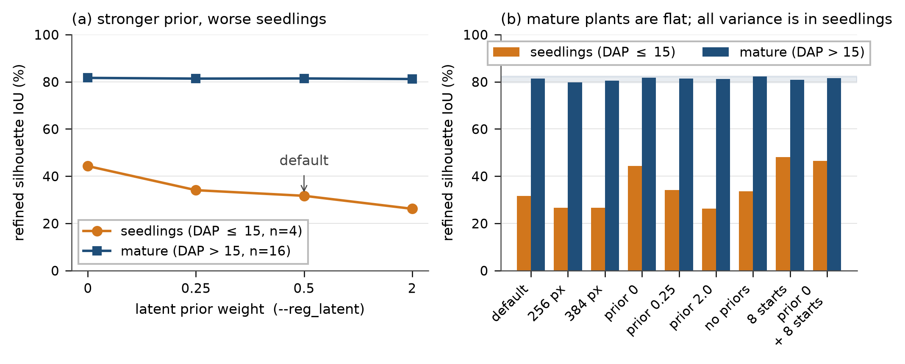

# Every test-time-refinement lever we have is a seedling lever

2026-09-19. Nine seeded refinement runs on the same checkpoint and the same 20-plant eval set.
Checkpoint `outputs/checkpoints/hierarchical_fm_v10_cam/hierarchical_fm_epoch_160.pt`, eval set
`outputs/checkpoints/hierarchical_fm_v9/eval_set.json`, `--steps 200 --sample_seed 0`.
Logs and per-plant JSON in `outputs/logs/20260919/s_*.{log,json}`.

## Why these runs are comparable and the earlier ones were not

An earlier unseeded version of this sweep varied 35.2-39.6% on the *raw* (pre-refinement) number
alone, because each run drew a different flow sample. That spread is larger than most of the
effects being measured, and it reversed the sign of two conclusions. `--sample_seed` (commit
`a78299d`) fixes the ODE sample, so eight of the nine runs below start from an identical
raw 37.9% and any difference in the refined column is caused by the flag under test. The two
`n_starts 8` runs necessarily differ, because their reported raw is the *selected* start.

## Result

*Figure regenerated by `assets/plot_refinement_levers.py` from the per-plant JSON in
`outputs/logs/20260919/s_*.json`.*

| run | raw | refined | lift | seedling DAP<=15 raw -> ref | DAP>15 raw -> ref |
|---|---|---|---|---|---|
| `s_base` (defaults) | 37.9 | 71.5 | +33.6 | 19.2 -> 31.7 | 42.6 -> 81.4 |
| `s_res256` | 37.9 | 69.2 | +31.3 | 19.2 -> 26.7 | 42.6 -> 79.8 |
| `s_res384` | 37.9 | 69.8 | +31.9 | 19.2 -> 26.6 | 42.6 -> 80.6 |
| `s_pr0` (`--reg_latent 0`) | 37.9 | **74.2** | +36.3 | 19.2 -> **44.3** | 42.6 -> 81.7 |
| `s_pr025` (`--reg_latent 0.25`) | 37.9 | 71.9 | +34.0 | 19.2 -> 34.1 | 42.6 -> 81.3 |
| `s_pr2` (`--reg_latent 2.0`) | 37.9 | 70.2 | +32.3 | 19.2 -> 26.2 | 42.6 -> 81.2 |
| `s_noreg` (latent *and* scale prior off) | 37.9 | 72.5 | +34.6 | 19.2 -> 33.7 | 42.6 -> **82.2** |
| `s_n8` (`--n_starts 8`) | 37.3 | **74.3** | +37.0 | 15.8 -> **48.0** | 42.7 -> 80.9 |
| `s_pr0_n8` (both) | 38.5 | 74.6 | +36.1 | 19.6 -> 46.5 | 43.3 -> 81.6 |

**The DAP>15 column is flat: 79.8-82.2 over all nine configs.** Nothing in this sweep moves mature
plants; refinement already takes them to ~81% and no flag studied here changes that by more than
noise. **The DAP<=15 column spans 26.2-48.0.** Every "global" effect in the `refined` column is a
seedling effect diluted by the sixteen mature plants in the set. Reporting only the 20-plant mean
hides what is actually happening, and earlier notes in this project that quoted a single refined
number were, without knowing it, reporting the seedling story at one-fifth strength.

## Three findings

**1. Resolution hurts, and it hurts seedlings.** 256 px costs 5.0 seedling points against the
default and 384 px costs 5.1, while mature plants move -1.6 and -0.8. The plausible mechanism is
that a higher-resolution silhouette gives the differentiable rasteriser a narrower gradient support
band at the mask boundary: an organ must already overlap the target to feel any pull. Low
resolution is a blurrier and therefore wider basin of attraction. That predicts the damage should
concentrate exactly where the initialisation is worst, which is what the table shows. This closes
"Test 1" (does raising render resolution help?) with a no.

**2. The latent prior is actively harmful, monotonically.** Across four settings with an identical
starting sample, seedling IoU is 26.2 / 31.7 / 34.1 / 44.3 for `reg_latent` 2.0 / 0.5 / 0.25 / 0.0.
Dropping the term is worth +18 seedling points and +2.7 overall, costs nothing and is one flag.
This is consistent with the Stage 3 conditioning probes (`docs/experiments/20260918-stage3-conditioning-settled/`):
if the per-organ latent carries almost no recoverable shape information from a nadir view, then
pulling the optimiser toward the flow's proposed latent is pulling it toward noise.

The effect is specific to the *latent* prior. `s_noreg`, which additionally drops `reg_scale`,
scores 72.5 against `s_pr0`'s 74.2 - so the scale prior is worth about 1.7 points and should stay.
It is doing the job its comment claims, keeping leaves from inflating to fill the target silhouette.

This also argues against score distillation as a direction: a distilled prior is a *stronger* pull
toward the generative model's belief, and the measured gradient of performance with respect to
prior strength is negative over the whole range we can test.

**3. Gate G and prior removal do not compose.** `n_starts 8` alone reaches 74.3, `reg_latent 0`
alone 74.2, and the combination 74.6 - between them rather than above them, and its *lift* (+36.1)
is no better than either alone (+36.3, +37.0). The two are redundant because they are two fixes for
one bottleneck: both are ways of escaping a bad latent proposal, one by resampling it eight times
and one by declining to be held to it. Once escaped, the second route buys nothing.

## What to use

Use **`--reg_latent 0` with `--n_starts 1`**. It matches eight-start Gate G (74.2 vs 74.3) at one
eighth of the compute - about 4 minutes against 25 for the same 20 plants. Gate G remains the
better choice only when the extra ~0.4 points of the combination is worth 8x the GPU time, which on
this evidence it is not.

## What this reframes

The refinement plateau is not an optimiser problem - L-BFGS was tested and lost badly to Adam
(54.3 vs 71.1 at 7.8x cost, commit `917d11e`) - and it is not a resolution problem. On mature
plants there is no plateau to attack: refinement reaches ~81% and the remaining gap is in the
initialisation the flow hands over, not in the fitting. On seedlings the fitting is the problem,
and the cause is that a 3-7 organ plant covering few pixels produces a weak render gradient that
the flow's proposal can overwhelm. Both levers that work, work by weakening that proposal.

The open question this raises is why the flow's seedling proposal is bad enough that ignoring it
beats using it, which is the same population where the organ-mode hull ratio was measured at 19x
and raw IoU sits at 19.2%. That is a training-side problem, not a refinement-side one.
