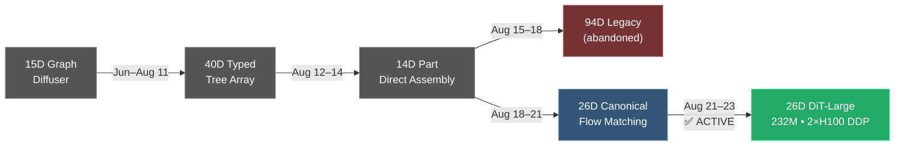

# Image-to-L-System: Project Status Report
> **Date**: 2026-08-23 · **Representation**: 26D Organ Vectors · **Active Model**: 232M DiT-Large Flow Matching

---

## Architecture Evolution Timeline



---

## 1. Current Pipeline Status (What's Live)

### ✅ Completed & Verified

| Component | Status | Key Files |
|-----------|--------|-----------|
| **26D Organ Encoding** | ✅ Production | [plant_organ_array.py](file:///home/lion397/codes/image-to-l-system/diffusion_based/models/plant_organ_array.py) — 512 slots × 26D |
| **100K Dataset Synthesis** | ✅ Complete | 10,000 XMLs (100 seeds × DAP 1–100) → `dataset/helios_data/cowpea/` |
| **GPU Tensor Sharding** | ✅ Complete | 100K `.pt` shards → `dataset/helios_data/cowpea_shard/` |
| **Helios C++ ↔ PyTorch Alignment** | ✅ 0.00 mm error | [helios_pytorch_geometry.py](file:///home/lion397/codes/image-to-l-system/diffusion_based/models/helios_pytorch_geometry.py) — gravitropic curvature, child shoot frames |
| **XML Round-Trip Fidelity** | ✅ 100% lossless | 100/100 samples, 200K+ tags, 0.000000 mm vertex error |
| **COCO Internode Masking** | ✅ Fixed | `main.cpp` → `"shoot"` mapped to Category ID 0 |
| **Multi-Arch CUDA Fatbin** | ✅ All GPUs | `nvdiffrast` compiled for sm_70/75/80/86/89/90+PTX |
| **Self-Healing SLURM** | ✅ Operational | Auto-resubmit + faulty GPU tarpit locking |

### 🔵 Active Training

| Item | Detail |
|------|--------|
| **Model** | 232M DiT-Large (ViT-16L encoder + Decoder-12L, embed=768, max_slots=4096) |
| **Hardware** | 2× NVIDIA H100 SXM5 on `gpu-10-58` via DDP |
| **SLURM Script** | [train_cowpea_dit_h100_ddp.sh](file:///home/lion397/codes/image-to-l-system/slurm_scripts/train_cowpea_dit_h100_ddp.sh) |
| **Training Script** | [train_cowpea_dit_100k_ddp.py](file:///home/lion397/codes/image-to-l-system/diffusion_based/training/train_cowpea_dit_100k_ddp.py) |
| **Config** | 60 epochs, BS=32, grad_accum=2, LR=4e-4, cosine+warmup |
| **Early Telemetry** | Step 50: velocity_loss=0.776, count_loss=16940, LR=4.28e-6 (warmup) |
| **Launch** | `sbatch slurm_scripts/train_cowpea_dit_h100_ddp.sh` |

---

## 2. 26D Node Vector Encoding

```
Dim  0–11:  One-hot organ classification (12 classes)
             0=Root Meta, 1=Shoot Meta, 2=Internode, 3=Petiole,
             4=Leaf, 5=Bud, 6=Peduncle, 7=Flower, 8=Fruit/Pod,
             9=Flower Closed, 10=Bud Aborted, 11=Empty
Dim 12–14:  Base position (x, y, z) / 20.0
Dim 15–20:  6D continuous rotation (R₆D, Gram-Schmidt)
Dim 21–23:  Scale (sx, sy, sz) / 50.0
Dim     24: Curvature / 100.0
Dim     25: Phyllotactic angle / 180.0
```

---

## 3. File Map — Active Pipeline

### Models

| File | Role | Params |
|------|------|--------|
| [canonical_cowpea_dit_large.py](file:///home/lion397/codes/image-to-l-system/diffusion_based/models/canonical_cowpea_dit_large.py) | **232M DiT-Large** (ViT-16L + Decoder-12L, max_slots=4096) | 232.43M |
| [canonical_cowpea_dit.py](file:///home/lion397/codes/image-to-l-system/diffusion_based/models/canonical_cowpea_dit.py) | 73M DiT (60 epoch baseline, superseded) | 73M |
| [helios_pytorch_geometry.py](file:///home/lion397/codes/image-to-l-system/diffusion_based/models/helios_pytorch_geometry.py) | 26D → 3D mesh builder (kinematics, gravitropic curvature) | — |
| [helios_pytorch_renderer.py](file:///home/lion397/codes/image-to-l-system/diffusion_based/models/helios_pytorch_renderer.py) | Multi-modal nvdiffrast GPU rasterizer (RGB + Depth + Mask) | — |
| [helios_xml_parser.py](file:///home/lion397/codes/image-to-l-system/diffusion_based/models/helios_xml_parser.py) | Helios XML → PlantOrganArray parser | — |
| [plant_organ_array.py](file:///home/lion397/codes/image-to-l-system/diffusion_based/models/plant_organ_array.py) | 26D organ array data structure & serialization | — |
| [part_assembly_to_xml.py](file:///home/lion397/codes/image-to-l-system/diffusion_based/models/part_assembly_to_xml.py) | PlantOrganArray → Helios XML reconstruction | — |

### Dataset

| File | Role |
|------|------|
| [cowpea_shard_dataset.py](file:///home/lion397/codes/image-to-l-system/diffusion_based/dataset/cowpea_shard_dataset.py) | `PlantShardDataset` — streaming shard loader + dynamic collation |
| [generate_tensor_shards.py](file:///home/lion397/codes/image-to-l-system/diffusion_based/dataset/generate_tensor_shards.py) | Phase 2 engine: XML → GPU render → 26D `.pt` shards |
| [canonical_cowpea_dataset.py](file:///home/lion397/codes/image-to-l-system/diffusion_based/dataset/canonical_cowpea_dataset.py) | Legacy 15K individual `.pt` dataset (superseded by shards) |
| [part_array_dataset.py](file:///home/lion397/codes/image-to-l-system/diffusion_based/dataset/part_array_dataset.py) | 26D node layout definition & normalization |

### Training

| File | Role |
|------|------|
| [train_cowpea_dit_100k_ddp.py](file:///home/lion397/codes/image-to-l-system/diffusion_based/training/train_cowpea_dit_100k_ddp.py) | **Active** — 2×H100 DDP training with W&B |
| [train_cowpea_dit_100k.py](file:///home/lion397/codes/image-to-l-system/diffusion_based/training/train_cowpea_dit_100k.py) | Single-GPU 100K shard training |
| [train_canonical_cowpea_flow_matching.py](file:///home/lion397/codes/image-to-l-system/diffusion_based/training/train_canonical_cowpea_flow_matching.py) | Legacy 73M trainer (60 epoch run complete) |

### Eval

| File | Role |
|------|------|
| [eval_cowpea_dit_100k.py](file:///home/lion397/codes/image-to-l-system/diffusion_based/eval/eval_cowpea_dit_100k.py) | 232M lifespan 6-column benchmark |
| [eval_canonical_cowpea_flow_matching.py](file:///home/lion397/codes/image-to-l-system/diffusion_based/eval/eval_canonical_cowpea_flow_matching.py) | 73M DAP-specific evaluation |
| [eval_pure_noise_flow_matching.py](file:///home/lion397/codes/image-to-l-system/diffusion_based/eval/eval_pure_noise_flow_matching.py) | Pure noise → generation quality |
| [metrics.py](file:///home/lion397/codes/image-to-l-system/diffusion_based/eval/metrics.py) | Masked SSIM, FG-IoU, Chamfer Distance |

### SLURM & Infrastructure

| File | Role |
|------|------|
| [train_cowpea_dit_h100_ddp.sh](file:///home/lion397/codes/image-to-l-system/slurm_scripts/train_cowpea_dit_h100_ddp.sh) | 2×H100 DDP training launcher |
| [generate_helios_dataset_jobs.sh](file:///home/lion397/codes/image-to-l-system/slurm_scripts/generate_helios_dataset_jobs.sh) | Master C++ XML + GPU sharding pipeline |

### C++ (Helios Submodule)

| File | Role |
|------|------|
| [main.cpp (syntheticdata_generation)](file:///home/lion397/codes/image-to-l-system/Digital-Crops/projects/syntheticdata_generation/main.cpp) | COCO mask export + XML synthesis |
| [render_xml/main.cpp](file:///home/lion397/codes/image-to-l-system/Digital-Crops/projects/render_xml/main.cpp) | Lightweight XML → image visualizer |

---

## 4. Checkpoints

| File | Model | Epochs | Notes |
|------|-------|--------|-------|
| `fm/canonical_cowpea_dit_best.pt` | 73M DiT | 60 | Baseline (loss ~1.2) |
| `fm/test_large.pt` | 232M DiT-Large | 1 | Test run only |
| `fm/cowpea_dit_large_2xh100_ddp.pt` | 232M DiT-Large | training… | **Active training target** |

---

## 5. 73M Baseline Performance (Reference)

| DAP | GT Vertices | Chamfer Distance | Mask IoU |
|-----|------------|-----------------|----------|
| 10  | 17,481     | 0.0529          | ~0.60    |
| 50  | 18,795     | 0.1902          | ~0.45    |
| 90  | 54,097     | 0.1711          | 0.4383   |

> Improvement target with 232M + 100K data: Chamfer < 0.05, Mask IoU > 0.70

---

## 6. Docs Organization — What's Where

### `docs/ongoing/` — Must-Read for Next Agent

| Document | Topic | Status |
|----------|-------|--------|
| [20260823 Renderer Alignment](file:///home/lion397/codes/image-to-l-system/docs/ongoing/20260823_differentiable_renderer_helios_alignment_and_roundtrip_report.md) | Kinematics, COCO masks, XML round-trip, renderer audit | ✅ Verified |
| [20260822 Dataset Pipeline](file:///home/lion397/codes/image-to-l-system/docs/ongoing/20260822_dataset_pipeline_multigpu_sharding_update.md) | CUDA 209 fix, 100-seed expansion, self-healing SLURM | ✅ Pipeline complete |
| [20260821 DiT Handoff](file:///home/lion397/codes/image-to-l-system/docs/ongoing/20260821_cowpea_100k_dit_large_handoff.md) | 73M → 232M DiT-Large scale-up, 26D encoding spec | ✅ Model designed |

### `docs/done/` — Completed Milestones (15 docs)

Covers Helios renderer handover (Aug 11), plant organ arrays (Aug 12), refactoring (Aug 13), 3D pipeline (Aug 14), 40D representation design (Aug 15), render alignment debug (Aug 15), flow matching scaffold analysis (Aug 18), and lab meeting reports (Aug 19).

### `docs/todo/` — Outstanding Items

| Document | Relevance to 26D DiT |
|----------|----------------------|
| [roadmap.md](file:///home/lion397/codes/image-to-l-system/docs/todo/roadmap.md) | ⚠️ **Stale** — references 14D/16D pipeline; needs rewrite for 26D |
| [15_loss_reduction_strategies.md](file:///home/lion397/codes/image-to-l-system/docs/todo/15_loss_reduction_strategies.md) | ⚠️ **Partially stale** — strategies valid but references 40D parameters |
| [2026-08-14-pytorch-renderer-optimization.md](file:///home/lion397/codes/image-to-l-system/docs/todo/2026-08-14-pytorch-renderer-optimization.md) | ⚠️ **Partially stale** — vectorized mesh is still relevant |

### `docs/results/` — Benchmark Reports

| Document | Content |
|----------|---------|
| [15_strategies_benchmark_report.md](file:///home/lion397/codes/image-to-l-system/docs/results/15_strategies_benchmark_report.md) | 14D benchmark across 3 paradigms (Direct Opt / ViT+Decoder / Diffusion) |
| `results/assets/` (36 images) | All benchmark figures including renderer comparisons, flow matching, VAE roundtrips |

### `docs/archived/` — Deprecated

| Subdirectory | Content |
|-------------|---------|
| `archived/todo/` | Abandoned XML diffusion plans |
| `archived/report1_backprop_vs_difffusion_legacy/` | Legacy 18D/40D figure generation scripts |
| `archived/done/`, `archived/ongoing/` | Empty |

### `docs/misc/`

| Document | Content |
|----------|---------|
| [20260822_cluster_power_cost_estimate.md](file:///home/lion397/codes/image-to-l-system/docs/misc/20260822_cluster_power_cost_estimate.md) | ~8.1 kW draw, $41.87/hr cloud equivalent |

---

## 7. Stale/Outdated Items Needing Update

> [!WARNING]
> The following items reference superseded representations (14D/15D/40D) and should be updated or archived.

### Root README.md
- [README.md](file:///home/lion397/codes/image-to-l-system/README.md) still describes the repo as "15D organ-typed graph diffusion" with file references to `graph_diffuser_3d.py`, `differentiable_renderer_3d.py` etc. — these are the *original* legacy files from the very first iteration. The active pipeline is **26D DiT-Large Flow Matching** with completely different file paths.

### docs/todo/roadmap.md
- References "14D precompute cache", "14D flow-matching model", and "extend 14D to 16D". All superseded by the 26D canonical pipeline. Should be rewritten.

### docs/todo/15_loss_reduction_strategies.md
- References "40 parameters per node" and "40D typed-array model". The strategy framework is still valuable but dimension references are wrong.

### docs/results/15_strategies_benchmark_report.md
- Header states "14D Part Assembly" benchmarks. Still useful as historical reference but no longer represents the active pipeline.

### diffusion_based/README.md & README_TECHNICAL.md
- [README.md](file:///home/lion397/codes/image-to-l-system/diffusion_based/README.md) and [README_TECHNICAL.md](file:///home/lion397/codes/image-to-l-system/diffusion_based/README_TECHNICAL.md) — likely describe earlier pipeline versions.

---

## 8. Recommended Next Actions

### Immediate (while training runs)
1. **Monitor 232M DiT-Large training** — check W&B for velocity loss convergence
2. **Update root README.md** — rewrite to reflect 26D DiT-Large pipeline
3. **Rewrite `docs/todo/roadmap.md`** — new roadmap around 26D, 232M, multi-species

### After Training Completes
4. **Run full lifespan evaluation**: `python diffusion_based/eval/eval_cowpea_dit_100k.py`
5. **Archive 08/21 and 08/22 ongoing docs to `docs/done/`** — dataset pipeline is complete
6. **Move stale todo docs to `docs/archived/todo/`**

### Medium-Term
7. **Canonical slot ordering** — sort by organ_type for training stability (noted in handoff doc)
8. **Renderer vectorization** — batch tube/leaf mesh construction (Phase 2 of [optimization plan](file:///home/lion397/codes/image-to-l-system/docs/todo/2026-08-14-pytorch-renderer-optimization.md))
9. **Multi-species expansion** — extend 26D pipeline to sorghum, bean

---

## 9. Directory Structure Summary (Active Code Only)

```
image-to-l-system/
├── diffusion_based/
│   ├── models/
│   │   ├── canonical_cowpea_dit_large.py   # 232M DiT-Large architecture
│   │   ├── plant_organ_array.py            # 26D organ array core
│   │   ├── helios_pytorch_geometry.py      # 26D → 3D mesh (kinematics)
│   │   ├── helios_pytorch_renderer.py      # nvdiffrast GPU rasterizer
│   │   ├── helios_xml_parser.py            # XML → PlantOrganArray
│   │   └── part_assembly_to_xml.py         # PlantOrganArray → XML
│   ├── dataset/
│   │   ├── cowpea_shard_dataset.py         # PlantShardDataset (streaming)
│   │   ├── generate_tensor_shards.py       # XML → GPU render → .pt shards
│   │   └── part_array_dataset.py           # 26D layout definition
│   ├── training/
│   │   ├── train_cowpea_dit_100k_ddp.py    # ★ Active: 2×H100 DDP trainer
│   │   └── train_cowpea_dit_100k.py        # Single-GPU fallback
│   └── eval/
│       ├── eval_cowpea_dit_100k.py          # Lifespan benchmark
│       └── metrics.py                       # mSSIM, FG-IoU, Chamfer
├── dataset/helios_data/
│   ├── cowpea/                              # 10K raw XMLs (100 seeds × 100 DAPs)
│   └── cowpea_shard/                        # 100K .pt tensor shards
├── slurm_scripts/
│   ├── train_cowpea_dit_h100_ddp.sh         # ★ Active: DDP training launcher
│   └── generate_helios_dataset_jobs.sh      # Master pipeline orchestrator
├── Digital-Crops/                           # Helios C++ submodule
│   └── projects/
│       ├── syntheticdata_generation/        # COCO mask + XML synthesis
│       └── render_xml/                      # Standalone XML viewer
└── docs/
    ├── ongoing/   # 3 active handoff docs (Aug 21–23)
    ├── done/      # 15 completed milestone docs
    ├── todo/      # 3 items (⚠️ stale — needs update)
    ├── results/   # 14D benchmark report + 36 figure assets
    ├── misc/      # Cluster cost estimate
    └── archived/  # Deprecated plans & legacy scripts
```
