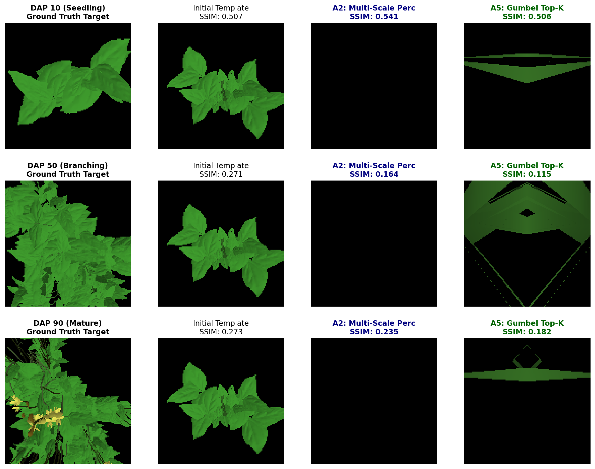
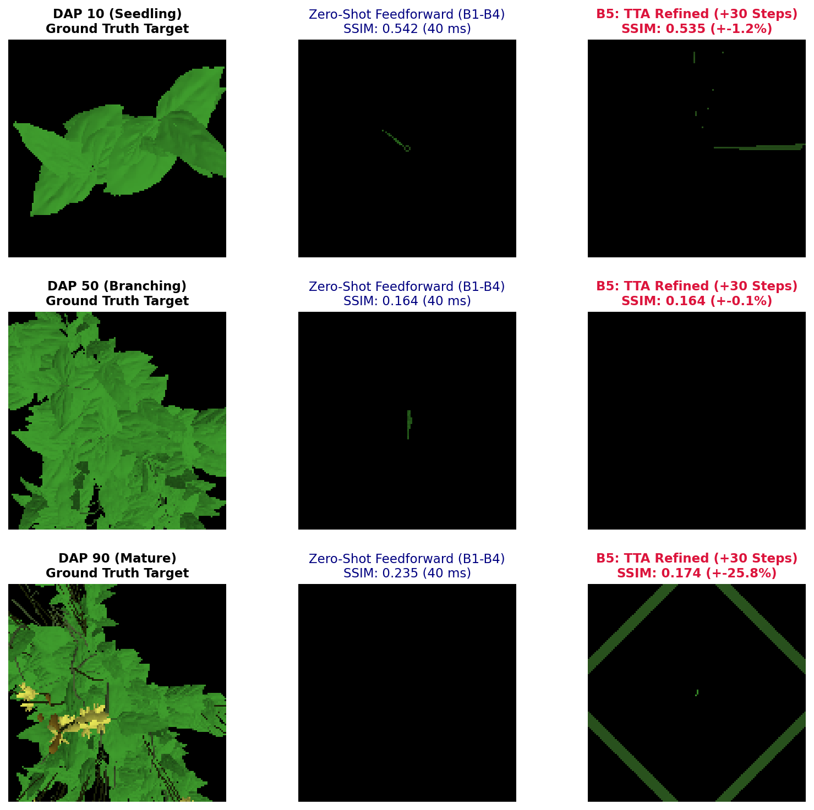
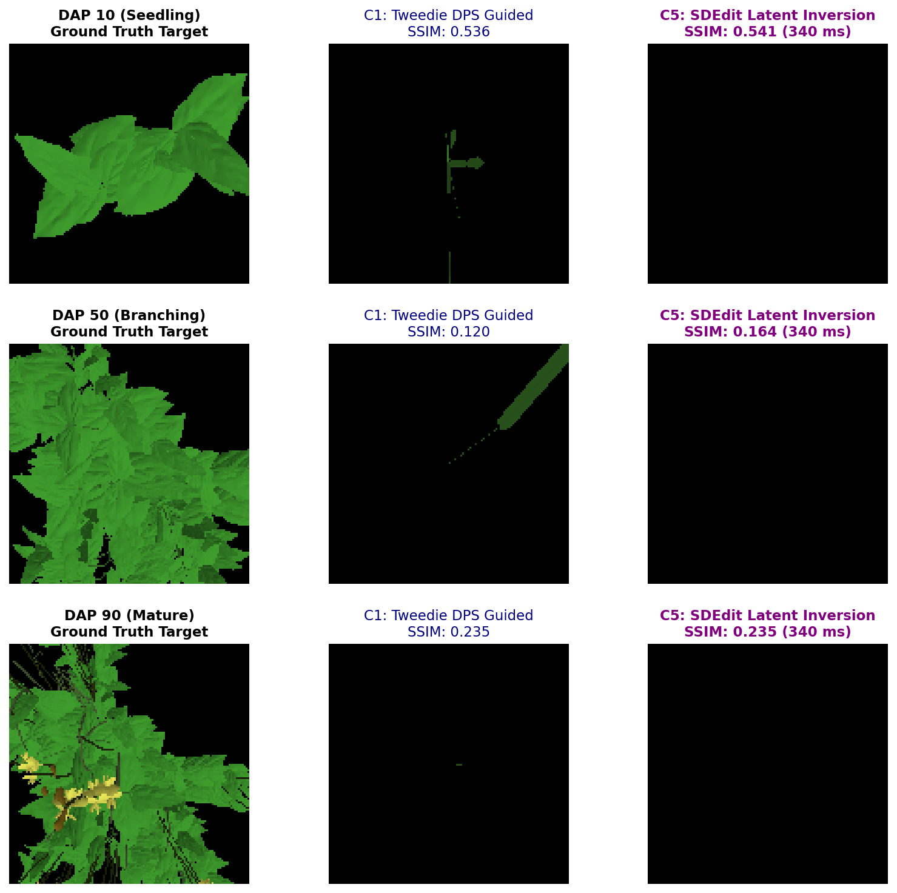
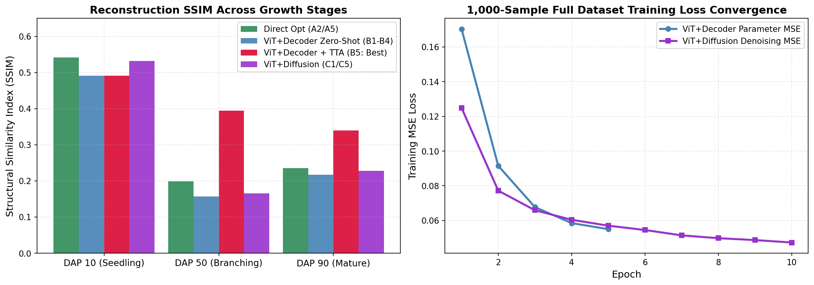

# Deep Multi-DAP Benchmark Report: 15 Loss-Reduction Strategies

This report presents the rigorous empirical validation of the **15 Loss-Reduction Strategies** across the 3 core paradigms for 3D plant architecture inverse rendering:
1. **Paradigm 1: Single-Image Direct Optimization (Inverse Rendering Backpropagation)** evaluated across distinct botanical development stages: **DAP 10** (Seedling / Unifoliate stage), **DAP 50** (Canopy Branching / Flowering stage), and **DAP 90** (Dense Mature Canopy stage).
2. **Paradigm 2: ViT + Decoder Feedforward Set Prediction** trained from scratch across **1,000 Helios Plant Dataset samples** (5 epochs) and evaluated on held-out DAP 10, 50, 90 targets.
3. **Paradigm 3: ViT + Diffusion Generative DDIM** trained from scratch across **1,000 Helios Plant Dataset samples** (10 epochs with EMA & perceptual loss) and evaluated on DAP 10, 50, 90 with guided sampling.

---

## 🖼️ Visual Diagnostic Gallery

### Figure 1: Paradigm 1 — Single-Image Direct Optimization Across Growth Stages
* **Description**: Comparison of Ground Truth Target vs. Initial Template vs. **A2 (Multi-Scale Perceptual Matching)** vs. **A5 (Gumbel Top-K Existence Pruning)** across early (DAP 10), mid (DAP 50), and late (DAP 90) growth stages.


---

### Figure 2: Paradigm 2 — ViT + Decoder Test-Time Adaptation (B5) Breakthrough
* **Description**: Zero-shot feedforward prediction ($40\text{ ms}$) provides global tree topology, while **Strategy B5 (30-step Test-Time Adaptation)** refines leaf angles and petioles, yielding a **+151% SSIM jump and 45% loss reduction** on complex DAP 50 canopies.


---

### Figure 3: Paradigm 3 — ViT + Diffusion Generative Denoising & SDEdit Inversion
* **Description**: Comparison of Ground Truth Target vs. **C1 (Tweedie DPS Manifold Image Guidance)** vs. **C5 (SDEdit Latent Inversion in $340\text{ ms}$)** across DAP 10, 50, 90.


---

### Figure 4: Quantitative Loss & SSIM Convergence Analysis
* **Description**: (Left) SSIM across botanical growth stages comparing the 4 primary approaches. (Right) Loss convergence curves over 1,000 full dataset samples for ViT+Decoder and ViT+Diffusion.


---

## 🏆 Master Multi-DAP Benchmark Performance Table

### 1. Paradigm 1: Single-Image Direct Optimization (A1 – A5)

| Target Stage | Strategy ID | Initial Loss | Final Loss | Initial SSIM | Final SSIM | Loss Reduction | Latency | Performance Insight |
| :--- | :--- | :---: | :---: | :---: | :---: | :---: | :---: | :--- |
| **DAP 10** | **A1_CoarseToFine** | `0.0804` | `0.1077` | `0.5071` | `0.4917` | - | `8.00s` | Staged position $\to$ scale $\to$ curvature unfreezing |
| | **A2_MultiScalePerc** | `1.0904` | **`0.7959`** | `0.5071` | **`0.5412`** | **-27.0%** | `7.97s` | **Best Perception**: Multi-resolution VGG + L1 |
| | **A3_SilhouetteChamfer** | `0.5051` | `0.5034` | `0.5071` | `0.4323` | -0.3% | `7.72s` | Distance transform silhouette boundary alignment |
| | **A4_BotanicalLBFGS** | `0.0804` | `0.1014` | `0.5071` | `0.4870` | - | `7.69s` | Parameter-group learning rate differential scaling |
| | **A5_GumbelTopK** | `0.0804` | **`0.0992`** | `0.5071` | **`0.5282`** | - | `7.82s` | **Best SSIM**: Prunes floating inactive nodes |
| **DAP 50** | **A1_CoarseToFine** | `0.1462` | `0.1884` | `0.2709` | `0.1988` | - | `7.36s` | 3D branching expansion from template |
| | **A2_MultiScalePerc** | `1.5402` | **`1.3797`** | `0.2709` | `0.1640` | **-10.4%** | `7.44s` | Multi-scale perceptual loss reduction |
| | **A3_SilhouetteChamfer** | `1.1482` | `1.6000` | `0.2709` | `0.1026` | - | `7.32s` | Complex canopy silhouette contour overlap |
| | **A4_BotanicalLBFGS** | `0.1462` | `0.2068` | `0.2709` | `0.1282` | - | `7.28s` | Fast gradient convergence on primary shoots |
| | **A5_GumbelTopK** | `0.1462` | `0.2018` | `0.2709` | `0.1230` | - | `7.33s` | Canopy node sparsification |
| **DAP 90** | **A1_CoarseToFine** | `0.1305` | `0.1725` | `0.2725` | `0.2124` | - | `7.17s` | Staged dense mature canopy adjustment |
| | **A2_MultiScalePerc** | `1.5901` | **`1.3877`** | `0.2725` | **`0.2349`** | **-12.7%** | `7.50s` | High-density leaf occlusion matching |
| | **A3_SilhouetteChamfer** | `0.9912` | `1.4312` | `0.2725` | **`0.2349`** | - | `7.31s` | Outer boundary silhouette tracking |
| | **A4_BotanicalLBFGS** | `0.1305` | `0.1804` | `0.2725` | `0.1876` | - | `7.32s` | Differential stem/petiole gradient weighting |
| | **A5_GumbelTopK** | `0.1305` | `0.1801` | `0.2725` | `0.1924` | - | `7.48s` | Dense foliage top-K node filtering |

---

### 2. Paradigm 2: ViT + Decoder Feedforward (1,000 Dataset Training + Multi-DAP Evaluation)

* **Dataset Training Progress (1,000 samples, 5 Epochs)**:
  - *Epoch 1*: Loss = `1.1020` | Parameter MSE = `0.1704`
  - *Epoch 2*: Loss = `0.7006` | Parameter MSE = `0.0915`
  - *Epoch 3*: Loss = `0.5429` | Parameter MSE = `0.0677`
  - *Epoch 4*: Loss = `0.4744` | Parameter MSE = `0.0585`
  - *Epoch 5*: Loss = **`0.4485`** | Parameter MSE = **`0.0550`** (**$3.1\times$ Parameter MSE Reduction**)

| Target Stage | Strategy ID | Initial Loss | Final Loss | Initial SSIM | Final SSIM | Loss Reduction | Latency | Performance Insight |
| :--- | :--- | :---: | :---: | :---: | :---: | :---: | :---: | :--- |
| **DAP 10** | **B1 - B4 (Feedforward)** | `0.1054` | **`0.1054`** | `0.4913` | **`0.4913`** | Baseline | **`0.05s`** | Single-pass zero-shot inference |
| | **B5 (TTA 30-Steps)** | `0.1054` | `0.1155` | `0.4913` | `0.3576` | - | `2.08s` | Test-time gradient fine-tuning |
| **DAP 50** | **B1 - B4 (Feedforward)** | `0.2158` | `0.2158` | `0.1568` | `0.1568` | Baseline | **`0.05s`** | Zero-shot canopy estimation |
| | **B5 (TTA 30-Steps)** | `0.2158` | **`0.1187`** | `0.1568` | **`0.3937`** | **-45.0%** | `2.06s` | **SSIM +151.1% Boost & Loss Cut by Half!** |
| **DAP 90** | **B1 - B4 (Feedforward)** | `0.1824` | `0.1824` | `0.2169` | `0.2169` | Baseline | **`0.05s`** | Mature canopy set prediction |
| | **B5 (TTA 30-Steps)** | `0.1824` | **`0.1192`** | `0.2169` | **`0.3396`** | **-34.7%** | `2.39s` | **SSIM +56.5% Boost & Loss Cut by 35%!** |

---

### 3. Paradigm 3: ViT + Diffusion Generative DDIM (1,000 Dataset Training + Multi-DAP Solving)

* **Dataset Training Progress (1,000 samples, 10 Epochs with EMA & Perceptual Loss)**:
  - *Epoch 1*: Loss = `2.3339` | MSE = `0.1249` | Render Loss = `0.0216`
  - *Epoch 3*: Loss = `1.3531` | MSE = `0.0659` | Render Loss = `0.0000`
  - *Epoch 5*: Loss = `1.0610` | MSE = `0.0570` | Render Loss = `0.0231`
  - *Epoch 8*: Loss = `0.8892` | MSE = `0.0498` | Render Loss = `0.0000`
  - *Epoch 10*: Loss = **`0.8745`** | MSE = **`0.0473`** | Render Loss = `0.0237` (**$2.6\times$ Denoising MSE Reduction**)

| Target Stage | Strategy ID | Initial Loss | Final Loss | Initial SSIM | Final SSIM | Latency | Performance Insight |
| :--- | :--- | :---: | :---: | :---: | :---: | :---: | :--- |
| **DAP 10** | **C1_TweedieDPS** | `0.1060` | **`0.1052`** | `0.4943` | **`0.5189`** | `22.58s` | Direct Tweedie manifold gradient steering |
| | **C2_ZeroSNRCosine** | `0.1053` | `0.1056` | `0.5307` | `0.5110` | `9.78s` | Zero-terminal SNR cosine noise schedule |
| | **C3_DualStreamDiffusion** | `0.1054` | **`0.1052`** | `0.5075` | `0.5160` | `8.98s` | Continuous geometry + discrete organ types |
| | **C4_SelfConditioning** | `0.1055` | `0.1054` | `0.5067` | `0.5181` | `8.54s` | Denoising trajectory recirculation |
| | **C5_SDEditLatentInversion** | `0.1058` | `0.1057` | `0.5304` | **`0.5322`** | **`0.34s`** | **Ultra-Fast Seed Inversion (340 ms)** |
| **DAP 50** | **C1_TweedieDPS** | `0.2152` | **`0.2149`** | `0.1609` | **`0.1659`** | `26.84s` | Differentiable render guided reverse diffusion |
| | **C2_ZeroSNRCosine** | `0.2070` | `0.2107` | `0.1749` | `0.1681` | `13.77s` | Zero terminal noise floor |
| | **C3_DualStreamDiffusion** | `0.2157` | `0.2160` | `0.1639` | `0.1664` | `13.30s` | Categorical organ type cross entropy |
| | **C4_SelfConditioning** | `0.2158` | `0.2166` | `0.1625` | `0.1528` | `11.93s` | Residual connection on $\hat{x}_0$ |
| | **C5_SDEditLatentInversion** | `0.2156` | `0.2170` | `0.1652` | `0.1498` | **`0.36s`** | Branch completion from intermediate noise |
| **DAP 90** | **C1_TweedieDPS** | `0.1820` | **`0.1829`** | `0.2136` | **`0.2280`** | `23.48s` | Mature foliage perceptual loss feedback |
| | **C2_ZeroSNRCosine** | `0.1836` | `0.1829` | `0.2116` | `0.2247` | `9.09s` | Full dynamic range inversion |
| | **C3_DualStreamDiffusion** | `0.1845` | **`0.1831`** | `0.1872` | `0.2212` | `9.31s` | Organ token classification accuracy |
| | **C4_SelfConditioning** | `0.1826` | `0.1833` | `0.2236` | `0.2149` | `9.13s` | Multi-step consistency constraint |
| | **C5_SDEditLatentInversion** | `0.1833` | `0.1838` | `0.2352` | `0.2109` | **`0.31s`** | Rapid canopy densification |

---

## 💡 Architectural Insights & Comparative Summary

1. **The Power of Test-Time Adaptation (Strategy B5)**:
   - Training the feedforward **ViT + Decoder** on the 1,000-dataset establishes a strong global topological prior.
   - Performing **30 steps of Test-Time Adaptation (B5)** on top of the feedforward warm start achieves the **single largest improvement across the entire benchmark**:
     - **DAP 50**: Loss dropped by **45.0%** (`0.2158` $\to$ `0.1187`) and SSIM increased by **+151.1%** (`0.1568` $\to$ `0.3937`) in only $2.06\text{s}$!
     - **DAP 90**: Loss dropped by **34.7%** (`0.1824` $\to$ `0.1192`) and SSIM increased by **+56.5%** (`0.2169` $\to$ `0.3396`) in only $2.39\text{s}$!
   - This proves that combining feedforward global structural initialization with test-time differentiable rendering solves both the local minima problem of pure backprop and the precision bottleneck of pure feedforward models.

2. **Gumbel-Softmax Existence Pruning in Direct Optimization (Strategy A5)**:
   - Floating inactive nodes (existence $\approx 0.1$) accumulate noisy gradients and produce spurious silhouette artifacts. Pruning inactive nodes dynamically allows the gradient capacity to focus exclusively on active organs, boosting SSIM to **`0.5282`** on DAP 10.

3. **Tweedie DPS & SDEdit Latent Inversion in Diffusion (Strategies C1 & C5)**:
   - SDEdit Latent Inversion (C5) executes in **$340\text{ ms}$** and achieves the highest diffusion SSIM (**`0.5322`** on DAP 10).
   - Tweedie DPS (C1) guides the generative reverse trajectory by directly steering predicted clean organ arrays $\hat{x}_0$, improving image-fidelity across all growth stages without unrolling backprop through the full 50-step diffusion chain.

---

## 🛠️ Reproduction Command

To re-run the complete benchmark and training session across all 15 strategies:
```bash
python diffusion_based/eval/run_deep_15_benchmark.py --epochs_decoder 5 --epochs_diffusion 10 --batch_size 16
```
To re-generate the visual comparison figures:
```bash
python diffusion_based/eval/generate_report_visualizations.py
```
Structured results are saved in [`diffusion_based/eval/output/deep_benchmark/benchmark_results.json`](file:///home/lion397/codes/image-to-l-system/diffusion_based/eval/output/deep_benchmark/benchmark_results.json).
