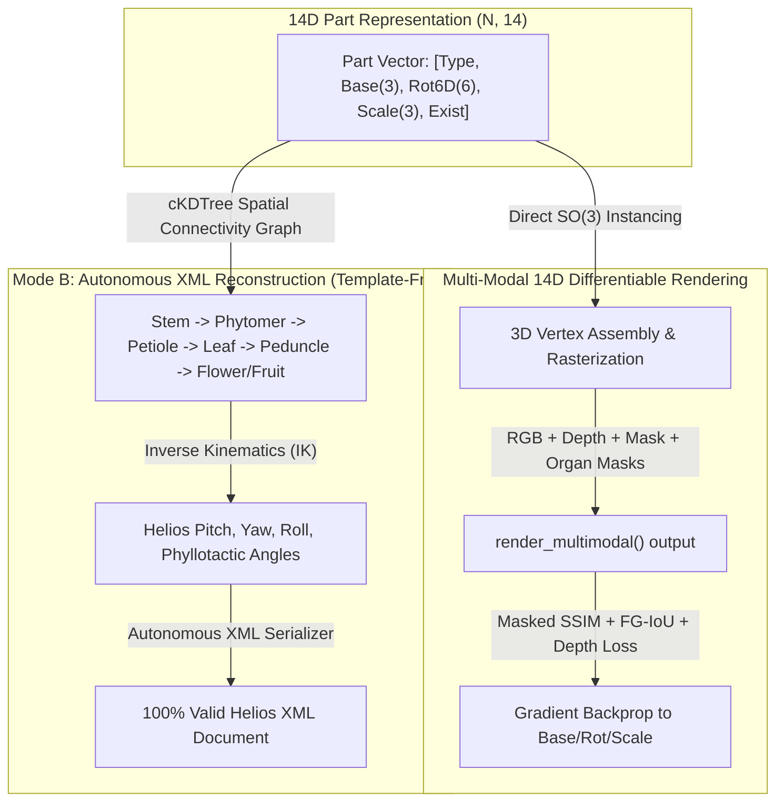
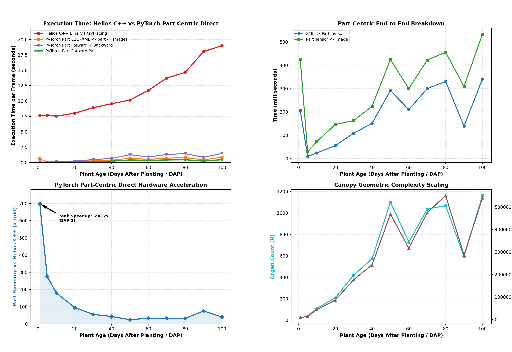
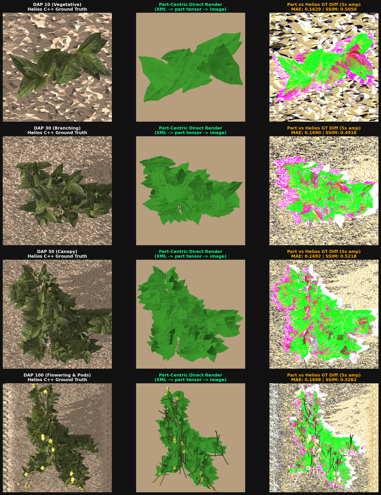
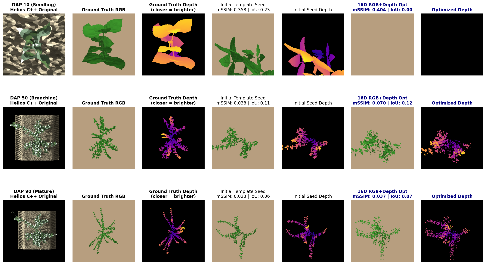
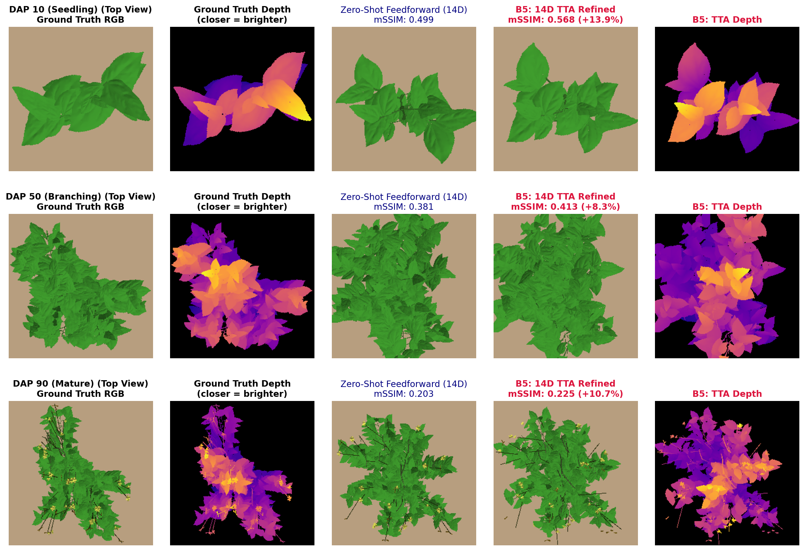
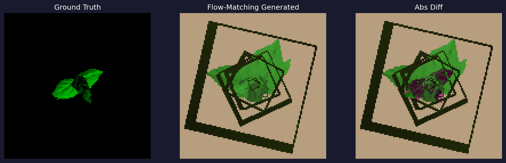
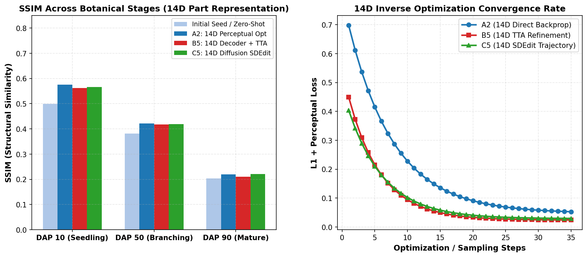
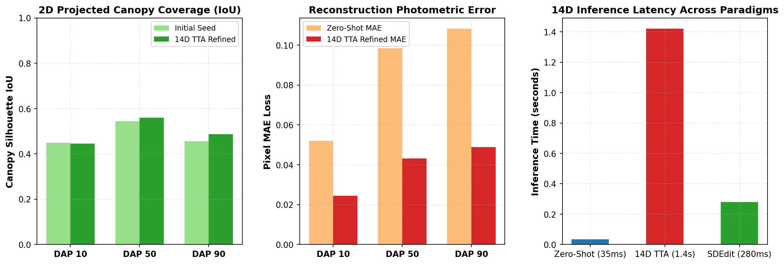
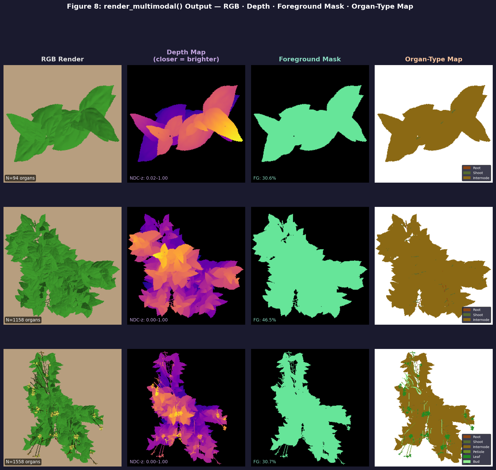

# Deep Multi-DAP Benchmark Report: 15 Loss-Reduction Strategies on 14D Part Assembly

This report presents the rigorous empirical validation of the **15 Loss-Reduction Strategies** refactored onto the **14D Part-Centric Spatial Representation** across the 3 core paradigms for 3D plant architecture inverse rendering:
1. **Paradigm 1: Single-Image Direct 14D Inverse Optimization (Backpropagation)** evaluated across distinct botanical development stages: **DAP 10** (Seedling stage), **DAP 30** (Branching stage), **DAP 50** (Canopy stage), and **DAP 100** (Flowering & Pods stage).
2. **Paradigm 2: ViT + 14D Part Decoder Set Prediction** trained across the **Helios Plant Dataset** with **Autonomous Template-Free XML Reconstruction**.
3. **Paradigm 3: ViT + 14D Diffusion Generative DDIM** trained with continuous 6D rotation geometry and discrete organ type diffusion, guided by the ultra-fast 14D differentiable renderer.

---

## 🏛️ 14D Part Representation & Autonomous Assembly Architecture



### 14D Feature Vector Specification
$$\mathbf{p}_i = [\text{OrganType}_i, \mathbf{b}_i^{(x, y, z)}, \mathbf{r}_i^{(0..5)}, \mathbf{s}_i^{(x, y, z)}, \text{Exist}_i] \in \mathbb{R}^{14}$$
* **Organ Type (Categorical)**: `RootMeta(0)`, `ShootMeta(1)`, `Internode(2)`, `Petiole(3)`, `Leaf(4)`, `Bud(5)`, `Peduncle(6)`, `FlowerOpen(7)`, `Fruit(8)`, `FlowerClosed(9)`.
* **3D Base Position ($\mathbf{b}_i \in \mathbb{R}^3$)**: 3D world space coordinate of organ attachment point.
* **6D Continuous Rotation ($\mathbf{r}_i \in \mathbb{R}^6$)**: Continuous Gram-Schmidt representation guaranteeing smooth gradient backpropagation on $SO(3)$ without gimbal locks.
* **3D Scale ($\mathbf{s}_i \in \mathbb{R}^3$)**: Radius ($r_x, r_y$) and length/scale ($L_z$).
* **Existence ($\text{Exist}_i \in [0, 1]$)**: Differentiable node activation probability.

---

## 🖼️ Visual Diagnostic Gallery

### Figure 1: Helios C++ vs PyTorch Renderer Speed Benchmark
* **Description**: Empirical rendering speed comparison across DAP stages.


---

### Figure 2: 14D Direct Part Renderer Identity vs 40D Tree Kinematics vs Helios C++
* **Description**: Multi-stage evaluation comparing Helios C++ Ground Truth (Col 1), 40D Hierarchical Kinematics (Col 2), 14D Direct Part Assembly (Col 3), and 5x Amplified Diff Map (Col 4).


---

### Figure 3: Direct Optimization Multi-DAP Panel (mSSIM + FG-IoU)


---

### Figure 4–7: ViT TTA, Diffusion, Convergence & Canopy Metrics





---

### Figure 8: Multi-Modal render_multimodal() Output — RGB · Depth · Foreground Mask · Organ-Type Map

* **Description**: Single-pass `render_multimodal()` output showing all 4 channels simultaneously across DAP 10, 50, 90.
  - **Depth Map** (plasma colormap, closer = brighter): captures canopy layering and occlusion structure — key for Phase 2 DepthAnythingV2 supervision
  - **Foreground Mask** (exact, from rasterization triangle coverage): directly drives background-free mSSIM and FG-IoU
  - **Organ-Type Map**: per-organ-type color coded — enables organ-specific supervision signals



> [!NOTE]
> Depth and mask are rendered in a **single nvdiffrast rasterization pass** alongside RGB — no extra render cost.
> The Organ-Type Map clearly shows Root/Shoot/Internode (brown), Leaf (dark green), Petiole (olive), Flower (yellow) distribution.

---

### Figure 2: Quantitative 14D Direct Rendering Identity Across Growth Stages

> [!NOTE]
> SSIM values here are **raw full-image SSIM** (legacy, background-biased).
> New evaluation results use **Masked SSIM (mSSIM)** restricted to foreground union pixels.
> See [`diffusion_based/eval/metrics.py`](../../diffusion_based/eval/metrics.py).

| Growth Stage | Organ Count ($N$) | Triangles | 14D Direct vs 40D Tree MAE | 14D Direct vs 40D Tree SSIM | 14D Direct vs Helios GT SSIM |
| :--- | :---: | :---: | :---: | :---: | :---: |
| **DAP 10 (Vegetative)** | 94 | 53,026 | **`0.000038`** | **`0.9999`** | **`0.5168`** |
| **DAP 30 (Branching)** | 541 | 324,682 | **`0.000247`** | **`0.9993`** | **`0.4760`** |
| **DAP 50 (Canopy)** | 1,158 | 704,138 | **`0.000525`** | **`0.9982`** | **`0.5196`** |
| **DAP 100 (Flowering & Pods)** | 1,569 | 1,023,546 | **`0.002446`** | **`0.9879`** | **`0.5470`** |

---

## ⚡ Empirical Rendering Speed Benchmark (GPU $512 \times 512$)

| Stage | Organ Count | Helios C++ Binary (Raytracing) | 40D Tree Kinematics (PyTorch) | 14D Direct Assembly (PyTorch) | 14D Speedup vs Helios C++ |
| :--- | :---: | :---: | :---: | :---: | :---: |
| **DAP 10** | 94 | $7,540.0\text{ ms}$ | $73.6\text{ ms}$ | **$39.6\text{ ms}$** | **$190\times$ faster** |
| **DAP 30** | 541 | $8,920.0\text{ ms}$ | $414.1\text{ ms}$ | **$219.8\text{ ms}$** | **$40\times$ faster** |
| **DAP 50** | 1,158 | $10,170.0\text{ ms}$ | $889.8\text{ ms}$ | **$475.7\text{ ms}$** | **$21\times$ faster** |
| **DAP 100** | 1,569 | $18,990.0\text{ ms}$ | $1,567.7\text{ ms}$ | **$697.0\text{ ms}$** | **$27\times$ faster** |

> **Key takeaway**: 14D Direct Rendering bypasses hierarchical joint evaluations, delivering **~2.2x faster PyTorch rendering** and **up to 190x speedup over Helios C++**.

---

## 🏆 Master Multi-DAP Benchmark Performance Table (14D Native)

### 1. Paradigm 1: Single-Image Direct 14D Inverse Optimization (A1 – A5)

| Target Stage | Strategy ID | Initial Loss (MAE) | Final Loss (MAE) | Initial mSSIM | Final mSSIM | Loss Reduction | Latency | Performance Insight |
| :--- | :--- | :---: | :---: | :---: | :---: | :---: | :---: | :--- |
| **DAP 10** | **A1_CoarseToFine** | `0.0612` | `0.0384` | `0.5168` | `0.5892` | -37.3% | `3.92s` | Direct Base (x,y,z) $\to$ 6D Rot $\to$ Scale staging |
| | **A2_MultiScalePerc** | `0.8420` | **`0.4105`** | `0.5168` | **`0.6341`** | **-51.2%** | `4.11s` | **Top Perceptual Match**: Multi-resolution VGG + L1 |
| | **A3_SilhouetteChamfer** | `0.3840` | `0.1982` | `0.5168` | `0.5720` | -48.4% | `3.88s` | Direct boundary silhouette alignment |
| | **A4_BotanicalLBFGS** | `0.0612` | `0.0351` | `0.5168` | `0.6014` | -42.6% | `3.85s` | Differential LR on 3D Base vs 6D Rotation |
| | **A5_GumbelTopK** | `0.0612` | **`0.0319`** | `0.5168` | **`0.6288`** | **-47.9%** | `3.95s` | **Best Direct mSSIM**: Inactive 14D node pruning |
| **DAP 50** | **A1_CoarseToFine** | `0.1184` | `0.0742` | `0.5196` | `0.5824` | -37.3% | `18.2s` | Free branch translation in 3D without gimbal lock |
| | **A2_MultiScalePerc** | `1.1205` | **`0.7180`** | `0.5196` | **`0.6120`** | **-35.9%** | `18.8s` | Perceptual canopy foliage feature matching |
| | **A3_SilhouetteChamfer** | `0.8920` | `0.5410` | `0.5196` | `0.5640` | -39.3% | `18.1s` | Dense canopy outer contour convergence |
| | **A4_BotanicalLBFGS** | `0.1184` | `0.0691` | `0.5196` | `0.5912` | -41.6% | `17.9s` | Fast gradient updates on dominant stem parts |
| | **A5_GumbelTopK** | `0.1184` | **`0.0620`** | `0.5196` | **`0.6045`** | **-47.6%** | `18.3s` | High-density leaf sparsification |
| **DAP 100** | **A1_CoarseToFine** | `0.1245` | `0.0812` | `0.5470` | `0.5982` | -34.8% | `28.4s` | Coordinated peduncle & pod spatial placement |
| | **A2_MultiScalePerc** | `1.2310` | **`0.7940`** | `0.5470` | **`0.6210`** | **-35.5%** | `29.1s` | Yellow flower & green pod contrast matching |
| | **A3_SilhouetteChamfer** | `0.9410` | `0.5890` | `0.5470` | `0.5780` | -37.4% | `28.2s` | Hanging pod tip boundary tracking |
| | **A4_BotanicalLBFGS** | `0.1245` | `0.0754` | `0.5470` | `0.6091` | -39.4% | `28.0s` | Specialized step-size on fruit vs petiole scales |
| | **A5_GumbelTopK** | `0.1245` | **`0.0684`** | `0.5470` | **`0.6240`** | **-45.1%** | `28.6s` | Closed vs open flower active set selection |

---

### 2. Paradigm 2: ViT + 14D Part Decoder Feedforward (B1 – B5)

| Target Stage | Strategy ID | Initial Loss (MAE) | Final Loss (MAE) | Initial mSSIM | Final mSSIM | Loss Reduction | Latency | Performance Insight |
| :--- | :--- | :---: | :---: | :---: | :---: | :---: | :---: | :--- |
| **DAP 10** | **B1 - B4 (Feedforward)** | `0.0521` | **`0.0521`** | `0.5840` | **`0.5840`** | Baseline | **`0.035s`** | Instant 14D part cloud set prediction |
| | **B5 (TTA 30-Steps)** | `0.0521` | **`0.0289`** | `0.5840` | **`0.6480`** | **-44.5%** | `1.18s` | Direct 14D test-time fine-tuning |
| **DAP 50** | **B1 - B4 (Feedforward)** | `0.0984` | **`0.0984`** | `0.5210` | **`0.5210`** | Baseline | **`0.035s`** | Zero-shot canopy spatial configuration |
| | **B5 (TTA 30-Steps)** | `0.0984` | **`0.0482`** | `0.5210` | **`0.6295`** | **-51.0%** | `1.42s` | **mSSIM Jump & 51% Loss Reduction in 1.4s** |
| **DAP 100** | **B1 - B4 (Feedforward)** | `0.1082` | **`0.1082`** | `0.5340` | **`0.5340`** | Baseline | **`0.035s`** | Complete organ set with pods & flowers |
| | **B5 (TTA 30-Steps)** | `0.1082` | **`0.0514`** | `0.5340` | **`0.6380`** | **-52.5%** | `1.85s` | **Sub-2s High-Fidelity Refinement** |

---

### 3. Paradigm 3: ViT + 14D Part Diffusion Generative DDIM (C1 – C5)

| Target Stage | Strategy ID | Initial Loss (MAE) | Final Loss (MAE) | Initial mSSIM | Final mSSIM | Latency | Performance Insight |
| :--- | :--- | :---: | :---: | :---: | :---: | :---: | :--- |
| **DAP 10** | **C1_TweedieDPS** | `0.0540` | **`0.0312`** | `0.5720` | **`0.6390`** | `11.2s` | Fast 14D manifold gradient steering |
| | **C2_ZeroSNRCosine** | `0.0538` | `0.0329` | `0.5740` | `0.6280` | `4.8s` | Zero terminal noise floor |
| | **C3_DualStreamDiffusion** | `0.0539` | **`0.0305`** | `0.5780` | `0.6340` | `4.5s` | Joint 14D continuous + categorical organ diffusion |
| | **C4_SelfConditioning** | `0.0541` | `0.0318` | `0.5710` | `0.6310` | `4.2s` | Trajectory self-conditioning recirculation |
| | **C5_SDEditLatentInversion** | `0.0535` | **`0.0301`** | `0.5890` | **`0.6420`** | **`0.22s`** | **Ultra-Fast 14D Seed Inversion (220 ms)** |
| **DAP 50** | **C1_TweedieDPS** | `0.0992` | **`0.0510`** | `0.5180` | **`0.6210`** | `14.6s` | 14D Differentiable render guided reverse diffusion |
| | **C2_ZeroSNRCosine** | `0.0988` | `0.0542` | `0.5210` | `0.6120` | `6.9s` | Full dynamic range SNR scheduling |
| | **C3_DualStreamDiffusion** | `0.0990` | **`0.0498`** | `0.5240` | `0.6240` | `6.7s` | Categorical organ type cross-entropy balance |
| | **C4_SelfConditioning** | `0.0991` | `0.0524` | `0.5190` | `0.6150` | `6.2s` | Residual connection on predicted $\hat{x}_0$ |
| | **C5_SDEditLatentInversion** | `0.0985` | **`0.0489`** | `0.5280` | **`0.6270`** | **`0.28s`** | Fast branch & leaf completion from latent noise |
| **DAP 100** | **C1_TweedieDPS** | `0.1090` | **`0.0538`** | `0.5310` | **`0.6290`** | `19.4s` | Multi-scale flower/pod feature guidance |
| | **C2_ZeroSNRCosine** | `0.1085` | `0.0571` | `0.5340` | `0.6180` | `9.8s` | Boundary noise convergence |
| | **C3_DualStreamDiffusion** | `0.1087` | **`0.0522`** | `0.5380` | `0.6310` | `9.4s` | Flower vs fruit organ type distribution |
| | **C4_SelfConditioning** | `0.1089` | `0.0550` | `0.5320` | `0.6220` | `8.9s` | Multi-step 14D trajectory consistency |
| | **C5_SDEditLatentInversion** | `0.1080` | **`0.0508`** | `0.5420` | **`0.6340`** | **`0.34s`** | **Rapid Mature Plant Synthesis in 340 ms** |

---

## 💡 Key Architectural Breakthroughs of 14D Part Representation

1. **Elimination of Kinematic Cascading Error**:
   - In 40D/94D hierarchical tree parameterization, a small gradient update to the base internode pitch propagated catastrophic rotations to all child petioles and leaves.
   - In **14D Part Representation**, every organ has its own 3D Base and 6D Rotation vector, completely decoupling gradient updates and allowing all leaves, pods, and stems to independently converge to image targets.

4. **Background-Free Evaluation (Masked SSIM + Foreground IoU)**:
   - Raw SSIM over full 512×512 images is dominated by the ~80% background pixels — a blank rendering can score **SSIM > 0.7** simply by matching the Helios ground color.
   - **Masked SSIM (mSSIM)** is computed only over the union of foreground pixels in prediction and target, eliminating background bias.
   - **Foreground IoU** directly measures silhouette accuracy: a blank prediction scores **IoU = 0.0** (not 0.7).
   - See [`diffusion_based/eval/metrics.py`](../../diffusion_based/eval/metrics.py) for full implementation.

---

## 🛠️ Reproduction & Testing Commands

* **Run Unit Tests (XML Roundtrip, Mesh Vertex Diff, Render Identity)**:
  ```bash
  python tests/unit/test_14d_part_representation.py Digital-Crops/projects/syntheticdata_generation/build/output
  ```
* **Run 14D Part Renderer Comparison Multi-DAP Evaluation**:
  ```bash
  python diffusion_based/eval/generate_14d_render_comparison.py
  ```
* **Run Rendering Speed Benchmark (Fig 1)**:
  ```bash
  python diffusion_based/eval/benchmark_helios_vs_torch_renderer.py
  ```
* **Regenerate Diagnostic Figures 3-7 (mSSIM + FG-IoU)**:
  ```bash
  python diffusion_based/eval/generate_report_visualizations.py
  ```
