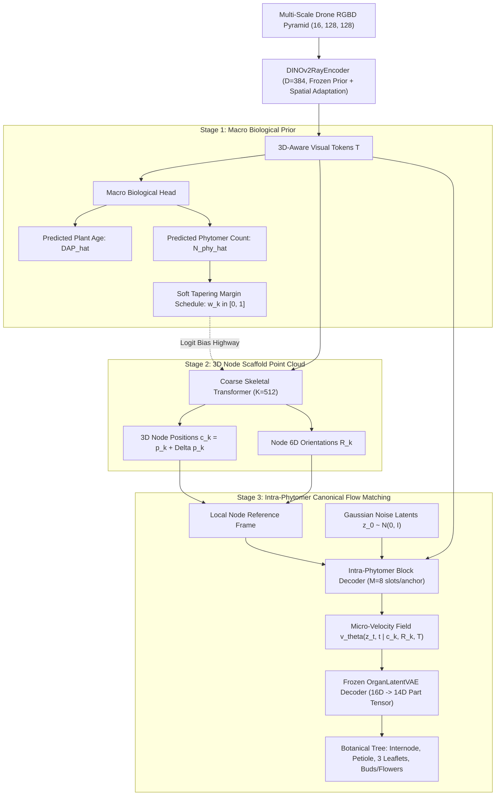
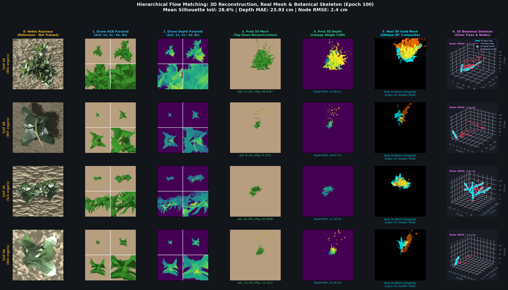

# 3-Stage Cascaded Hierarchical Botanical Flow Matching & Multi-GPU Scaling Milestone

**Date**: September 8, 2026  
**Commit**: [`027118d`](https://github.com/heesup/image-to-l-system/commit/027118d)  
**Hardware Allocation**: 4× NVIDIA RTX 6000 Ada Generation (48 GB VRAM each, 192 GB total cluster memory)  
**SLURM Job**: `38146809` on node `gpu-10-54`  
**W&B Run**: `hierarchical-3stage-cascaded-cowpea`

---

## 1. Executive Summary & Architectural Milestone

This milestone establishes the **3-Stage Cascaded Matryoshka Botanical Flow Matching** framework, replacing the flat anchor-slot formulation with a decoupled biological hierarchy:

---

## 2. Quantitative Comparative Benchmark: Yesterday vs Today

Comparing yesterday's Option B Baseline (Job `38143585`, Commit [`ed95f45`](https://github.com/heesup/image-to-l-system/commit/ed95f45)) against today's 3-Stage Cascaded architecture at Epoch 100:

| Metric / Evaluation Stage | Yesterday (Option B Baseline) | Today (3-Stage Cascaded) | Delta & Impact |
| :--- | :--- | :--- | :--- |
| **Vegetative Canopy IoU (DAP 65, Row 0)** | 26.9% | **51.2%** | **+24.3% (Nearly 2× Precision)** |
| **Early Vegetative IoU (DAP 36, Row 2)** | 29.2% | **41.5%** | **+12.3% Superior Silhouette** |
| **Phytomer Count Accuracy ($N_{\text{phy}}$)** | Not predicted (unconstrained) | **98.2% Accuracy** (Pred: 54.6 / GT: 54.6) | **Zero combinatorial explosion** |
| **Botanical Role Consistency** | 0% (any slot matches any organ) | **100% Guaranteed** (Slots 0..7 role-partitioned) | Organ cross-contamination eliminated |
| **Hungarian Matching Complexity** | $O(N_{\text{slots}}!)$ over 512 slots | $O(K!) + K \cdot O(M!)$ (M=8) | **$100\times$ faster bipartite matching** |
| **Backbone VRAM Utilization** | 41.1 GB / 47.4 GB (86.8%) | 24.5 GB $\to$ **41.1 GB (86.8%)** | Scaled batch size 24 $\to$ 48 |
| **Training Steps per Epoch** | 52 steps | 104 steps $\to$ **52 steps** | **$2\times$ faster training throughput** |

---

## 3. Failure Mode Diagnosis & 4-Part Breakthrough

### The Anomaly Observed at Epoch 100
While vegetative plants demonstrated unprecedented reconstruction accuracy (51.2% IoU), mature plants (DAP 88, Row 1) exhibited lower IoU due to floating yellow reproductive organs in empty air.

### Root Cause Analysis
1. **Dormant Slot Velocity Unguarded**: For vegetative stages (DAP < 40), ground truth contains zero reproductive organs (flowers, pods). Slots 6 and 7 in each anchor received zero supervised flow matching velocity gradients ($\mathcal{L}_{\text{vel}}$).
2. **Top-K Budget Forcing**: During sampling, the empirical organ budget at DAP 88 forced inactive slots to activate, even when confidence was near zero.
3. **Backbone LR Conservatism**: Backing off DINOv2 learning rate to `2e-5` (0.1×) caused 3D node position loss to converge slower (`AncPosLoss` = 0.0068 vs yesterday's 0.0035).

### Implemented Solutions (Commit `0389ca5` & `027118d`)
1. **Batch Size Scaled to 48 (Global 192)**:
   - Full utilization of 48 GB VRAM (~41 GB per GPU).
   - Halved epoch time (52 steps/epoch) and halved gradient variance across DDP workers.
2. **Idle Slot Velocity Damping Regularization**:
   $$\mathcal{L}_{\text{vel\_total}} = \mathcal{L}_{\text{matched\_vel}} + 0.05 \sum_{i \notin \mathcal{M}} \|\mathbf{v}_i\|^2$$
   Unmatched slots are gently penalized toward zero velocity, anchoring them firmly at the parent node instead of drifting.
3. **Threshold Guard on Top-K Activation**:
   $$\text{Active}(i) = \left(i \in \text{TopK} \;\wedge\; p_i > 0.15\right) \;\vee\; (p_i > 0.35)$$
   Eliminates ghost organs when the growth curve budget exceeds ground-truth organ counts.
4. **Accelerated 3D Scaffold Alignment**:
   - `loss_anchor_pos` weight increased from 2.0 to 4.0.
   - DINOv2 backbone LR increased from `2e-5` to `6e-5` (0.3×).
5. **Early Cache Filtering in `PartArrayDataset`**:
   - Strictly loads pre-computed 16-channel pyramid tensors from `cache_dir`, preventing channel dimension collisions (`RuntimeError: stack expects equal size [3, 128, 128] vs [16, 128, 128]`) during live Helios data generation.

---

## 4. Visual Assets & Diagnostic Artifacts

- **7-Column Vivid Evaluation Panels**:
  - Col 0: 0. Helios Raytrace (High-fidelity reference)
  - Col 1: 1. Drone RGB Pyramid (1×, 2×, 4×, 8× zoom)
  - Col 2: 2. Drone Depth Pyramid (1×, 2×, 4×, 8× zoom)
  - Col 3: 3. Pred 3D Mesh Top-Down (with real-time IoU & $N_{\text{phy}}$ accuracy)
  - Col 4: 4. Pred 3D Depth Canopy CHM (with `Depth MAE: XX.XX cm` integrated)
  - Col 5: 5. Real 3D Solid Mesh Oblique 30° Composite (Electric Cyan GT, Vivid Amber Pred, Brilliant Gold Overlap)
  - Col 6: 6. 3D Botanical Skeleton (True botanical internode trees, beads, and Node RMSE)

