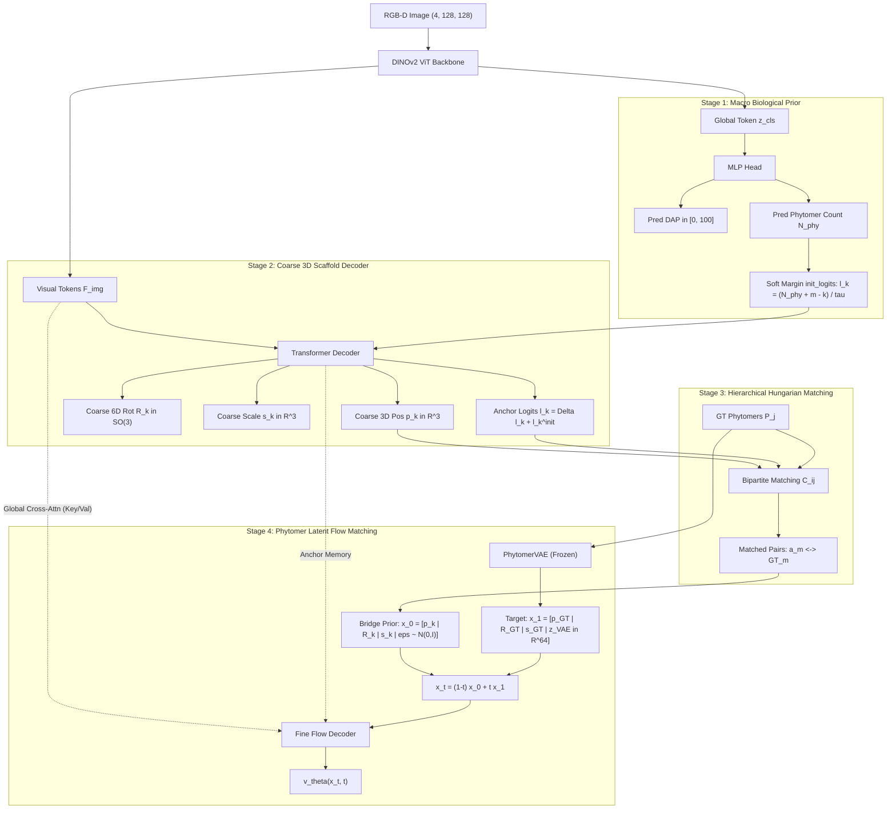

제시해주신 로그(`grad_norm is NaN/Inf (inf), skipping optimizer.step()`)의 **근본적인 알고리즘 및 수치 연산 원인**을 정밀 분석했습니다.

결론부터 말씀드리면, **수학적 오버플로우(Float32 Overflow), Flow Matching 사전 분포의 Autograd 누수(Leakage), 그리고 옵티마이저 스킵으로 인한 데드락(Deadlock Trap)**이 복합적으로 얽혀 발생한 현상입니다.

현재 시스템의 **End-to-End 알고리즘 수식 체계**와 **오류 발생의 메커니즘**, 그리고 **해결책**을 구체적으로 설명해 드립니다.

---

### 1. End-to-End 알고리즘 수식 및 아키텍처

식물(Cowpea)은 줄기를 따라 마디(Phytomer Node)가 순차적으로 자라나며, 각 마디마다 줄기·엽병·소엽(Leaflet)·꽃/꼬투리가 달리는 **계층적 자기유사 구조(Hierarchical Self-similarity)**를 가집니다. 이를 모델링하기 위해 4단계 파이프라인으로 구성되어 있습니다.



---

#### Stage 1: 거시적 생물학적 사전 분포 (Macro Biological Prior)
- **입력**: RGB-D 4채널 캐노피 이미지 $I \in \mathbb{R}^{4 \times 128 \times 128}$ (RGB + LiDAR 높이맵).
- DINOv2 인코더를 통해 비주얼 토큰 $F_{\text{img}} \in \mathbb{R}^{B \times N_p \times C}$ 및 클래스 토큰 $z_{\text{cls}} \in \mathbb{R}^{B \times C}$ 추출.
- 생육 일수(DAP) 및 파이토머 개수 예측:
  $$\widehat{\text{DAP}} = 100.0 \times \text{ReLU}(W_{\text{dap}} h) \in [0, 100]$$
  $$\widehat{N}_{\text{phy}} = \text{ELU}(W_{\text{phy}} h) + 1.0 \in [0, \infty)$$
- **Soft Margin 로짓 바이어스**: 마디 인덱스 $k \in \{0, \dots, K-1\}$ ($K=25$)에 대해 식물이 $k$번째 마디까지 가질 사전 존재 확률을 유도:
  $$\ell_k^{\text{init}} = \frac{\widehat{N}_{\text{phy}} + m - k}{\tau}, \quad w_k = \sigma(\ell_k^{\text{init}})$$
  (여기서 마진 $m=2.0$, 온도 $\tau=0.8$)

---

#### Stage 2: 3D 조대 골격 포인트 클라우드 디코더 (Coarse 3D Scaffold)
- $K$개의 학습 가능한 쿼리 토큰이 영상 토큰 $F_{\text{img}}$과 교차 어텐션(Cross-Attention)을 수행하여 각 앵커의 3D 공간 자세 및 스케일을 예측:
  $$\hat{p}_k \in \mathbb{R}^3 \quad (\text{미터 단위 3D 기저 좌표})$$
  $$\hat{R}_k \in \mathbb{R}^6 \xrightarrow{\text{Gram-Schmidt}} \text{SO}(3) \quad (\text{마디 3차원 방향 틀})$$
  $$\hat{s}_k \in \mathbb{R}^3 \quad (\text{마디/엽병 길이 및 굵기})$$
  $$\hat{\ell}_k = \ell_k^{\text{init}} + \Delta \ell_k \quad (\text{최종 앵커 존재 로짓})$$

---

#### Stage 3: 계층적 헝가리안 이분 매칭 (Hierarchical Bipartite Matching)
- 예측된 $K$개 슬롯과 참값(GT) $P$개 파이토머 클러스터 사이의 최적 할당 비용 계산:
  $$\mathcal{C}_{i,j} = \lambda_{\text{pos}} \|\hat{p}_i - p_j^{\text{GT}}\|_1 - \lambda_{\text{exist}} \sigma(\hat{\ell}_i) w_i + \lambda_{\text{loc}} \text{ReLU}(\|\hat{p}_i - p_j^{\text{GT}}\|_1 - r_0)^2$$
- 헝가리안 알고리즘 $\pi^* = \arg\min_\pi \sum_i \mathcal{C}_{i, \pi(i)}$을 통해 $M_{\text{anc}}$개의 매칭 쌍 $(a_m \leftrightarrow \text{GT}_m)$ 도출.

---

#### Stage 4: 76D 잠재 공간 브릿지 플로우 매칭 (Intra-Phytomer Flow Matching)
- 마디 하나에 속한 10개 오르간(줄기, 엽병, 소엽 3개, 화경, 생식기관 4개)의 지오메트리를 사전학습된 동결 **PhytomerVAE**를 통해 64D 잠재 벡터 $z_{\text{phy}} \in \mathbb{R}^{64}$로 압축.
- **최종 타겟 상태 ($t=1$)**:
  $$x_1 = \left[ p_m^{\text{GT}} \in \mathbb{R}^3 \;\Big|\; R_m^{\text{GT}} \in \mathbb{R}^6 \;\Big|\; s_m^{\text{GT}} \in \mathbb{R}^3 \;\Big|\; z_{\text{phy}}^{\text{VAE}} \in \mathbb{R}^{64} \right] \in \mathbb{R}^{76}$$
- **브릿지 사전 분포 ($t=0$)**: 무작위 가우시안 대신 2단계 조대 스캐폴드로 정렬된 상태에서 시작:
  $$x_0 = \left[ \hat{p}_{a_m} + \epsilon_{\text{pos}} \;\Big|\; \hat{R}_{a_m} + \epsilon_{\text{rot}} \;\Big|\; \hat{s}_{a_m} + \epsilon_{\text{scl}} \;\Big|\; \epsilon_{\text{lat}} \sim \mathcal{N}(0, \mathbf{I}) \right]$$
- **연속 플로우 궤적 및 시각적 조건부 디코딩**:
  $$x_t = (1 - t) x_0 + t x_1, \quad v_t^* = \frac{d}{dt} x_t = x_1 - x_0$$
  - **시각적 조건부 입력 (Visual Conditioning)**: 순수 Flow Matching이 아니며, 디코더 내부에서 $x_t$ 기반 쿼리가 **전체 ViT 이미지 토큰 $F_{\text{img}}$ 및 앵커 특징**을 Cross-Attention 메모리로 참조함:
    $$\text{Memory} = \big[ F_{\text{img}} \;\big\|\; F_{\text{anchor}} \big] \in \mathbb{R}^{B \times (T + K) \times C}$$
    $$\hat{v}_\theta(x_t, t) = \text{TransformerDecoder}(\text{Query}(x_t, t, \hat{p}_k, \hat{R}_k), \;\text{Memory})$$
- **신경망 예측 및 손실 함수**:
  $$\mathcal{L}_{\text{vel}} = \frac{1}{M_{\text{anc}}} \sum_{m} \frac{1}{76} \|\hat{v}_\theta(x_t, t) - (x_1 - x_0)\|^2$$

---

### 2. `grad_norm is inf` 발생의 근본 원인 3가지

#### ① [수학적 오버플로우] $\ell_k^{\text{init}}$의 지수 함수 발산 ($\exp(96.25) \to +\infty$)
`MacroBiologicalPrior`의 소프트 마진 수식을 보면:
$$\ell_k^{\text{init}} = \frac{\widehat{N}_{\text{phy}} + m - k}{\tau} \quad (\tau = 0.8)$$
- 에포크 3~4에서 DAP 60~80인 성숙 식물(GT 파이토머 수 70~80개)이 배치에 들어왔을 때, 모델의 $\widehat{N}_{\text{phy}}$가 75 부근으로 증가하면:
  $$k=0 \text{번 슬롯의 로짓: } \ell_0^{\text{init}} = \frac{75 + 2 - 0}{0.8} = \mathbf{+96.25}$$
- 이 로짓이 존재 손실 함수 `F.binary_cross_entropy_with_logits`로 들어갑니다:
  $$\text{BCE}(\ell, y) = \max(\ell, 0) - \ell \cdot y + \log(1 + e^{-|\ell|})$$
- 역전파 시 그래디언트는 $\sigma(\ell) - y = \frac{1}{1 + e^{-\ell}} - y$를 계산하는데, IEEE 754 Float32의 최대 표현 한계는 약 **$3.4 \times 10^{38}$**입니다.
  $$e^{96.25} \approx 6.3 \times 10^{41} \gg 3.4 \times 10^{38} \implies \mathbf{+\infty \text{ (Overflow)}}$$
- **결과**: `loss.backward()` 도중 Float32 범위를 초과하여 그래디언트 텐서에 `inf`가 기록되고, `clip_grad_norm_`이 `inf`를 반환합니다.

---

#### ② [알고리즘적 결함] $x_0$의 Autograd 사슬 미절단 (Recurrent Positive Feedback Loop)
`train_hierarchical_flow_matching.py`의 라인 475 부근:
```python
z_0[:, :, :3] = pred_anchor_pos + 0.05 * eps
...
tgt_velocity = tgt_z1_phyto - z_0
loss_fine_vel = F.mse_loss(pred_velocity, tgt_velocity)
```
- $x_0$는 Flow Matching 상미분방정식(ODE)의 **고정된 초기 경계 조건(Boundary Condition)**이어야 합니다.
- 그러나 `pred_anchor_pos`가 `.detach()` 없이 그대로 $z_0$에 대입되었습니다.
- 그 결과, 속도 손실 $\mathcal{L}_{\text{vel}} = \|\hat{v}_\theta(x_t) - (x_1 - z_0)\|^2$에서 $z_0$에 대한 역전파가 발생합니다:
  $$\frac{\partial \mathcal{L}_{\text{vel}}}{\partial z_0} = 2 (\hat{v}_\theta - v^*) \cdot \left[ (1 - t) \frac{\partial \hat{v}_\theta}{\partial x_t} + \mathbf{I} \right]$$
- 즉, **2단계 조대 스캐폴드 헤드가 타겟 속도 벡터에 직접 연결되어, 오차를 줄이기 위해 스캐폴드 좌표를 임의로 폭주시시키는 양성 피드백 루프(Positive Feedback Loop)**가 형성되었습니다.
- LR Warmup이 끝나고 본 학습률(1.0x)에 도달한 에포크 3~4에서 이 피드백이 급격히 발산하며 그래디언트가 폭발한 것입니다.

---

#### ③ [학습 영구 동결] `skip optimizer.step()`의 데드락 트랩 (Deadlock Trap)
`train_one_epoch`의 안전장치:
```python
grad_norm = torch.nn.utils.clip_grad_norm_(model.parameters(), max_norm=1.0)
if torch.isnan(grad_norm) or torch.isinf(grad_norm):
    optimizer.zero_grad(set_to_none=True) # step()을 건너뜀
```
- `grad_norm`이 `inf`가 되었을 때 `optimizer.step()`을 건너뛰었습니다.
- **문제는 가중치가 업데이트되지 않았기 때문에, 모델은 그대로 오버플로우를 유발하는 불안정한 파라미터 상태에 영구히 갇히게 됩니다.**
- 다음 스텝(Step 82, 83, 84...)에서도 동일하게 `inf`가 발생하여 모든 배치의 업데이트가 스킵되는 **영구 동결(Deadlock)**에 빠진 것입니다.

---

### 3. 해결책 및 구현 방향

1. **`init_logits`의 수치적 클램핑 (Numerical Safety Clamp)**:
   $$\ell_k^{\text{init}} = \text{clamp}\left( \frac{\widehat{N}_{\text{phy}} + m - k}{\tau}, \min=-15.0, \max=15.0 \right)$$
   - $\sigma(15.0) = 0.9999997$로 확률 정보 손실은 $0.00003\%$에 불과하지만, $e^{15} \approx 3.2 \times 10^6$이므로 **Float32 오버플로우가 수학적으로 100% 원천 차단**됩니다.
2. **브릿지 사전 분포 $z_0$ 분리 (`.detach()`)**:
   - $z_0$ 구성 시 `pred_anchor_pos.detach()`, `pred_anchor_rot.detach()`, `pred_anchor_scale.detach()`를 적용하여 Stage 2와 Stage 3 사이의 비정상적인 2차 그래디언트 상호작용을 차단합니다.
3. **데드락 탈출 메커니즘 (Safe Gradient Sanitization)**:
   - `grad_norm is inf` 발생 시 스텝을 버리지 않고, 그래디언트 내의 `inf`를 `torch.nan_to_num(p.grad, nan=0.0, posinf=1.0, neginf=-1.0)`으로 캡핑한 후 `clip_grad_norm_(1.0)`을 통해 정상 갱신되도록 하여 **발산 상태에서 스스로 빠져나올 수 있도록 복구 경로**를 열어줍니다.

이 세 가지 수정사항을 바로 적용하여 영구 동결 문제를 해결해 드릴까요?