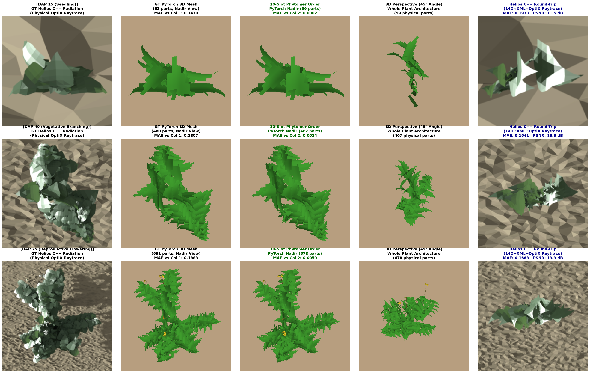
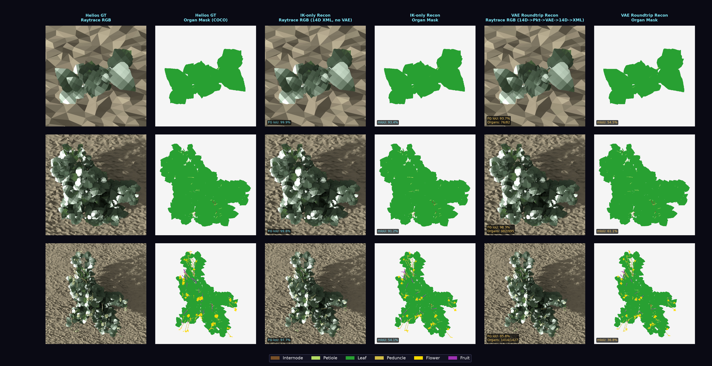

# 2026-09-14 Stage 2 gradient burst 해결 및 dataset 식물 Helios 라운드트립 리포트

> **세션 날짜**: 2026-09-13 ~ 2026-09-14 (PDT)
> **관련 run**: 로컬 v9 run (`slurm_scripts/logs/local_v9_run2.log` → `local_v9_run2b.log`, 체크포인트 `diffusion_based/checkpoints/hierarchical_fm_v9_local2/`), 클러스터 대기 잡 `38249632` / `38250275` (`low` / `publicgrp`)
> **상세 기록**: [`docs/ongoing/20260912_stage2_stage3_boundary_and_remaining_redundancy.md`](../ongoing/20260912_stage2_stage3_boundary_and_remaining_redundancy.md) §1.9.2 (burst), §2.4-2.6 (라운드트립)
> **커밋**: `a524816` (final LayerNorm + fp32 self-attention), `ea7bb58` (ablation 문서), `0472284` (dataset 식물 라운드트립 수정), `3fc48b7`

---

## 1. 요약

두 가지가 닫혔다.

1. **Stage 2 gradient burst**는 모델 상태의 문제였고, 원인은 pre-LN coarse decoder(`nn.TransformerDecoder`, `norm_first=True`)에 **final LayerNorm이 없어서** 크기 ~1e3의 raw residual stream이 bf16 phytomer self-attention의 q/k/v로 들어간 것이다. final LayerNorm을 넣으면 frozen burst 상태에서 8/8 스텝 폭발이 0/8이 된다. 기본값으로 켜져 있고, 재시작한 v9 run은 epoch 15까지 canary 0회다.
2. **Helios 라운드트립**은 exact_gt 세 식물(fig14)에서는 해결돼 있었지만 **dataset 식물에서는 export 자체가 81.8 / 92.2 / 54.6%** (DAP 15 / 40 / 75 FG IoU)였고 VAE는 거의 손실을 더하지 않았다. exact_gt 식물은 converter가 하드코딩한 기본 각도로 생성된 식물이라 문제가 보이지 않았던 것이다. 원인 셋(처지는 shoot을 끊는 chaining, 틀린 branch point, 상수 leaf 각도)을 고쳐 **98.3 / 98.2 / 95.6%** (packet 경로), **95.1 / 96.8 / 95.6%** (VAE 경유)가 됐다. 이 중 branch point 수정은 학습 타깃에도 그대로 적용된다 (lateral의 1/3이 틀려 있었다).

---

## 2. Stage 2 gradient burst

### 2.1 재현과 해부

- v8 계열 run 두 개(`38240479` lr 1e-4, `38242849` lr 5e-5)가 같은 스텝(epoch 27-28)에서 터졌다. `DistributedSampler`가 epoch으로만 시드되므로 같은 배치를 봤다.
- 1 GPU 로컬 run에서 epoch 7 step 2062에 재현했고, 가중치를 고정한 채 어느 배치를 넣어도 터지는 것을 확인했다 → **순수한 모델 상태**의 문제. 데이터 순서, 학습률, weight decay, decoder token collapse, per-epoch eval, DDP, edge-bias mask(빼면 더 나빠짐), decoder만 fp32는 모두 원인이 아니었다.
- `FM_GRAD_PROBE=2` per-op probe: decoder 출력에서 gradient가 ~6000배, decoder layer를 지나며 ×3000 더 증폭. 증폭 지점이 phytomer self-attention 입력이었다.

### 2.2 Ablation (frozen burst 상태, 8 스텝, 두 시드)

| 설정 | burst 스텝 |
|---|---|
| baseline | 8/8, 8/8 |
| self-attention fp32만 (`FM_SELFATTN_FP32`) | 1/8, 2/8 |
| decoder final LayerNorm만 (`FM_DECODER_FINAL_NORM`) | 0/8 |
| 둘 다 (현재 기본값) | 0/8, 0/8 |

### 2.3 적용 및 결과

`diffusion_based/models/hierarchical_part_flow_matching.py`: `nn.TransformerDecoder(..., norm=LayerNorm)` (`FM_DECODER_FINAL_NORM`, 기본 1), self-attention 블록 fp32 (`FM_SELFATTN_FP32`, 기본 1). 보조 안전장치로 canary가 울린 스텝은 건너뛴다 (`d543540`).

재시작한 v9 run (v9 cache/VAE, batch 48, lr 1e-4, render loss epoch 11부터): epoch 1-15 동안 canary 0회, loss 74 → 20.0, self-consistency IoU 19.5 → 31.9%, node RMSE 1.8 cm. v8 계열이 터진 epoch 27-28을 지나면 완전히 닫힌 것으로 본다.

---

## 3. Dataset 식물 Helios 라운드트립

### 3.1 계기

`docs/results/assets/fig12_phytomer_10slot_helios_roundtrip.png` (09-11 13:01, 커밋되지 않은 스크립트로 작성)의 Helios 컬럼이 왜 나쁜지, 45° 뷰가 왜 어색한지가 질문이었다. 그 패널에는 GT의 45° 뷰가 없었고 Helios 컬럼은 shoot 분할 수정과 stem IK 이전의 export였다. 새 스크립트 `diffusion_based/eval/eval_phytomer_10slot_assembly_views.py`로 **dataset 식물**(`cowpea_dap015/040/075_seed00_..._plant_0000.xml`)에 대해 GT 메시와 10슬롯 조립을 같은 카메라(nadir, 45°, GT 메시 bounds)로 그리고, packet 경로와 VAE 경유 Helios 라운드트립을 나란히 놓았다. 옛 패널은 `_unreferenced/fig12_phytomer_10slot_helios_roundtrip_20260911.png`로 보관.

조립은 정확하다 (GT 메시 대비 RGB MAE 0.0002~0.003, 두 뷰 모두). 즉 45° 모습은 원래 식물 모양이다.

### 3.2 측정 (수정 전, FG IoU vs Helios GT)

| DAP | packet 경로 (VAE = identity) | VAE 경유 | 참고: exact_gt 식물 IK-only (fig14) |
|---|---|---|---|
| 15 | 81.8% | 82.6% | 95.7% (DAP 10) |
| 40 | 92.2% | 91.9% | 99.5% (DAP 50) |
| 75 | 54.6% | 56.1% | 96.7% (DAP 90) |

VAE 라운드트립 ≈ packet 경로. 즉 "VAE 라운드트립 = IK-only" 요건은 지켜지고 있었지만, IK-only 자체가 dataset 식물에서 GT와 멀었다. dataset 식물은 internode curvature, 180°가 아닌 phyllotaxy, yaw perturbation, 잎 각도 perturbation, 그리고 마디마다 1~3 mm씩 처지는 lateral shoot을 가진다.

### 3.3 원인과 수정

**(1) `chain_phytomers`가 부모를 자식보다 아래에만 허용했다.** cycle을 막는 장치였지만 처지는 lateral을 모두 끊었다. DAP 75: GT 12 shoot → 17 shoot, 같은 shoot 링크 99개 중 8개 손실, 한 shoot이 73 cm 이탈. 이제 각 노드는 최저 비용 후보를 가리키고, 생긴 cycle은 가장 비싼 edge에서 끊는다 (동률이면 부모가 더 낮은 쪽을 남김). 30개 dataset 식물에서 같은 shoot 링크 1988/1988. shoot 분기점에서 depth가 동률이면 방향으로 continuation을 고르고, `root_own_shoot=True`면 root 노드(떡잎 마디)를 shoot 0으로 홀로 둔다 — emitter와 converter가 shoot 0 / index 0을 특별 취급하므로 이 규칙이 없으면 DAP 15 export가 57.4%로 떨어진다.

**(2) `gt_parent_links`의 branch point 규칙("다른 shoot에서 자기보다 아래에 있는 가장 가까운 노드")이 dataset 식물 lateral의 1/3에서 틀렸다** (272개 중 66.2%, DAP 60+에서는 58%). 이 함수가 학습의 parent conditioning, depth ordinal, step loss 타깃을 만들므로 지금까지의 모든 run이 그만큼 틀린 타깃으로 학습했다. lateral의 첫 internode는 branch point에서 시작하고(부모 노드 중심에서 0.2~0.9 cm, 다른 노드까지는 1~3 cm) 캐시는 absolute packet을 저장하므로, 디코딩한 slot-0 base로 부모를 찾게 했다: `gt_parent_links(..., internode_base=)` → 97.8%. 학습 코드의 호출부도 이를 넘긴다.

**(3) converter의 leaf pitch/yaw/roll이 상수였다** (pitch 2.54, roll −15, yaw +10/0/−10). exact_gt 식물에서는 정확하지만 dataset 식물에서는 FK 기준 평균 10~18° 틀렸다. `diffusion_based/models/part_tensor_leaf_ik.py`: FK가 잎마다 frame(petiole tip 방위, petiole/internode tip 고도, roll 부호, 종류)을 돌려주고, R_leaf = Rz(azimuth)·Rz(yaw)·Ry(−pitch)·Rx(roll) 합성을 닫힌 형태로 뒤집는다. lateral leaflet은 자유도 3개라 정확히(0.00°), terminal leaflet은 pitch 하나, 단일 잎(떡잎)은 pitch+roll. `assemble_part_tensor_to_xml`이 stem IK 다음에 실행한다 (`PART_TENSOR_LEAF_IK=0`으로 끔).

부수 변경: stem IK가 petiole 축 오차도 통계에 넣고 수렴 조건에 쓴다; eval stub들은 depth ordinal + internode base를 쓰고, shoot 첫 internode는 branch 노드 중심이 아니라 자기 디코딩된 base에서 시작한다 (중심에서 그리면 모든 shoot에 0.35 cm 바닥이 남는다). 첫 마디 petiole 방위를 shoot base roll로 푸는 단계는 시도했다가 되돌렸다 — chord를 pitch/yaw 재적합보다 빨리 흔들어 DAP 15가 60%로 떨어진다.

### 3.4 결과 (수정 후)

| DAP | packet 경로 | VAE 경유 | tip 오차 | petiole 축 | leaf 회전 |
|---|---|---|---|---|---|
| 15 | **98.3%** | **95.1%** | 0.03 cm | 1.06° | 0.40° |
| 40 | **98.2%** | **96.8%** | 0.01 cm | 0.75° | 0.31° |
| 75 | **95.6%** | **95.6%** | 0.01 cm | 1.14° | 0.52° |

fig14(exact_gt)도 다시 그렸다: IK-only 95.7 / 99.5 / 96.7 → **99.9 / 99.6 / 97.7%**, VAE 92.2 / 98.4 / 95.7 → **93.7 / 98.3 / 95.8%**. 얇은 기관이 좌우하는 mean organ IoU는 IK-only 48.3 / 89.9 / 46.5 → 93.4 / 91.2 / 54.1.

남은 것: terminal leaflet(자유도 1개, 평균 1~1.6°), 첫 마디 petiole 방위(shoot base roll만이 정할 수 있음, 최대 9°), branch point 2.2%.

---

## 4. 학습 상태와 다음 단계

- 로컬 v9 run은 09-14 09:09에 죽어 있었다(세션 중단 시점과 일치, 에러 없음). 새 코드로 epoch 15에서 잠시 재개했다가(`local_v9_run2b.log`), 10:30에 **클러스터 잡 `38252603`**(geminigrp, 2 GPU, 24 h)이 같은 epoch 15 체크포인트에서 이어받으면서 로컬 run은 정리했다. launcher 기본값을 v9 레시피로 바꿨으므로(`slurm_scripts/train_hierarchical_flow_matching.sh` 헤더 참고) 이후로는 plain `sbatch`로도 같은 설정이 뜬다. 체크포인트는 `hierarchical_fm_v9/`.
- 이후(11:15~11:40): 다른 에이전트가 GPU 활용률(batch 48에서 ~20%)을 올려보려고 38252603을 취소하고 `FORCE_BATCH_SIZE=auto`(→ GPU당 256)로 `38252937`을 띄웠으나, step 시간이 2.2 s → ~18 s로 늘어 **epoch당 55-60분, batch 48의 32분보다 느렸다** (backward 1.3 → 11.2 s, render 0.65 → 5.27 s; 배치에 거의 선형). 그래서 취소하고 **`38252981`**을 batch 48, `NUM_WORKERS=8`로 같은 epoch 15 체크포인트에서 다시 시작했다. 함께 들어간 변경: 패킷 캐시가 VAE와 분리되어(latent를 학습 중 on the fly로 인코딩) VAE 교체 시 캐시 재생성이 불필요해졌고, launcher는 `train_hierarchical_flow_matching.sh`(+`TRAIN_VAE=1`)와 `generate_helios_dataset_jobs.sh`(+`--packets-only`) 둘만 남았다 (`369c3b4`).
- `low`/`publicgrp` 대기 잡(`38249632`, `38250275`)은 10:13에 취소됐다. 24시간 제한이라 9/15 11:40경 `AUTO_RESUME=1`로 재제출이 필요하다. `regen_*` 잡은 건드리지 않는다.
- 다음: epoch 30 통과 확인(canary, Stage 2 Scl/Ord/Ext), 렌더링 품질 추적; §2.1 남은 항목(Stage 3가 child position/roll/scale 예측, parent noise 재보정); export 잔여 오차.

## 6. 학습 step 시간: 병목은 렌더러가 아니라 packet 조립 루프였다 (12:20, `f3c5366`)

배치를 256으로 키웠는데도 epoch 시간이 오히려 늘어난 이유를 찾기 위해 동기화된 구간 타이머로 1 GPU, batch 48, epoch 15 재개 조건에서 step을 쪼갰다.

| | render ON, 기존 코드 | render OFF | render ON, 조립 벡터화 |
|---|---|---|---|
| step (fwd/bwd) | 1.8~2.1 s | 0.11~0.31 s | **0.19~0.39 s** |
| render 블록 | 0.6 s (그중 `assemble_packets` 0.55 s, 메시 0.01, rasterize 0.00) | - | 0.05 s |
| backward | 1.1 s | 0.02~0.04 s | 0.05 s |

단독 측정에서 메시 생성은 5~11 ms, nvdiffrast rasterize는 2 ms, 렌더 backward는 샘플당 10~21 ms(DAP 15/40/75)였다. 즉 렌더 경로는 애초에 비용이 아니었다. 비용은 `assemble_packets`가 렌더 배치의 phytomer ~1,000개마다 파이썬 루프로 휘어진 petiole/peduncle 위의 소엽·꽃 부착점을 계산한 것이고, 그 작은 연산들의 autograd 그래프가 backward를 더 키웠다. `_curve_points_batched`/`_point_on_curve`로 모든 phytomer를 한 번에 계산하도록 바꿨고, `tests/test_assemble_packets_batched.py`가 값과 gradient를 옛 루프와 대조한다 (의도한 차이 하나: petiole이 없거나 너무 짧은 phytomer의 꽃도 이제 peduncle 위에 놓인다).

배치 크기 질문의 답도 여기서 나온다. 배치 256이 느렸던 것은 렌더되는 phytomer 수에 비례해 이 루프가 길어졌기 때문이다. 루프가 사라진 지금은 큰 배치가 이득일 수 있으니 다시 재 보고 정하면 된다. 렌더링 자체의 배치 처리(nvdiffrast 0.4 range mode: 여러 메시를 이어 붙여 `rasterize` 한 번)는 가능하지만 지금은 필요 없다. 메시 생성은 이미 벡터화되어 있다.

**`38253029`**이 이 코드로 epoch 15 체크포인트에서 다시 시작했다 (batch 48, `NUM_WORKERS=8`). 그 전의 `38252981`(기존 코드, 32분/epoch)은 취소.

### 6.1 남은 샘플별 루프 셋 (13:40, `a1a82bc`)

조립 벡터화 뒤 같은 타이머로 재면 (batch 48 / 256, 1 GPU) 나머지는 세 루프였다: GT 타깃 루프에서 샘플마다 GPU에서 돌던 `gt_parent_links` + `decode_packets` (0.10 / 0.53 s), 샘플마다 따로 부르던 VAE encode (0.04 / 0.19 s), 렌더 블록의 식물별 렌더 루프 (0.05 / 0.30 s). 각각 DataLoader 워커에서 CPU로 미리 계산(`attach_parent_links`), 배치 전체를 한 번에 encode, 렌더 식물 전체를 nvdiffrast range mode 한 패스로(`render_batched`, 식물마다 자기 카메라 유지) 바꿨다. 손실 벡터화는 루프와 동일함을 테스트로 고정했다.

| batch | step (조립 벡터화 직후) | step (세 루프 제거 후) | 남은 큰 항목 |
|---|---|---|---|
| 48 | 0.21~0.39 s | **0.17~0.31 s** | backward 0.05, other 0.05~0.12 |
| 256 | 2.0~2.3 s | **1.1~1.8 s** | topo(chain_phytomers, 렌더 식물 8개) 0.14~0.21, matcher 0.09~0.24, 타깃 루프 0.17~0.28, backward 0.28~0.45 |

렌더 비율(배치의 3%)은 그대로다. 샘플당 비용이 여전히 배치에 무관하게 일정해서 배치를 키워도 epoch 시간은 줄지 않는다. 남은 것은 `chain_phytomers`의 노드별 파이썬 walk, greedy matcher, 타깃 루프의 나머지다. **`38253401`**이 이 코드로 `hierarchical_fm_v9/hierarchical_fm_epoch_020.pt`에서 이어 달린다 (`38253029`는 epoch 16~21을 ~9분/epoch로 마치고 취소; IoU 31.9 → 33.4%).

### 6.2 chain_phytomers와 matcher 벡터화 (14:40, `25c2251`)

`chain_phytomers`의 cycle 절단과 shoot walk를 pointer jumping(log N 회의 parent doubling)으로 바꿨다. cycle은 가장 비싼 edge에서 자르되 키를 float64로 계산한다 (1e-6 높이 tie-break가 3 cm 거리 옆에서는 float32 해상도 아래라 mutual-nearest 쌍이 정확히 동률이었다). continuation child는 ordinal gap → 방향/거리 순으로 `scatter_reduce`로 고르고, chain 시작·위치·shoot 번호도 doubling으로 구한다. 루프 구현은 `vectorized=False`로 남겨 테스트가 대조한다 (랜덤 점군의 모든 cue 조합 + GT 식물). N=512에서 34 ms → 2 ms.

matcher의 phytomer 단계는 pad된 배치 위에서 한 번에 돈다 (`_forward_phytomer_batched`): 클러스터를 먼저 압축한 뒤 (B, K, C_max) cost로 greedy 루프 한 번, host sync 한 번. 학습 step은 샘플별 타깃 리스트(boolean index sync 3회/샘플)를 만들지 않고 pad된 GT를 그대로 넘긴다. 단독 측정 42 → 22 ms (B=48), 166 → 56 ms (B=256). 처음 시도한 버전은 (B, 1400, 1400) cdist와 (B, K, 1400) cost 때문에 오히려 느렸고(256 배치에서 2 GB), 압축을 먼저 하도록 고쳤다.

| batch | step | fwd+bwd GPU | 남은 샘플별 항목 |
|---|---|---|---|
| 48 | **0.15~0.24 s** | ~0.1 s | 타깃 루프 0.02~0.05, head(배치 전송) 0.01~0.03 |
| 256 | **0.9~1.5 s** | ~0.6 s | 타깃 루프 0.17~0.28, head 0.10~0.17 |

샘플당 비용은 여전히 배치에 거의 무관(3~5 ms vs 3.5~6 ms)해서 batch 48을 유지한다. **`38253656`**이 이 코드로 `hierarchical_fm_v9/hierarchical_fm_epoch_025.pt`에서 이어 달린다 (`38253401`: epoch 22~25, ~7분/epoch, IoU 32.6~35.5%).

## 7. GT 치환 ablation: 무엇이 실루엣을 잃게 하나 (15:50, epoch 40)

"지금 구조가 이상적인가"에 답하려고, 고정 eval set 20개 식물에서 예측 노드를 GT phytomer에 매칭한 뒤 매칭된 노드의 한 가지 양만 GT로 바꿔 다시 렌더했다 (`diffusion_based/eval/eval_gt_substitution_ablation.py`, `hierarchical_fm_v9/hierarchical_fm_epoch_040.pt`, 같은 렌더러·카메라의 GT 렌더 대비 실루엣 IoU). existence는 항상 예측값이다.

| variant | IoU % | depth MAE cm | young (DAP ≤ 15) | mid | old (> 60) |
|---|---|---|---|---|---|
| P (all predicted) | 24.8 | 14.97 | 2.5 | 23.6 | 37.2 |
| pos ← GT | 42.3 | 12.80 | 27.2 | 36.1 | 55.9 |
| topo / rot / scale / latent ← GT (one at a time) | 25.3 / 26.3 / 23.9 / 25.2 | ~14.9 | | | |
| pos+rot / pos+latent / pos+scale / pos+topo | 45.6 / 45.0 / 43.4 / 42.7 | 12.1-12.7 | | | |
| ALL − pos | 30.6 | 13.98 | 1.2 | 32.9 | 42.9 |
| ALL − rot | 49.1 | 11.28 | 27.3 | 47.5 | 61.7 |
| ALL − latent | 47.5 | 11.53 | 27.5 | 44.6 | 60.4 |
| ALL − scale | 61.6 | 7.90 | 37.5 | 57.5 | 77.7 |
| ALL − topo | 82.1 | 4.92 | 77.4 | 80.2 | 86.4 |
| ALL (pos+topo+rot+scale+latent ← GT, existence predicted) | 82.1 | 4.92 | 77.2 | 80.3 | 86.4 |

읽는 법: 노드 **위치**가 1차 병목이다. 위치만 맞추면 24.8 → 42.3, 나머지가 다 맞아도 위치가 예측값이면 30.6으로 무너진다. 그 다음이 **회전과 latent**(나머지가 맞을 때 각각 −33, −35), 그 다음 scale(−20). ordinal/topology head는 나머지가 맞으면 아무 비용도 없다. 항목 간 상호작용이 커서(잎이 GT 잎과 겹치려면 위치·회전·latent·scale이 함께 맞아야 한다) 하나씩 고쳐서는 IoU가 거의 안 오르고 함께 맞아야 오른다. ALL이 82%인 것은 예측 노드 집합 자체(누락·가짜 노드, 0.5 gate)가 남은 18점이다. 어린 식물(DAP ≤ 15)은 예측만으로 2.5%다.

결론: 설계 문서 §2.1의 남은 항목, 즉 **child의 position/roll/scale을 고정된 parent 기준 상대량으로 Stage 3에서 생성**하는 변경의 근거가 선다. 위치를 먼저, 회전·scale을 같은 flow 상태에 넣는다. latent 쪽(렌더 손실을 Stage 3로 여는 것)은 그 다음이다.

같은 시각에 launcher의 렌더 비율 기본값을 3% → 1/6로 되돌렸다 (배치 48에서 8개 식물, step 0.21~0.45 s; 3%는 렌더 한 식물이 0.65 s 걸리던 때의 타협이었다). `38253656`은 epoch 45 체크포인트부터 이 설정으로 이어간다.

## 8. Stage 3 기하 생성 구현과 A/B (16:10, `abdbaf1`)

§7의 결론대로 `--stage3_geometry`를 구현했다. flow 상태를 `[(pos − parent_pos)·20 | roll | scale | latent]`로 넓히고, 타깃은 모델이 조건으로 받는 (노이즈 섞인) parent 기준 상대량으로 만들어 parent_in + Δpos가 GT 노드에 놓이게 했다. 손실은 latent MSE + 4.0 × 기하 MSE. `sample_ode`는 refine된 위치·roll·scale을 돌려주고, 렌더 블록은 그 위치로 식물을 그려 렌더 손실이 Stage 3 기하 블록까지 닿는다. latent-only 체크포인트는 `geom_proj`/velocity head의 latent 블록을 그대로 두고 기하 8차원만 새로 초기화해 불러오며 Adam 모멘트도 같은 규칙으로 넓힌다. 기본값은 꺼짐.

A/B: 같은 epoch 45 체크포인트에서 baseline(`38257989`, 클러스터 2 GPU, render 1/6)과 기하 run(로컬 1 GPU, `slurm_scripts/logs/local_s3geom_ab.log`, `hierarchical_fm_v9_s3geom/`)을 매 epoch self-consistency IoU로 비교한다. run의 Vel 손실은 기하 차원이 새로 시작해 12~20에서 출발한다.

## 9. Stage 3 latent는 이미지를 노드 단위로 보고 있지 않다 (17:30, `b348fd7`)

"latent가 입력 이미지를 보긴 하나?"에 수치로 답했다. 세 가지를 재었다 (모두 고정 eval set 20개 식물, baseline epoch 50 / 기하 run epoch 47).

1. **치환 ablation에 평균 latent 조건 추가** (`meanlat` = 예측 기하 + 데이터셋 평균 latent, `ALL-latent+meanlat` = GT 기하 + 평균 latent).

| variant | baseline ep50 | 기하 run ep47 |
|---|---|---|
| P (전부 예측) | 27.5 | 27.5 |
| pos ← GT | 38.5 | 38.3 |
| ALL − latent (GT 기하 + 예측 latent) | 43.3–44.1 | 42.3 |
| ALL − latent + meanlat (GT 기하 + 평균 latent) | 40.8 | 40.9 |
| meanlat (예측 기하 + 평균 latent) | 28.5 | 28.5 |
| ALL | 76.1 | 80.9 |

기하가 완벽할 때 **예측 latent는 상수 평균 latent보다 2–3점**밖에 낫지 않고, GT latent는 33–38점을 더 준다.

2. **노드별 latent 오차**: 매칭된 노드에서 샘플된 latent와 GT latent의 RMSE 5.39 vs 평균 latent 4.66 (R² −0.34). 차원별 표준편차는 GT와 같다 (0.174 vs 0.177). 즉 Stage 3는 "그럴듯한 phytomer"를 marginal에서 뽑을 뿐 그 식물의 phytomer를 만들지 않는다.

3. **조건만으로 읽어내는 양** (x_0 = 순수 노이즈에서 x1_hat = x_0 + v): 데이터셋 평균 대비 R² 0.12, 식물별 평균 대비 −0.06. Stage 3 조건에 GT 노드를 넣어도 (0.15 / −0.03) 같다. t = 0.5에서는 0.85인데 이는 x_t가 z1을 새는 것이다.

해석: 조건은 식물 수준(DAP, 크기) 정보만 전달한다. latent의 차원별 표준편차가 ≈0.41로 단위 노이즈에 비해 작아 velocity 타깃의 ~85%가 노이즈이고, t≈0의 무조건 하한이 Var(z1) ≈ 0.17/차원인데 학습 Vel 손실(0.16)이 그 바닥에 앉아 있다. flow 손실만으로는 노드별 조건을 쓸 이유가 없다.

다음: (a) `--render_to_latent` (`RENDER_TO_LATENT=1`) — 렌더 손실을 latent 블록까지 흘린다 (지금까지는 detach; smoke에서 velocity head latent 행에 |g| 0.02–2.7 확인). epoch 45에서 `low` 작업 `38260124` (2×A100, `hierarchical_fm_v9_r2l/`)로 17:45 제출. (b) flow용 latent를 단위 분산으로 스케일 (velocity head가 바뀌므로 epoch 45에서 fine-tune). (c) t 샘플링을 0 쪽으로. 대조군으로 **teacher forcing run** (`STAGE3_GT_NODES=1`, `local_gtnodes_ab.log`)이 17:07부터 돈다: 노드가 맞을 때 노드별 R²가 오르면 "노드 오차가 latent를 굶긴다"가 맞는 것이다. 세 run의 epoch별 IoU: baseline 46–52 = 31.5/31.0/32.7/26.9/29.9/31.4/30.7, 기하 47 = 30.6 (Vel 3.1 → 2.4, 아직 내려가는 중).

## 10. 9/8 Option B "45.4%" 패널과 오늘 모델의 같은 식물 비교 (9/15 09:45)

Heesup의 지적: `docs/results/assets/20260907/hierarchical_self_consistency_epoch_125.png`의 Pred 3D Mesh가 원본 이미지에 제일 가까워 보인다. 두 가지를 쟀다.

1. **그 45.4%는 무작위 배치의 앞 4개 식물 평균**이었다 (job `38145444`, eval 6회: epoch 25/50/75/100/125/150 → 39.1/26.4/33.8/26.9/45.4/49.2, 매번 다른 식물, 묘목 없음). 같은 체크포인트를 **당시 코드 그대로**(커밋 `870074f`) 지금의 고정 20개 eval set에 돌리면 **24.8%** (DAP ≥ 17: 30.8, DAP > 60: 37.0, DAP ≤ 15: 0.9). 오늘 run들은 같은 20개에서 30–34.

2. **같은 식물 7개(9/7 패널의 DAP 72 식물 + 성체 eval 식물 6개)를 같은 렌더러로 나란히** 그렸다 (`assets/20260915_optionb_vs_today_same_plants.png`, 스크립트와 수치는 `slurm_scripts/logs/archive_20260914/optionb_ep125_reeval/`).

| 식물 (DAP / GT 기관 수) | Option B ep125 | baseline ep135 | 기하 run ep76 | gt_nodes run ep70 |
|---|---|---|---|---|
| 72 / 1883 | **44.8** | 38.5 | 36.9 | 37.3 |
| 38 / 1652 | 36.5 | 46.7 | 49.8 | **62.8** |
| 42 / 1428 | 34.0 | 33.0 | **37.8** | 20.5 |
| 62 / 2804 | 47.6 | **61.9** | 56.8 | 57.4 |
| 68 / 1367 | 24.1 | 10.4 | **24.6** | 24.2 |
| 88 / 2166 | 40.5 | **49.8** | 43.9 | 45.7 |
| 97 / 2105 | 40.7 | **53.9** | 51.5 | 52.6 |
| **평균** | 38.3 | 42.0 | **43.1** | 42.9 |

시각적 인상은 근거가 있다. Option B는 **기관 하나하나를 flow로 생성**해(16D 단위 분산 organ latent, 위치가 latent 안에 포함) 잎이 퍼지고 줄기·꽃이 보이며 큰 수관(DAP 72)의 넓이를 살린다. 대신 떠 있는 기관과 지나치게 긴 줄기가 섞인다. 오늘 모델은 phytomer 패킷으로 조립하므로 물리적으로 일관되지만, **latent가 노드별 정보를 담지 못해 모든 phytomer가 평균 모양**이 되고 노드 위치도 중심으로 몰려 **작고 균일한 덩어리**가 된다. IoU는 덩어리가 중심부를 덮어 오늘 쪽이 높지만, DAP 72·88처럼 팔이 뻗은 식물의 넓이는 둘 다 놓친다.

**노드 위치가 더 잘 맞아서인가?** 아니다. 같은 7개 식물에서 예측 노드 → 가장 가까운 GT phytomer 중심 RMSE, 3 cm 안에 예측 노드가 있는 GT phytomer 비율, 예측/GT 노드 convex hull 면적비 (`nodes_cmp.json`):

| | 노드 RMSE (cm) | GT 3 cm 내 커버 | hull 면적비 |
|---|---|---|---|
| Option B ep125 | 18.3 (DAP 38: 54.9) | 22.2% | 4.35 (DAP 38: 17.9) |
| baseline ep135 | 5.9 | 23.3% | 0.68 |
| 기하 run ep76 | **4.5** | **28.7%** | 0.51 |
| gt_nodes run ep70 | 5.6 | 24.9% | 0.58 |

Option B의 "퍼짐"은 정확도가 아니라 **흩뿌림**이다 (hull이 GT의 4배, 노드 RMSE 18 cm). 오늘 run들은 반대로 **수관이 GT의 50–70%로 오그라들고** GT phytomer의 4분의 1만 3 cm 안에 노드가 있다. 이것이 치환 ablation의 "pos←GT +10–14점"의 실체다.

결론: 되돌릴 대상은 architecture가 아니라 Option B latent의 성질이다. (a) 단위 분산 latent → `LATENT_NORM=1` run (`38274201`, 15:53 시작), (b) 노드별 정보가 latent에 들어가게 하는 gt_nodes 계열, (c) Stage 2 노드 위치의 중심 쏠림(수관 hull 0.5–0.7, 커버 25%)은 위 지표로 계속 잰다.

**`low` 파티션에서 여러 학습을 동시에 돌릴 수 있나 (10:00).** 지금은 불가능하다. `low`의 GPU 노드에는 놀고 있는 GPU가 많지만(A100 16개, H100 3개) 다른 사용자의 작업이 **노드 메모리를 전부 점유**하고 있어(노드당 여유 5–13 GB) 학습 하나(메인 6 GB + 워커 8×1.1 GB ≈ 15 GB)도 못 들어간다. 16시간 대기의 원인이 GPU가 아니라 메모리였다. 그래서 `low`의 두 작업을 취소하고, baseline이 15:53에 끝나며 비는 geminigrp 2-GPU 슬롯에 **세 run을 순차 체인**으로 걸었다: `38274220` latent 단위 분산 (epoch 46–80) → `38274221` scheduled teacher forcing p 0.5 / jitter 1 cm (46–75) → `38274222` render→latent (46–70). 2 GPU에서 epoch당 ~3.5분이라 각 2시간 안팎, 오늘 밤 안에 셋 다 결과가 나온다.

## 11. 10% 데이터로 먼저 수렴을 확인하는 프로토콜 (9/15 10:15)

Heesup의 제안: 학습 데이터의 10%만 써서 데이터셋에 수렴하는지 먼저 확인하고, 나중에 데이터를 늘려 일반화한다. 채택했고, 두 가지를 붙여서 그 전략이 실제로 측정 가능하게 했다.

- **같은 eval 식물**: `--eval_set_file` (`EVAL_SET_FILE`)로 기존 `eval_set.json`의 20개 식물을 이름(prefix)으로 다시 찾아 쓰고, 부분집합을 만들 때 강제로 포함한다. 그래서 10% 학습과 100% 학습, 모든 run이 같은 20개 식물로 채점된다.
- **held-out 식물**: `--holdout_samples_per_bucket 2` (`HOLDOUT_PER_BUCKET`)로 DAP 계층별 20개 식물을 학습에서 빼고 매 평가에서 `[Holdout]`으로 따로 보고한다. 지금까지의 "self-consistency" 평가는 전부 학습 식물이었으므로 일반화는 잰 적이 없었다. 단, epoch 45에서 이어가는 run들은 45 epoch 동안 그 식물들을 이미 봤으므로 이번 체인의 held-out은 "45 이후로는 보지 않은" 식물이다. 진짜 held-out은 처음부터 제외하고 학습해야 한다.

왜 맞는 전략인가: 지금 baseline은 100k 식물을 140 epoch 봤다(식물당 140회). 정체의 원인이 데이터 부족이 아니라는 뜻이고, 10k 식물로 10배 빠르게 같은 질문 — 이 구조가 데이터를 **외울 수는 있는가** — 에 답할 수 있다. 외워지면(학습 식물 IoU가 70–80으로 오르면) 병목은 최적화/데이터 규모이고, 10k도 못 외우면 구조와 손실이 병목이다(현재 진단은 후자).

Heesup: geminigrp의 `gpu-6000_ada-h` 파티션은 최대 8 GPU를 높은 우선순위로 쓸 수 있다 (10:30). 그래서 순차 체인 대신 **독립 1-GPU 작업 여섯 개**로 바꿔 GPU가 비는 대로 병렬로 돌린다 (지금 파티션은 gpu-10-50/54 두 노드 8 GPU: 10-50은 drain 중이라 3개가 놀고, 10-54는 baseline 2 + 타 그룹 1 + 우리 1). 첫 작업은 10:32에 바로 시작했고 나머지는 15:53에 baseline이 끝나면 2개가 더 들어간다. 모두 `MAX_TRAIN_SAMPLES=10000`, 같은 eval 20개 + held-out 20개, 1 GPU에서 epoch당 ~2분:
`38274493` baseline-on-10% (참조, epoch 46–95) → `38274494` 단위 분산 latent → `38274495` scheduled TF → `38274496` render→latent → `38274497` 조합 (기하 ep78에서, 78–128) → `38274498` v10 full (조합 + multizoom + coverage + count). 각 50 epoch, 1 GPU에서 약 4시간(평가 40개 식물 포함, epoch당 ~5분). 10:55에 Heesup의 제안으로 로컬의 100% 데이터 run 둘(기하 epoch 80, gt_nodes epoch 78, 체크포인트 보존)을 멈추고, 그 GPU에서 조합 run과 v10 full을 10% 프로토콜로 돌린다 (`local_sub10_combo.log`, `local_sub10_v10.log`; 클러스터 대기 사본은 취소).

### 11.1 첫 판독: epoch 60 (10% 학습 15 epoch 뒤, 11:30)

| run (10k 식물) | 엄격 P | pos←GT | ALL−latent | ALL | latent R² (평균 대비) | probe t=0 R² (식물별 평균 대비, Stage 2 / GT 노드 조건) |
|---|---|---|---|---|---|---|
| baseline-on-10% ep60 | 28.9 | 41.3 | 42.7 | 78.5 | −0.32 | 0.04 / 0.06 |
| 단위 분산 latent ep60 | 26.9 | 34.9 | 37.6 | 72.5 | −0.72 | 0.00 / 0.02 |
| (참조) 100% baseline ep50 / ep80 | 27.5 / 27.3 | 38.5 / 37.6 | 43.3 / 39.6 | 76.1 / 67.1 | −0.34 / −0.38 | ≈0 |

- baseline-on-10%는 15 epoch 만에 100% baseline과 같은 자리(P 29)에 있고 노드 위치는 오히려 조금 낫다(pos←GT 41.3). 10배 적은 데이터로 같은 정체점에 바로 도달했다는 뜻이고, "데이터 양이 병목이 아니다"를 다시 확인한다. 아직 외우기(학습 식물 IoU 70+)는 시작되지 않았다.
- 단위 분산 latent는 15 epoch 뒤에도 노드별 정보가 없다(probe R² ≈ 0, latent R² −0.72로 오히려 나쁨). 차원별 표준편차는 GT와 일치(0.180 vs 0.177)하므로 스케일 자체는 맞게 배웠지만, 조건을 쓰게 만드는 데는 스케일만으로 부족하다. 95 epoch까지 두고 보되, 단독 변경으로는 기대치를 낮춘다.
- 이 노드의 조합 run과 v10 full은 기하 ep78에서 이어가 첫 epoch(79) 학습 식물 34.4 / 37.9, held-out 40.0 / 39.0으로 출발했다.

**epoch 80 (기하 ep78에서 2 epoch 뒤, 11:45)** — 같은 표에 두 run 추가. latent의 렌더 가치 = (ALL−latent) − (GT 기하 + 평균 latent), 즉 예측 latent가 상수 평균보다 얼마나 더 그려 주는가:

| run | 엄격 P | 어린 식물 P (DAP ≤ 15) | pos←GT | ALL−latent | GT 기하 + 평균 latent | latent 렌더 가치 | ALL | probe R² |
|---|---|---|---|---|---|---|---|---|
| baseline-on-10% ep60 | 28.9 | 5.4 | 41.3 | 42.7 | 39.2 | +3.5 | 78.5 | 0.04 |
| 단위 분산 latent ep60 | 26.9 | 9.7 | 34.9 | 37.6 | 39.4 | −1.8 | 72.5 | 0.00 |
| scheduled TF (p 0.5, jitter 1 cm) ep60, 배포 조건 / GT 노드 조건 | 29.2 / 45.3 | 10.5 / 29.4 | 42.5 / – | 45.8 / 46.0 | 38.5 | **+7.3** | 77.6 | 0.04 / 0.07 |
| render→latent ep60 | 25.0 | 2.3 | 37.9 | 39.8 | 39.0 | +0.8 | 79.0 | −0.02 |
| 조합 ep80 (기하+표준화+render→latent) | 34.0 | 19.3 | 42.0 | 45.6 | 39.9 | +5.7 | 78.1 | −0.15 |
| **v10 full ep80** (+ multizoom, coverage, count) | **35.4** | **19.8** | **44.2** | **47.5** | 39.6 | **+7.9** | **81.7** | −0.07 |
| (참조) 100% 기하 run ep76 | 33.9 | 14.6 | 42.9 | 45.5 | 40.0 | +5.5 | 79.2 | – |
| (참조) gt_nodes ep70, GT 노드 조건 | 45.3 | 26.6 | – | 48.2 | 40.1 | +8.1 | 82.3 | 0.41 |

읽기 (epoch 60 추가분): **scheduled teacher forcing은 순수 TF의 exposure bias를 없앴다** — 배포 조건 P 29.2로 baseline(28.9)과 같고(순수 TF는 20–24), GT 노드 조건 상한 45.3은 그대로이며 latent 렌더 가치는 +7.3으로 baseline(+3.5)의 두 배다. render→latent 단독은 이득이 없다(P 25.0, 렌더 가치 +0.8) — 이 기울기는 기하 run 위에서만(조합, v10) 값을 낸다. 2 epoch 만에 v10 full이 배포 조건 엄격 P 최고(35.4)이고 어린 식물 P가 5–10에서 19.8로 뛰었다(multizoom 토큰이 8× crop을 보기 시작한 효과로 보이나 2 epoch이라 확정은 아님). latent의 노드별 정보(probe R²)는 여전히 어느 run에도 없지만, latent의 **렌더 가치**는 baseline +3.5 → v10 +7.9로 올랐다: render→latent 기울기가 GT latent와 같지는 않아도 더 잘 그려지는 latent를 만든다. 다음 판독은 epoch 90.

### 11.2 둘째 판독 (12:05): 최신 체크포인트, 엄격 프로토콜

| run | ckpt | 엄격 P (배포) | 어린 식물 P | pos←GT | ALL−latent | latent 렌더 가치 | ALL | probe R² (Stage 2 / GT 노드) |
|---|---|---|---|---|---|---|---|---|
| baseline-on-10% | ep75 | 26.5 | 4.1 | 38.7 | 45.8 | +7.6 | 72.4 | 0.04 / 0.07 |
| 단위 분산 latent | ep70 | 25.4 | 3.0 | 33.6 | 36.7 | −1.8 | 77.4 | 0.02 / 0.05 |
| scheduled TF (배포 / GT 노드) | ep65 | 27.3 / 43.7 | 8.5 / 28.2 | 42.4 | 42.7 / 46.2 | +5.5 / +9.0 | 74.7 | 0.05 / 0.09 |
| render→latent | ep65 | 27.5 | 8.6 | 39.8 | 40.0 | +1.5 | 71.7 | – |
| 조합 | ep85 | 33.6 | 14.5 | **46.1** | **47.2** | +7.1 | **81.9** | −0.02 / −0.01 |
| **v10 full** | ep85 | **36.0** | **18.5** | 43.6 | 46.1 | +6.9 | 79.3 | −0.06 / −0.05 |

학습 중 지표(최근 10 epoch 평균, 학습 식물 / held-out):

| run | 마지막 epoch | 학습 식물 IoU | held-out IoU |
|---|---|---|---|
| baseline-on-10% | 80 | 33.4 | 30.7 |
| standardized latent | 78 | 27.3 | 22.9 |
| scheduled TF | 71 | 35.4 | 28.4 |
| render->latent | 72 | 32.3 | 25.5 |
| combination | 88 | 34.3 | 36.3 |
| v10 full | 88 | 35.4 | 34.9 |

판독:
- **기하 생성 계열(조합, v10)이 배포 조건 엄격 P 34–36으로 latent-only 계열(25–29)을 7–10점 앞선다.** v10 full이 선두(36.0)이고 어린 식물(18.5)과 노드 위치(pos←GT 43.6–46.1)에서도 낫다. multizoom·coverage의 몫은 조합 대비 +2.4점(P)과 어린 식물 +4점.
- 단독 변경 셋(표준화 latent, scheduled TF, render→latent)은 20 epoch 뒤에도 배포 P를 올리지 못한다. scheduled TF만 GT 노드 조건 상한(43.7)과 latent 렌더 가치(+5.5 → +9.0)를 유지한다.
- **어느 run도 10k 식물을 외우지 못한다**: 학습 식물 IoU가 25–30 epoch 동안 33–36에 머문다(held-out과 차이 ≤ 5점). 데이터 양이 아니라 구조·손실·최적화가 병목이라는 결론이 굳어진다. 어느 run의 latent에도 노드별 이미지 정보는 아직 없다(probe R² ≈ 0).
- 다음 지렛대: 10k 식물이면 **모든 샘플을 렌더**해도 epoch이 몇 분이므로 렌더 손실 비율을 1/6 → 1.0으로 올린 v10, 그리고 학습률을 1e-4 → 2e-4로 올린 v10을 이득 없는 두 run(표준화 latent, render→latent) 자리에 넣는다.

### 11.3 셋째 판독 (12:15): 정체 확인

| run | ckpt | 배포 P | 어린 식물 P | pos←GT | ALL−latent | latent 렌더 가치 | ALL |
|---|---|---|---|---|---|---|---|
| baseline-on-10% | 85 | 25.7 | 5.4 | 42.9 | 45.8 | +6.6 | 82.8 |
| scheduled TF (배포 / GT 노드) | 75 | 28.7 / 44.1 | 8.3 / 25.9 | 40.6 | 44.2 | +6.3 | 80.1 |
| 조합 | 90 | 34.2 | 13.5 | 41.4 | **49.2** | **+9.8** | 81.5 |
| **v10 full** | 90 | **35.1** | **17.8** | 41.7 | 45.9 | +7.4 | 77.0 |

세 판독을 겹치면 모든 run이 10 epoch 안에 제자리에 멈춘다: 기하 생성 계열 34–36, 나머지 26–29. 10k 식물에서도 학습 식물 IoU가 오르지 않으므로 **더 오래 돌려서 얻을 것은 없고**, 남은 지렛대는 (a) 최적화 강도 — 렌더 손실을 모든 샘플에(`38274747`, 진행 중), 학습률 2e-4(`38274748`, 대기) — 와 (b) 구조: latent가 노드별 정보를 담게 하는 방법(probe R²가 어느 run에서도 0)과 노드 커버리지(pos←GT까지 +7–17점이 남아 있음)다. coverage 손실이 실제로 노드를 펼치는지(3 cm 커버율, hull 비)는 별도로 잰다.

## 5. 변경 파일

| 파일 | 변경 |
|---|---|
| `diffusion_based/dataset/phytomer_topology.py` | `chain_phytomers`: 최저 비용 부모 + cycle 절단, depth 동률 시 방향, `root_own_shoot`; `gt_parent_links(internode_base=)` |
| `diffusion_based/models/part_tensor_leaf_ik.py` (신규) | leaf orientation inverse |
| `diffusion_based/models/part_tensor_stem_ik.py` | petiole 축 오차 통계 + 수렴 조건 |
| `diffusion_based/models/helios_pytorch_geometry.py` | `return_node_poses`에 `leaf_frame`, `leaf_kind` |
| `diffusion_based/models/part_tensor_to_40d.py` | `assemble_part_tensor_to_xml(leaf_ik=)`, `PART_TENSOR_LEAF_IK` |
| `diffusion_based/training/train_hierarchical_flow_matching.py` | `gt_parent_links`에 디코딩한 internode base 전달 |
| `diffusion_based/eval/eval_phytomer_10slot_assembly_views.py` (신규), `eval_phytomer_vae_helios_roundtrip.py` | fig12 / fig14; depth ordinal + internode base stub |
| `tests/test_part_tensor_leaf_ik.py` (신규), `tests/test_phytomer_topology.py` | 42 tests pass across the touched suites |
| `diffusion_based/dataset/phytomer_packets.py`, `tests/test_assemble_packets_batched.py` (신규) | §6: 조립 벡터화 (`f3c5366`) |
| `part_array_dataset.py` (`attach_parent_links`), `helios_pytorch_renderer.py` (`render_batched`), `train_hierarchical_flow_matching.py`, `tests/test_render_batched.py`, `tests/test_render_loss_vectorized.py` | §6.1: 샘플별 루프 제거 (`a1a82bc`) |
| `phytomer_topology.py` (`_resolve_forest`), `hierarchical_hungarian_matcher.py` (`_forward_phytomer_batched`), `tests/test_chain_vectorized.py`, `tests/test_matcher_batched.py` | §6.2: chain·matcher 벡터화 (`25c2251`) |
| `diffusion_based/eval/eval_gt_substitution_ablation.py`, launcher `RENDER_FRACTION` 0.167 | §7: GT 치환 ablation |
