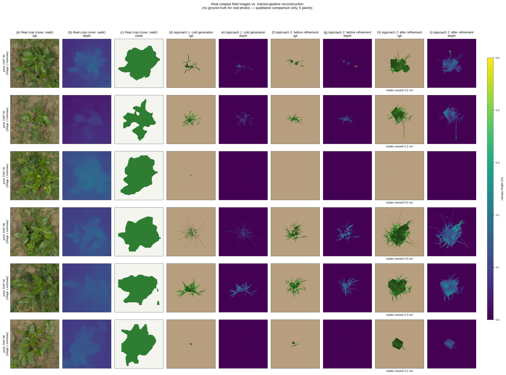

# First Real-Image Test: Real Cowpea Field Photos Through the Trained 4-Stage Pipeline

**Date**: September 15, 2026
**Data**: Roboflow `gemini-breeding-eqsam/t4_plant_weed_seg` v1 (159 real nadir tunnel-cart
images, classes `plant`/`weed`, cowpea)
**Checkpoint**: `diffusion_based/checkpoints/hierarchical_fm_v10_cam/hierarchical_fm_epoch_085.pt`
(the current full-data v10_cam lineage) + `phytomer_vae_v9_tl_rw4_20k`

## 1. What this tests

Every part of the trained pipeline — the DINOv2/PETR encoder, the DAP/phytomer-count head, the
coarse scaffold, the flow-matching phytomer decoder, the PhytomerVAE, and the differentiable
`HeliosPyTorchRenderer` — was trained and validated exclusively on Helios-simulated cowpea
plants rendered from a fixed synthetic nadir drone camera. This is the first time the pipeline
has been pointed at real, rover-captured cowpea images, following the plan in
`/home/lion397/.claude/plans/i-wan-to-make-glistening-globe.md`.

## 2. New code (`real_world/`)

- **Phase A** `real_world/download_roboflow_dataset.py` — downloads the Roboflow export; the
  API key lives only in the untracked `real_world/.env`.
- **Phase B** `real_world/detector/train_yolo_detector.py` + `slurm_scripts/train_real_plant_detector.sh`
  — fine-tunes YOLO11n-seg on the 159-image export (80 train / 22 valid / 57 test) to localize
  individual plants and separate them from weeds. Trained locally (111 epochs, early-stopped),
  weights + curves at `slurm_scripts/logs/20260915/real_plant_detector/`:

  | class | Box P | Box R | Box mAP50 | Box mAP50-95 | Mask mAP50 |
  |---|---:|---:|---:|---:|---:|
  | plant | 0.848 | 0.793 | 0.844 | 0.633 | 0.850 |
  | weed | 0.681 | 0.550 | 0.612 | 0.361 | 0.625 |

- **Phase C** `real_world/dataset/real_plant_crop_utils.py` (rover-margin crop, detection,
  16-channel zoom-pyramid builder, mask-pyramid builder) and
  `real_world/dataset/depth_anything_calib.py` (Depth Anything V2 pseudo-CHM).
- **Phase D** `real_world/dataset/real_field_dataset.py` — one item per detected plant crop.
- **Phase E/F** `real_world/eval/run_approach1_cold.py` (cold forward generation) and
  `run_approach2_refine.py` (AdamW test-time refinement against the real crop, forked from
  `diffusion_based/eval/eval_test_time_refinement.py`).
- **Phase G** `real_world/eval/figure_real_vs_synthetic.py` (+ shared `real_world/eval/viz_utils.py`
  for depth/mask colorization) — the comparison figure below, RGB and depth per stage, plus the
  real crop's own segmentation mask (the actual Dice-loss foreground target).

## 3. Two findings from actually running Phase A on real data (not assumed in the plan)

1. **The rover rig is a nadir tunnel-cart, not a side-view rover.** The real images
   (`2592x2048`) are shot straight down through a metal-rail tunnel with integrated LED bars —
   camera framing is close to the synthetic training convention (nadir), which is better news
   for the domain gap than a genuinely oblique rover camera would have been. `crop_rover_margins`
   defaults to stripping 11%/14% off the left/right (no rig visible top/bottom), based on where
   Roboflow's own plant/weed polygons stay (x in [0.11, 0.92], 1st-99th percentile).
2. **Depth Anything V2's metric-indoor checkpoint fails on this scene; the relative checkpoint
   does not.** The Metric-Indoor-Small checkpoint (trained on room-scale Hypersim) keyed off the
   rig's metal rails and read the entire leaf canopy as flat. The plain relative checkpoint
   resolves individual leaf structure clearly. `pseudo_chm_for_crop` defaults to the relative
   checkpoint, calibrated to canopy-height meters via a percentile affine fit anchored at the
   known 1.5 m camera height — a documented heuristic, not a metric measurement (see the plan's
   open risks).

## 4. Results (6 real plants, qualitative — no ground truth exists for a real photo)

Each stage shows RGB *and* the rendered CHM-depth channel (fixed 0-0.5 m color scale across
every panel, `real_world/eval/viz_utils.py`) — the real crop's own pseudo-depth (Depth Anything
V2, column b) is included for the same reason: a degenerate flat prediction shows up as a
near-uniform color patch instead of being auto-scaled to look textured. Column (c) adds the real
crop's own YOLO-seg segmentation mask at zoom 1x — the actual Dice-loss foreground target
`run_approach2_refine.py` optimizes against (`build_mask_pyramid`), so a reader can directly
compare what the optimizer is chasing against what it produces (h). At this zoom level the mask
looks reasonable (a single well-formed blob roughly matching the visible canopy); the 97-100%
coverage at 4x/8x zoom that contributed to the inflation bug (§4.1) is not visible in this
single-zoom column.

- **Approach 1 (cold generation)** produces recognizably cowpea-like branching structures (small
  stems, trifoliate-ish leaf clusters) but consistently **undersizes and under-fills** the frame
  relative to the real canopy, which typically fills most of the crop. Two of six plants
  collapsed to only a handful of organs.
- **Approach 2 (test-time refinement)** now produces structurally plausible plants on all six
  (columns g/h) after a same-day root-cause fix (§4.1) — no more flat-plate collapse anywhere in
  the depth column. Row 4 (DAP 66) shows the clearest gain: refinement spreads and fills the
  canopy well beyond the cold sample while every organ stays individually resolved in depth
  (h), not a single flat patch.

### 4.1 Diagnosing and fixing the "canvas inflation" failure (same day, after the initial pass)

The first pass of Approach 2 (synthetic-tuned defaults: `reg_scale=5.0`, `reg_latent=0.5`, no
position prior) reproduced the project's known "canvas inflation" failure mode at a much larger
magnitude than on synthetic inputs: leaves inflated into large flat rotated polygons covering
the silhouette target, visually confirmed as literal flat plates by the depth column (uniform
color, no organ-level height variation). Diagnosed by elimination, testing the user's own
hypotheses along the way:

1. **Is it the wrong silhouette target (depth-threshold instead of the real segmentation
   mask)?** No — the Dice loss was *already* targeting the detector's own YOLO-seg mask
   (`build_mask_pyramid`), confirmed by inspection (`mask_pyramid is None? False`). Switching
   target type was not available as a fix because it was already the target.
2. Checking *why* the mask target might still be pathological surfaced a real bug: at zoom
   4x/8x, cropping tightly around the detected plant's own center lands almost entirely *inside*
   its own segmentation mask (measured coverage 0.97 and 1.00 at those zooms, vs. 0.35 at
   zoom 1x) — because YOLO-seg gives one blob mask per plant instance with no per-leaf internal
   detail, unlike the synthetic depth-threshold target which keeps fine structure at every zoom.
   Tested in isolation (`--target_zooms 1`, dropping the saturated high-zoom targets): **still
   inflated.** Zoom saturation makes the loss landscape worse but is not the root cause.
3. Tested `--no_depth_loss` (silhouette-only, ruling out the (admittedly uncalibrated)
   pseudo-depth term as the culprit): **still inflated.**
4. Tested `reg_scale=40, lr_scale=5e-3` (8x/4x the synthetic defaults): **still inflated.**
5. **Root cause, found by inspecting `denormalize_packet_scales()`
   (`diffusion_based/dataset/phytomer_packets.py:280`)**: the one `scale` value optimized per
   phytomer multiplies *every* organ in that phytomer's packet (internode, petiole, all 3
   leaflets, peduncle, all 4 repro organs) by the same factor, linearly. Leaf **area** therefore
   grows quadratically with `scale`, while `reg_scale`'s penalty is only quadratic in the raw
   value — for a large enough initial coverage gap (real photos: cold sample covers a small
   fraction of a canopy that fills most of the frame) no finite soft penalty weight stopped the
   optimizer from finding it cheaper to inflate one or two organs than to correctly reconstruct
   many. **Position had no regularizer at all either** (matching the synthetic script, which
   never needed one in-distribution), so it was equally free to spread organs apart to help
   cover area.
6. **Fix**: replace/augment the soft penalty with a **hard multiplicative bound** on scale
   (`--scale_clip_mult`, clamps `scale` into `[scale0/mult, scale0*mult]` after every step — a
   penalty can always be outweighed by the loss it competes against; a clamp cannot) plus a
   quadratic **position** prior (`--reg_pos`, previously absent). `scale_clip_mult=1.5,
   reg_pos=20` (now the script's defaults) eliminated the flat-plate collapse on every plant
   re-tested, including the two that only partially improved under `scale_clip_mult=2.0` alone.

## 5. Takeaways for the next real-image pass

1. **The core sim-to-real gap is canopy *scale*, not viewpoint.** The nadir tunnel-cart framing
   is close enough to the synthetic convention that camera geometry is not the dominant error
   source; Stage 1/2's undersized cold prediction is — and it is now confirmed to be large
   enough that a *soft* prior on the refinement loop's free variables is not a reliable brake
   regardless of its weight; only a hard bound was.
2. Approach 2 is now usable end-to-end on real images with the new defaults, but the *deeper*
   fix implied by finding 1 is unchanged: Stage 1's DAP/count head and Stage 2's scaffold need
   real-image-aware calibration so the cold start is closer to the real canopy size to begin
   with, rather than relying on test-time refinement to close a very large gap every time.
3. The real crop's own pseudo-depth (column b) is visibly low-resolution and blob-like — a side
   effect of `RealFieldPlantDataset`'s `depth_downsample=3` speed shortcut smoothing out fine
   leaf structure before the multi-zoom crop. Worth revisiting (smaller downsample factor, or
   run Depth Anything at full crop resolution) if the depth loss term is to carry real signal
   rather than a coarse silhouette-like prior — and the zoom 4x/8x mask-saturation issue (§4.1
   point 2) is worth fixing properly (e.g. per-leaf instance masks, or excluding saturated zoom
   levels from the Dice term) even though it was not the primary driver of the collapse.

## 6. Three follow-up questions, answered with evidence (same day)

### 6.1 Why not remove the cap and let it fully close the loss?

Because the lowest-loss solution is not the correct one, and now this is measured, not just
argued. `refine_one()` was instrumented to report `data_loss` — the depth+Dice loss *alone*,
before the plausibility priors are added — at the best step. On the same two plants, 40 steps:

| config | plant0 `data_loss` | plant1 `data_loss` |
|---|---:|---:|
| fully unconstrained (no `reg_scale`/`reg_latent`/`reg_pos`, no `scale_clip_mult`) | **0.459** | **0.789** |
| new defaults (`reg_scale=5`, `reg_latent=0.5`, `reg_pos=20`, `scale_clip_mult=1.5`) | 0.782 (+70%) | 0.846 (+7%) |

The unconstrained run really does reach a lower depth+mask loss — confirmed, not assumed — via
the flat-plate geometry shown earlier (§4.1). This is single-view inverse-rendering ill-posedness:
many 3D shapes project to a similar top-down silhouette + depth profile, and one flat tilted
plate is a far more *accessible* gradient-descent basin (monotonic loss decrease from growing
one existing parameter) than the correct solution (coordinating many small leaves into a complex
arrangement). Capping trades a lower number for a geometrically real answer — intentionally.

### 6.2 Can organs be added or removed dynamically during optimization?

**Removing** is already effectively available: an organ scaled toward the `scale_clip_mult` floor
or moved far away contributes negligibly to the render, so the *optimizer* can already make an
existing organ disappear in effect, without a special mechanism.

**Adding** is architecturally harder and NOT implemented. Confirmed by reading the loop: `exist`
(which organs are "on") is passed into `plant_from_nodes` without `.requires_grad_()` and is
never in `opt_set`/`params` — the SET of active organs is frozen at whatever Stage 2's cold
generation activated (`active_k` query slots, gated by existence probability), before refinement
ever starts. Two ways to actually add organs:
  - **Widen `active_k` before the cold sample is even generated** (§6.3 below) — the cheap,
    already-available lever.
  - **Make existence itself a continuous, optimized variable** — go back to Stage 2's raw
    existence *logits* (pre-threshold) instead of the hard `exist > 0.5` boolean baked in at
    cold-sample time, and use a soft/differentiable compositing weight in `plant_from_nodes` /
    `assemble_packets` so gradients can "turn on" a currently-dormant-but-allocated slot. This is
    a real, coherent extension but a moderate-effort rework (`plant_from_nodes`'s `keep` mask is
    currently a hard boolean index-select), not attempted here.

### 6.3 Use a DAP estimate from the capture timestamp (planted ~late May)?

Implemented and tested — `real_world/dataset/dap_from_timestamp.py` decodes the nanosecond epoch
timestamp embedded in every Roboflow filename (confirmed: `...1687286498964934887_jpg...` →
2023-06-20 18:41:38 UTC, matching that file's own date prefix, and present even on the few files
without one) and computes `DAP = capture_date - planted_date`. `sample_ode`'s existing `daps=`
argument (`hierarchical_part_flow_matching.py:1798-1811`) turned out to be a **full replacement**
of the DAP conditioning clue fed into Stage 2/3 (`clue = daps`), not merely a capacity floor as
first assumed — `active_k = max(k_pred, k_dap)` only widens capacity, but the actual value used
to *condition* generation is fully overridden. Wired into both scripts as `--planted_date
YYYY-MM-DD` (`run_approach1_cold.py`, `run_approach2_refine.py`).

Tested across the dataset's full capture-date range (2023-06-20 to 2023-07-28, assumed planting
2023-05-25 → timestamp DAP 26-64) against Stage 1's self-prediction, one image per date:

| date | timestamp DAP | Stage 1 self-pred DAP | organs, `daps=None` | organs, `daps=timestamp` |
|---|---:|---:|---:|---:|
| 06-20 | 26 | 49.1 | 104 | 109 |
| 06-27 | 33 | 35.1 | 391 | 399 |
| 07-03 | 39 | 57.4 | 6 | 4 |
| 07-07 | 43 | 72.1 | 6 | 4 |
| 07-14 | 50 | 62.8 | 241 | 394 |
| 07-18 | 54 | **0.0** | **0** | 4 |
| 07-25 | 61 | 47.0 | 74 | 64 |
| 07-28 | 64 | 74.4 | 6 | 4 |

Two findings, one negative and one positive:
- **Negative (for the undersizing/collapse problem)**: Stage 1's self-predicted DAP is higher
  than the true timestamp DAP in 7/8 cases and essentially uncorrelated with it (true DAP rises
  monotonically 26→64; predicted DAP jumps 49, 35, 57, 72, 63, 0, 47, 74). Since capacity can
  only widen under `max(k_pred, k_dap)`, and the self-prediction is already the larger of the
  two almost everywhere, injecting the true DAP rarely changes organ count — most rows are
  within noise of the baseline, and 3 of the 4 already-collapsed cases (6→4 organs) stay
  collapsed. This rules out "wrong DAP clue" as the primary driver of undersizing/collapse; the
  deeper problem is upstream, in how Stage 1/2 read the real image's visual features at all
  (independent of what DAP value conditions them) — Helios-trained DINOv2 features on a real
  rover photo may simply sit somewhere the existence-gating head has never had to calibrate for.
- **Positive**: one genuinely broken case is fixed. `2023-07-18` self-predicted DAP **0.0** and
  collapsed to **0 organs** (a hard failure — Approach 1/2 cannot run on it at all); with the
  timestamp DAP substituted, it produces 4 organs — still small, but no longer a total failure.
  `--planted_date` is kept as a standing CLI option for this reason: it is the objectively
  correct age signal, occasionally rescues a hard failure, and costs nothing to supply when a
  planting date is known, even though it is not the fix for the broader undersizing problem.
