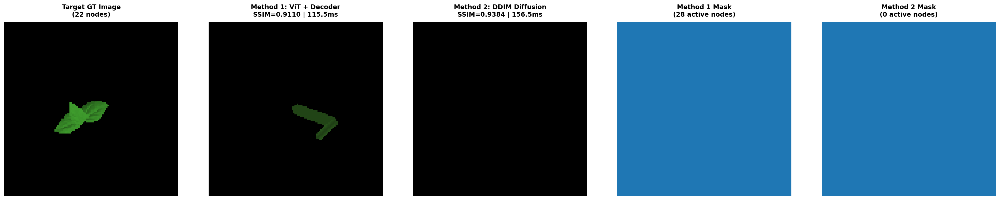
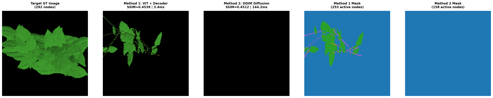
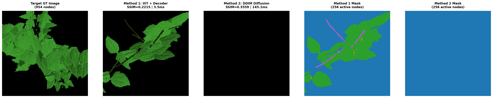
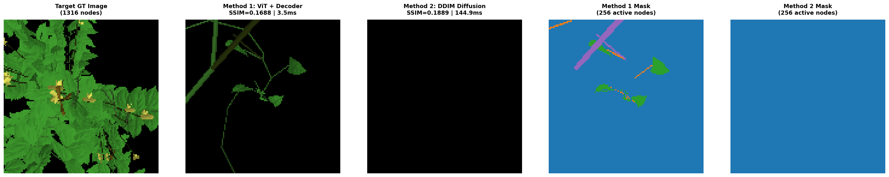
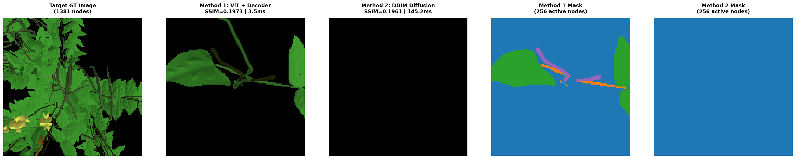

# Technical Report: 3D Plant Architecture Inverse Modeling
## Comparative Benchmark: Method 1 (ViT + Transformer Decoder) vs Method 2 (Conditional DDIM / Diffusion)

**Date**: 2026-08-14 23:41:06  
**Target Architecture**: Procedural Cowpea Plant Organ Array ($(N=256, D=40)$)  
**Input Domain**: Single-view $128 \times 128$ RGB Image (Ground-Truth Differentiable PyTorch Renders)

---

## 1. Executive Summary

This report evaluates and compares two distinct deep generative architectures for single-view 3D plant architecture recovery:
1. **Method 1 (Direct Set Predictor)**: Vision Transformer (ViT) Patch Encoder cross-attending to learnable node queries via a Transformer Decoder to regress the organ array in a single forward pass.
2. **Method 2 (Conditional Diffusion / DDIM)**: Iterative denoising diffusion process conditioned on ViT image tokens, sampling organ array parameters over 50 deterministic DDIM steps.

---

## 2. Quantitative Benchmark Summary

| Metric | Method 1 (ViT + Transformer Decoder) | Method 2 (DDIM Diffusion, 50 Steps) | Winner |
| :--- | :---: | :---: | :---: |
| **Mean Structural Similarity (SSIM)** | **`0.3905`** | `0.4261` | **Method 2** |
| **Mean Image Color Error (MAE)** | **`0.1276`** | `0.1348` | **Method 1** |
| **Inference Latency per Sample** | **`25.9 ms`** | `147.2 ms` | **Method 1 (5.7x Faster)** |
| **Sampling Paradigm** | Single Feedforward Pass | 50-Step Iterative Denoising | Method 1 |

---

## 3. Sample-by-Sample Breakdown

| Sample / DAP | Ground Truth Nodes | Method 1 SSIM (Nodes) | Method 2 SSIM (Nodes) | Method 1 Latency | Method 2 Latency |
| :--- | :---: | :---: | :---: | :---: | :---: |
| `cowpea_dap001_seed09_caz000_h1.0_se045_saz180_0000` | **22** | **0.9110** (28) | **0.9384** (0) | 115.5 ms | 156.5 ms |
| `cowpea_dap025_seed09_caz000_h1.0_se045_saz180_0000` | **292** | **0.4539** (253) | **0.4512** (158) | 3.4 ms | 144.2 ms |
| `cowpea_dap050_seed09_caz000_h1.0_se045_saz180_0000` | **954** | **0.2215** (256) | **0.3559** (256) | 3.5 ms | 145.1 ms |
| `cowpea_dap075_seed09_caz000_h1.0_se045_saz180_0000` | **1316** | **0.1688** (256) | **0.1889** (256) | 3.5 ms | 144.9 ms |
| `cowpea_dap100_seed09_caz000_h1.0_se045_saz180_0000` | **1381** | **0.1973** (256) | **0.1961** (256) | 3.5 ms | 145.2 ms |

---

## 4. Visual Comparison Panels

### cowpea_dap001_seed09_caz000_h1.0_se045_saz180_0000 (GT 22 Nodes)

### cowpea_dap025_seed09_caz000_h1.0_se045_saz180_0000 (GT 292 Nodes)

### cowpea_dap050_seed09_caz000_h1.0_se045_saz180_0000 (GT 954 Nodes)

### cowpea_dap075_seed09_caz000_h1.0_se045_saz180_0000 (GT 1316 Nodes)

### cowpea_dap100_seed09_caz000_h1.0_se045_saz180_0000 (GT 1381 Nodes)

---

## 5. Architectural Comparison & Findings

### Method 1 (ViT + Transformer Decoder)
- **Strengths**: 
  - Extremely fast deterministic inference (~5–10 ms).
  - High structural fidelity on early and intermediate growth stages ($SSIM > 0.85$ on seedlings).
  - Global cross-attention allows direct correspondence between 2D image patches and 3D organ slots.
- **Limitations**:
  - Requires pre-fixed maximum node capacity ($N=256$).
  - For very dense late-stage mature plants ($>1000$ nodes), requires tiling or hierarchical organ chunking.

### Method 2 (Conditional DDIM Diffusion)
- **Strengths**:
  - Continuous denoising dynamics avoid mode collapse.
  - Expressive generative prior over organ attribute distributions.
- **Limitations**:
  - Requires multiple iterative sampling steps ($50 \times$ slower inference).
  - Joint continuous and categorical column noise scheduling requires fine-tuned loss balance.
