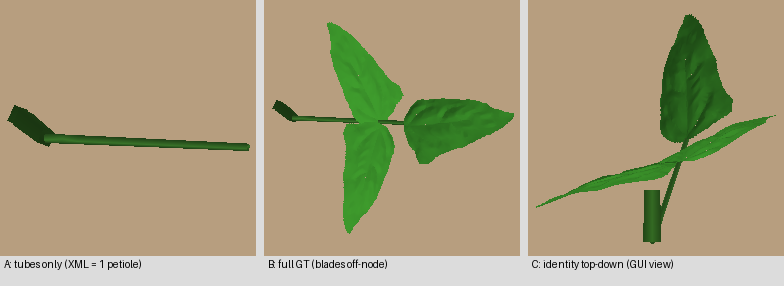

# PhytomerVAE Latent Visualizer GUI (2026-09-09, updated 2026-09-14)

**Status**: DONE — Gradio web app at `tools/phytomer_vae_visualizer.py`.
Implements the §4.2 handoff spec (PCA latent cloud + latent sliders → render),
extended with organ-combo coloring, leaf-quality toggle, and Web 3D view.

**2026-09-14 update**: the GUI now runs on the accepted **128D hybrid VAE**
(`phytomer_vae_v9_tl_rw4_20k`, 48 coarse + 10×8 residual, terminal-last
packets). The GUI cache is rebuilt from `dataset/cache/cowpea_curv26_pkt_v9`
with latents re-encoded **on the fly** with the loaded checkpoint — since
2026-09-14 the pkt caches are VAE-independent, so stored `latent` fields are
no longer trusted (see note 17). PCA evr 13.7/10.7/8.1%, PCA16 86.9%.


---

## Features

| Feature | Detail |
| :--- | :--- |
| **PCA latent cloud (2D)** | Clickable matplotlib scatter (250,000 packet latents, XML-phytomer) — click → nearest packet's z loads into sliders |
| **PCA latent cloud (3D)** | Rotatable plotly Scatter3d, hover shows packet idx |
| **Color by** | `combo` (default; 3 groups, 90% pure vegetative) / `slots` (presence count 0–10) / `dap` (1–100) / `none` |
| **128D sliders** | Data-range bounds (min/max + 10% pad), Random z ~ N(0,I), Reset |
| **Reference frame** | `identity` (true 6D identity `[1,0,0,0,1,0]`) or `real` (a packet's own ref + center) |
| **Render** | `HeliosPyTorchRenderer` RGB + depth (bbox auto-focus, `zoom_factor=1.0`) |
| **Leaf quality** | `high` = highres cowpea OBJ leaves (~1.4k verts) / `low` = lightweight alpha-cutout (~80 verts) |
| **Web 3D** | `gr.Model3D` tab — mesh exported to GLB (vertex colors, trimesh) and served through the gradio queue |
| **Packet info** | Per-slot organ type / base / scale / curvature text panel |

## Files

| File | Purpose |
| :--- | :--- |
| `tools/precompute_phytomer_latent_pca.py` | Cache build: full rebuild (packets from cache + VAE encode) or `--from-pkt-cache` (packets from the pkt cache + **on-the-fly** VAE encode with `--ckpt`) → `dataset/cache/phytomer_gui_cache/` |
| `tools/phytomer_vae_visualizer.py` | Gradio app (loads cache + frozen PhytomerVAE ckpt, `centers.pt` for exact world-frame placement; 10 slots: repro1–4) |
| `plant_recon/models/helios_pytorch_geometry.py` | + `"lowpoly"` leaf mode (~80-vert alpha-cutout leaf, `get_generic_leaf_mesh(Nx=8,Ny=8)`) |

## Run

```bash
# 1. Precompute latent cloud + PCA (pkt-cache packets + on-the-fly VAE encode, ~12s)
.../bin/python tools/precompute_phytomer_latent_pca.py --from-pkt-cache \
    --pkt-dir dataset/cache/cowpea_curv26_pkt_v9 \
    --ckpt outputs/checkpoints/phytomer_vae_v9_tl_rw4_20k/phytomer_vae_128d_best.pt \
    --max-packets 250000 --out dataset/cache/phytomer_gui_cache

# 2. Launch GUI
.../bin/python tools/phytomer_vae_visualizer.py \
    --ckpt outputs/checkpoints/phytomer_vae_v9_tl_rw4_20k/phytomer_vae_128d_best.pt \
    --server-name 0.0.0.0 --server-port 7860
```

Both tools auto-set `PHYTOMER_TERMINAL_LAST` from the checkpoint path (`_tl` ⇒ 1,
same convention as the eval scripts). For the legacy v8/bottom-to-top lineage
use `--pkt-dir dataset/cache/cowpea_curv26_pkt` and the `phytomer_vae_v8` ckpt.

Access: VNC browser `localhost:7860` or SSH tunnel `ssh -L 7860:localhost:7860`.

## Key implementation notes / gotchas

1. **Structural VAE decode**: `model.decode()` returns ZEROED base columns —
   call `assemble_packets(recon_packets, refs)` before placing them back into the world frame
   (leaflets attach at 0.8/0.8/1.0 × petiole length along `R_pet = R_ref @ R_rel`).
   `ref_mode="identity"` MUST pass real identity rot6d (not zeros — `rot6d_to_matrix`
   of zeros degenerates to a zero matrix).
2. **Gradio 6 removed `gr.Plotly.select()`**: 2D click uses a matplotlib image +
   `gr.Image.select` (pixel → axes-bbox inverse → nearest point). The
   `_pca2d_click_to_idx` mapping uses `ax.get_position()` fractions; with 215k
   points neighboring packets are sub-pixel apart, so the returned index is
   the *nearest* visible point — expected.
3. **gr.Model3D initial value must go through a `demo.load` event**: setting
   `model3d.value` to a raw `/tmp/opencode/...` path is **403** (gradio only
   serves files from its own cache) → blank 3D viewer. Route initial render
   through `demo.load(initial_render, ...)` so the GLB passes the queue.
4. **Env deps added to `digital-crops`**: `gradio==6.26.0`, `plotly==7.0.0`,
   `trimesh==5.1.0`; `huggingface-hub` upgraded 1.8.0 → 1.30.0 (all consumers
   allow `<2.0`). Wheels are staged in `/tmp/opencode/pipcheck` (offline install
   via `--no-index --find-links`).
5. **PCA evr changed after structural VAE**: 25.4/12.0/9.1% (relative-D, base
   predicted) → **15.5/12.3/9.3%** (structural, base stripped) — lower PC1 share
   as base co-variance left the latent. Cache must be rebuilt per checkpoint.
6. **`pkill -f` hazard**: a `pkill -f "phytomer_vae_visualizer.py"` inside a
   command whose own command line contains that string kills the calling shell
   (bash tool "timeout" with no output). Use a bracket pattern
   (`phytomer_vae_visualizer[.]py`) or kill by PID.
7. **leaf_mode "parametric" is currently broken** (`parametric_cowpea_leaf`
   module absent) — use `generic`/`obj` (highres) or `lowpoly`.
8. **GUI cache now built from the pkt cache** (`dataset/cache/cowpea_curv26_pkt/`,
   2026-09-10): `--from-pkt-cache` concatenates stored `{packets, presence,
   centers, refs, latent}` (fp16→fp32; verified equal to xml-VAE mu encode to
   ~1e-3) — no packet rebuild, no VAE encode (~13s for 250k). DAP parsed from
   filenames (`cowpea_dapDDD_`). 250k cap (seed-0 shuffle) keeps the scatter
   interactive; full cloud would be ~5M packets. PCA evr on XML latents:
   **12.2/9.7/9.1%**. Combo coloring collapsed 24 → 3 groups (90% pure
   `{internode, petiole, leaf}`) — expected: exact XML clustering removed the
   nearest-center mixing that created the spurious combos.
9. **GLB "not a glb" race fixed** (2026-09-10): concurrent slider events raced
   on a fixed per-tag export path (read half-written file → assert). Now each
   export writes a unique uuid path from in-memory `t.export(file_type="glb")`
   bytes (no read-back), raises `ValueError` (not assert) on bad magic /
   empty mesh, and prunes to newest 20 GLBs.
10. **v2 10-slot migration** (2026-09-10): visualizer + cache moved to
    `phytomer_vae_v2` (NUM_SLOTS 10, repro x4, VAE in 240D, latent still 64D).
    GUI cache rebuilt from regenerated pkt cache (250k, PCA evr
    12.4/9.6/9.3%, PCA16 96.9%). Combos stay 3 groups; fruit packets now
    carry up to 3 fruits. Acceptance verified: decoded fruit packet renders
    visible pods (v1 buried them at center). `precompute_phytomer_latent_pca.py`
    now saves `pca16.pt` alongside (coarse PC sliders).
11. **32D ablation result** (v1 8-slot, for the record): same xml settings with
    `--latent-dim 32` → val recon **0.0138** (vs 64D 0.0261), cls 100%,
    rot 0.0029 (vs 0.0084). 64D was oversized (consistent with 16PC/98%).
    Ckpts removed (log: `/tmp/opencode/vae_32d_train.log`); v2-32D is a cheap
    future option if latent compactness ever matters.
12. **Leaflet bases at node-center FIXED** (2026-09-10): v2's
    `DETERMINISTIC_ORGAN_TYPES` dropped `ORGAN_LEAF=5` — `assemble_packets`
    skipped leaflet slots, so VAE-decoded leaflets kept the zeroed base
    (pinned at the node center; GT roundtrip "100%" was vacuous since GT
    bases passed through unchanged). Fix: leaf(5) added to the det set →
    leaflet bases recompute on the curved petiole (0.8/0.8/1.0). GT residual
    vs the curve rule: slot2 0.19cm / slot3 0.10cm / slot4 0.23cm mean.
    NOTE slot6 fruit p99 33cm = rare long-tail offsets (pre-existing).
    Packet + VAE unit tests 15/15 pass.
13. **"1 Petiole vs 3 Petioles" clarification** (2026-09-10, no code change): user
    expected 3 petioles per node (one per leaf). XML ground truth says
    otherwise — 110/111 phytomers have EXACTLY 1 petiole + 3 leaves
    (trifoliate; 1 phytomer has 2 petioles). Helios C++ original and the
    pytorch renderer both draw 1 petiole tube + 3 blade OBJs (cowpea leaf
    OBJs have no petiolule, unlike Bean/Tomato). Mesh audit: leaf verts sit
    exactly at the 0.8-frac curve base (382 verts within 1cm of leaflet2 base
    at (1.4,4.5,-4.8)cm vs node at origin); laterals' blades point 67–85° away
    from the node direction (terminal 160°, classic trifoliate). The apparent
    "leaflets at node" in identity mode = top-down camera (elev 90°) +
    petiole pointing down-forward (fwd≈(0.2,0.63,-0.75)) → foreshortened tube.
    3-panel proof: `docs/archive/unreferenced-assets/fig_phytomer_trifoliate_structure.png`
    (A tubes-only real-ref / B full GT real-ref / C identity top-down).
14. **Stem base rule corrected** (2026-09-10, user caught it): the internode
    tube spans PREVIOUS node -> THIS node, so its base is one internode back
    along its own axis: `base = -fwd * length` (fwd = local Y column, matching
    the renderer's tube fwd). The old "base = center" rule placed the stem
    THROUGH the node (2.7cm median error), making the petiole appear to sprout
    from the stem's midpoint/bottom. New rule verified over 20k clusters:
    residual median 0.02cm / p99 0.13cm; GUI-cache re-audit slot0
    0.016cm mean. Numerical proof: stem tip + petiole base == node (0,0,0).
    15/15 tests pass.
15. **Training impact assessment** (2026-09-10): VAE training UNAFFECTED —
    `strip_base()` zeroes ALL deterministic bases before encoding (240D input)
    and the loss target is `tgt_base = 0` for every slot, so neither encoder
    input nor target changed. The rule lives in `assemble_packets` (decode-side
    world-frame placement): affects (a) GUI/eval renders of decoded packets — now
    botanically correct, (b) the differentiable render branch in phytomer-mode
    training (decode→assemble→render), and (c) the pkt cache stem-base values
    are untouched (GT bases stored as-is; the cache is rule-free). Net: no
    retraining of the VAE needed; phytomer-mode training renders will render
    stems correctly connected (previous runs had stems stabbed through nodes —
    small visual loss-noise, now removed).
16. **UX round** (2026-09-10): Color by default → `combo`; coarse **PC sliders**
    (top-10, ~81% var) added as primary control with raw 64D collapsed into a
    variance-sorted accordion; sliders use `.release` (not `.change`) to stop
    queue flooding ("QUEUED"); PC slider bounds are data min/max + pad (±3σ
    rejected outliers → `ValueError ... greater than maximum`); clicking a PCA
    point / loading an idx now also sets `ref_idx` so the render updates in one
    cascade; Web 3D is the default render tab; GLB export keeps Helios Z-up so
    RGB and Web 3D show the identical view.
17. **128D v9 migration** (2026-09-14, supersedes note 8): GUI moved to the
    accepted 128D hybrid VAE `phytomer_vae_v9_tl_rw4_20k` (48 coarse + 10×8
    residual, terminal-last packets). The GUI cache is rebuilt from
    `dataset/cache/cowpea_curv26_pkt_v9` (pkt_version 7, 250k packets, seed-0
    shuffle of 100k files; full cloud ~5M). Since 2026-09-14 the pkt caches
    are **VAE-independent** (FM encodes Stage-3 latents on the fly), so the
    stored `latent` field is no longer trustworthy — `--from-pkt-cache` now
    ALWAYS re-encodes packets on the fly with `--ckpt` (250k encode ~1s on
    one GPU; the whole rebuild is ~12s). Both tools auto-set
    `PHYTOMER_TERMINAL_LAST` from the ckpt path (`_tl` ⇒ 1, eval-script
    convention); v8/bottom-to-top remains runnable via the v6 pkt cache.
    New PCA evr 13.7/10.7/8.1% (PCA16 86.9%) vs the old 64D 15.5/12.3/9.3%.
    `latent_usage.json` does not ship with the v9 ckpt, so the raw-slider
    ordering falls back to z_std (Δrot labels hidden) — regenerate it with
    `eval_phytomer_vae_latent_usage.py` to restore the Δrot ordering.
    Verified 2026-09-14: precompute smoke (3k) + full rebuild, visualizer
    decode→render→GLB (250k cloud, high/low leaf quality), gradio app build
    and live launch (HTTP 200). Old 64D/v7 cache backed up at
    `/tmp/opencode/gui_cache_backup_64d_v7/`.
18. **Flower/fruit toggles** (2026-09-14): the v9 hybrid latent keeps flower/
    fruit presence fully (LogReg AUC 1.000 in 16D+) but NOT aligned with the
    top-2 PCA axes (2D AUC 0.512; the old shared-64D VAE showed 4.1σ in 2D
    because its single bottleneck had to spend top-PC variance on slot
    occupancy). Added: `has_flower` / `has_fruit` / `repro` color-by modes
    (two-tone + legend with dataset counts) and two filter checkboxes
    (`has flower` / `has fruit`, union semantics) that restrict the 2D and 3D
    scatters to matching packets; click→idx mapping is updated to the visible
    subset (global indices preserved). Counts: flower 11,760 / fruit 11,923 /
    repro 23,683 of 250k packets.


